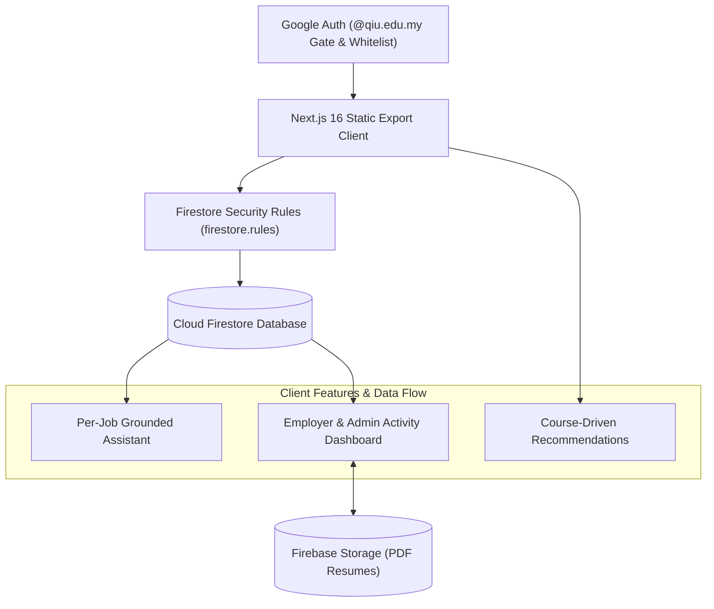

# QIU Industry Webapp

> [!NOTE]
> **Status:** Active Internal Testing Phase — Currently undergoing internal validation. Live deployment links and public hosting URLs are strictly withheld during testing.

**QIU Industry Webapp** is a full-fledged industry career & vacancy discovery web application built for **QIU (Quest International University)** students, academic staff, and participating industry partner employers. Built with Next.js 16 (App Router static export), React 19, Tailwind CSS v4, Cloud Firestore, and Firebase Authentication.

> [!IMPORTANT]
> **Privacy & Security Boundary:** Private source files (CSV, XLSX, XLS, TSV) and generated vacancy files (`data/jobs.json`) are strictly excluded from version control and static website export bundles. Shared vacancy and application records are securely managed in Cloud Firestore and protected by server-enforced Firestore Security Rules (`firestore.rules`).


## Core Features

- **Gated Job Applications**: Applying to a vacancy requires a submitted resume on file. Candidates can provide a shareable resume URL (Google Drive, OneDrive, Dropbox) for zero-cost Firebase Spark plan hosting, or opt for direct PDF upload via Firebase Storage.
- **Per-Job Grounded Assistant**: Embedded directly within each job details popup, the assistant is strictly grounded to that single vacancy's data (title, company, salary, location, job scope, requirements) to answer applicant queries without external LLM costs or model hallucinations.
- **Course-Driven Recommendations**: Automatically delivers personalized vacancy recommendations tailored to the student's program by matching vacancy specializations and titles against their directory course profile.
- **Employer Activity Dashboard**: A centralized activity dashboard. Employers view applications submitted specifically to their pre-bound company, while Admins and Superadmins maintain webapp-wide visibility across all candidate submissions.
- **Strict Required Fields**: Enforces strict data quality when posting or editing vacancies by requiring numeric salary values (with pay frequency) alongside structured Job Scope & Minimum Requirements.
- **Branded & Dark-Mode Optimized UI**: Features responsive navigation, QIU logo branding, adjustable font scaling, and high-contrast `on-primary` dark mode styling for enhanced visual clarity and accessibility.
- **Interactive Location Filtering**: Supports state selection across Malaysia as well as international country mapping.
- **Role-Based Access Control (RBAC)**: Enforced via Firestore Security Rules supporting 4 distinct user roles (`user`, `admin`, `superadmin`, `employer`).

---

## Access Model & Roles Matrix

Authentication requires a verified Google account. Access rights and capabilities are governed by server-side Firestore Security Rules and pre-whitelisted account entries.

| Role | Target Identity | Granted Capabilities & Scope |
| --- | --- | --- |
| `user` | Standard QIU student or staff (`@qiu.edu.my`) | Default role upon first Google sign-in. Can browse and filter vacancies, view course-driven recommendations, interact with per-job assistants, upload resume (URL or PDF), and apply to open positions. |
| `employer` | External partner email whitelisted in `whitelisted_emails` | Granted access via pre-whitelisted email entry bound to a specific `company` name. Can post and edit vacancies under their assigned company, and monitor candidate applications in their company-specific Activity Dashboard. |
| `admin` | Internal user promoted by Superadmin | Inherits all `user` capabilities plus full vacancy management (create, edit, delete any vacancy webapp-wide), viewing all applications in the Activity Dashboard, and promoting `user` accounts to `admin`. |
| `superadmin` | Fixed identity (`ai@qiu.edu.my`) | Master administrator. Inherits all `admin` capabilities plus initial bulk JSON data import, system maintenance, and user role management. Immutable role that cannot be demoted or deleted. |

> [!NOTE]
> Signing in with a non-whitelisted, non-QIU Google account results in an immediate authorization rejection; Firestore Security Rules deny all read/write access to vacancy, user, and application collections.

---

## Architecture Diagram



---

## Technology Stack

| Layer | Technology |
| --- | --- |
| **Framework & Client** | Next.js 16 (App Router with `output: 'export'`), React 19, TypeScript |
| **Styling** | Tailwind CSS v4, PostCSS |
| **Authentication** | Firebase Authentication (Google OAuth provider) |
| **Database & Security** | Cloud Firestore, Firestore Security Rules (`firestore.rules`) |
| **Storage** | Firebase Storage (Optional PDF resume file upload) |
| **Hosting** | Firebase Hosting (Static export output in `out/`) |
| **AI Assistant** | Per-job grounded deterministic lexical retrieval engine |
| **Testing** | Node.js Test Runner, Firebase Rules Unit Testing (`@firebase/rules-unit-testing`) |

---

## Commands & Local Setup

### Prerequisites

- **Node.js**: `22.13.0` or newer
- **npm**: Included with Node.js
- **Java Runtime**: Required for local Firestore emulator security rules testing
- **Firebase Project**: A Firebase project with Google Auth, Cloud Firestore, and Firebase Storage enabled.

### 1. Installation

Navigate into the `webapp/` directory and install project dependencies:

```bash
cd webapp
npm ci
```

### 2. Environment Setup

Create your local environment configuration file:

```bash
cp .env.example .env.local
```

Configure your Firebase Web App credentials in `.env.local`:

```dotenv
NEXT_PUBLIC_FIREBASE_API_KEY=your_api_key
NEXT_PUBLIC_FIREBASE_AUTH_DOMAIN=your_project_id.firebaseapp.com
NEXT_PUBLIC_FIREBASE_PROJECT_ID=your_project_id
NEXT_PUBLIC_FIREBASE_STORAGE_BUCKET=your_project_id.firebasestorage.app
NEXT_PUBLIC_FIREBASE_MESSAGING_SENDER_ID=your_messaging_sender_id
NEXT_PUBLIC_FIREBASE_APP_ID=your_app_id
```

### 3. Execution Commands

Inside `webapp/`:

| Command | Description |
| --- | --- |
| `npm run dev` | Start Next.js development server at `http://localhost:3000` |
| `npm run build` | Build static export bundle into `out/` |
| `npm run start` | Serve static build locally via `npx serve out` |
| `npm run lint` | Run ESLint syntax and code quality checks |
| `npm test` | Build application and run unit & regression test suite |
| `npm run test:rules` | Run authorization tests against local Firestore emulator |

Recommended pre-commit verification gate:

```bash
npm run lint
npm test
npm run test:rules
```

---

## Initial Private Data Import

Private source files (CSV/XLSX) are never compiled into the client bundle. To seed or update vacancy records:

1. Run the Python data normalization script to generate `data/jobs.json` (git-ignored):
   ```bash
   python3 scripts/generate_data.py
   ```
2. Sign in to QIU Industry Webapp as Superadmin (`ai@qiu.edu.my`).
3. Open **Admin Tools** -> **Initial Data Import**.
4. Upload `data/jobs.json` to perform bulk batch writes into the Firestore `vacancies` collection.

---

## Deployment

Deploy rules, indexes, and static hosting to Firebase:

```bash
npm run build
npx firebase-tools deploy --only firestore:rules,firestore:indexes,hosting
```

---

## Security & Data Privacy

To guarantee confidentiality and protect sensitive internal data:
- Source data files (`*.csv`, `*.xlsx`, `*.xls`, `*.tsv`) and intermediate files (`data/jobs.json`) are strictly excluded from Git.
- Local configuration files containing credentials (`.env`, `.env.local`) are ignored by version control.

### Verification Command

Run this command before pushing commits to verify that no sensitive files or environment variables are tracked:

```bash
git ls-files -- data/jobs.json '*.csv' '*.xlsx' '*.xls' '*.tsv' '.env' '.env.local'
```

*Expected output: Empty output (no files returned).*

---

## Project Structure

```text
QIU-Industry-Webapp/
├── webapp/
│   ├── app/
│   │   ├── auth-context.tsx         # Auth state, Google sign-in gate, role manager
│   │   ├── auth-policy.ts           # Email whitelist & role verification helpers
│   │   ├── chat.ts                  # Grounded assistant retrieval logic
│   │   ├── firebase-client.ts       # Firebase SDK setup (Auth, Firestore, Storage)
│   │   ├── globals.css              # Tailwind v4 styling & dark mode system
│   │   ├── layout.tsx               # Root layout & providers
│   │   └── page.tsx                 # Webapp dashboard, vacancy listing & modals
│   ├── components/                  # UI components (Modals, Dashboards, Assistant)
│   ├── docs/                        # Project & software documentation
│   ├── public/                      # Static assets & QIU branding logos
│   ├── scripts/                     # Data processing scripts (generate_data.py)
│   ├── tests/                       # Unit, regression, and Firestore rules tests
│   ├── firebase.json                # Firebase Hosting and emulator configuration
│   ├── firestore.indexes.json       # Composite index definitions
│   ├── firestore.rules              # Security rules for Firestore collections
│   ├── storage.rules                # Security rules for Firebase Storage
│   ├── next.config.ts               # Next.js config (output: 'export')
│   └── package.json                 # Dependencies & scripts
└── README.md                        # Repository homepage documentation
```

---

## System Notes

- **Scope**: Built as a full-fledged industry career & vacancy discovery web application for QIU students, staff, and industry partner employers.
- **Deterministic Lexical Assistant**: Per-job assistant operates on fast deterministic lexical matching rather than LLM generation or vector embeddings, eliminating API token costs and hallucination risks during high-traffic usage.
- **Firebase Quotas & Scalability**: Operations are calibrated for production-ready performance; monitor storage and Firestore read/write limits during peak recruitment activity.
