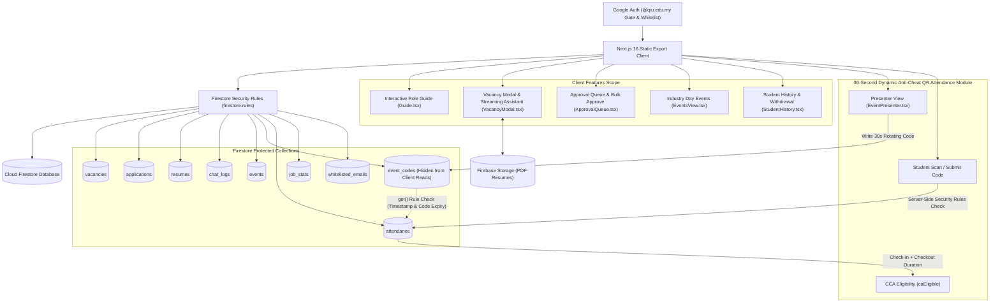

# QIU Industry Webapp

> [!NOTE]
> **Status:** Active Internal Testing Phase — Currently undergoing internal validation. Live deployment links and public hosting URLs are strictly withheld during testing.

**QIU Industry Webapp** is a full-fledged industry career, event & vacancy discovery web application built for **QIU (Quest International University)** students, academic staff, and participating industry partner employers. Built with Next.js 16 (App Router static export), React 19, TypeScript 5.9, Tailwind CSS v4.2, Cloud Firestore, and Firebase Authentication.

> [!IMPORTANT]
> **Privacy & Security Boundary:** Private source files (CSV, XLSX, XLS, TSV) and generated vacancy files (`data/jobs.json`) are strictly excluded from version control and static website export bundles. Shared vacancy, application, and event records are securely managed in Cloud Firestore and protected by server-enforced Firestore Security Rules (`firestore.rules`).

---

## Brand & Visual Identity: Signature QIU-Red Design System

QIU Industry Webapp features a bespoke visual identity built around QIU's signature brand colors and high-contrast typography:

- **QIU-Red Palette**: Core brand identity anchored by QIU-Red (`#ba1a1a` / `#900010` / `--color-primary: #d12a32`, hovering at `#b21f27`, and brightened to `#ef5a60` in dark mode).
- **Prominent Salary Callouts**: Styled salary metadata blocks displaying clean, high-visibility wage figures (e.g. `RM 3,500 / monthly`) across vacancy cards and detail modals.
- **Enlarged QIU Brand Logo & Theme Inversion**: Prominent logo asset sizing (`height: 3.2rem` desktop / `3rem` mobile) across header, authentication modal, and mobile header, automatically inverted on dark surfaces (`filter: invert(1) brightness(1.9)`).
- **Light Default Theme with Seamless Dark Mode**: Designed with a clean light default theme that automatically respects system preferences or user toggles, adjusting backgrounds, surface tokens, and contrast levels dynamically without layout shifts.

---

## Core Features & Workflow Architecture

### 1. Interactive Role Guide System (`webapp/features/Guide.tsx`)
- **Tailored Role Onboarding**: Step-by-step interactive onboarding guides customized for `student`/`user`, `employer`, `admin`, and `superadmin` roles, reopenable anytime via the `?` topbar button.
- **Live-Styled Button Snapshots**: Features rendered visual previews of key action buttons and status badges (`<Demo>` & `<Chip>`) directly inside the guide, matching live theme styles (`tone-accent`, `save-job`, `tone-success`, `enquire-main`, `cancel-edit`, `job-assistant-toggle`, `admin-button`, `edit-local`).

### 2. Multi-Criteria Vacancy Sorting System (`webapp/features/vacancies/VacancyFilters.tsx`)
- **5-Mode Sorting Engine**: Dedicated **Sort By** dropdown control supporting instant re-ordering of vacancy listings across 5 modes:
  - `default`: Best match for students (prioritizing course recommendations); Newest first for managers.
  - `newest`: Newest published vacancies first (by creation timestamp `id`).
  - `oldest`: Oldest vacancies first.
  - `salary_high`: Highest monthly salary first (descending).
  - `salary_low`: Lowest monthly salary first (ascending).
- **Reactive Filter Integration & 1-Click Reset**: Fully integrated into the reactive vacancy search and multi-criteria filter pipeline (keyword search, company, specialization, opportunity type, max salary range slider), complete with a 1-click filter reset (`resetFilters`).

### 3. Mobile UX & Header Polish (`webapp/app/globals.css` & `webapp/app/page.tsx`)
- **Enlarged Brand Logo**: Prominent logo asset sizing (`height: 3.2rem` desktop / `3rem` mobile) across topbar header, auth modal, and mobile header views.
- **Non-Wrapping Tab Navigation**: Added `white-space: nowrap` to main section tabs (`Vacancies`, `History`, `My Resume`, `Events`) ensuring tab navigation titles never line-wrap on smaller screens.
- **Responsive Auth Header Layout**: Optimizes mobile screens (<600px) by hiding secondary account text (`.auth-account small, .auth-account strong`) to give maximum breathing room to the enlarged QIU logo and avatar/Sign Out controls.

### 4. Enhanced Candidate & Vacancy Workflows
- **Real-Time Applicant Counter**: Live applicant tallies displayed per job on cards and modal popups, backed by atomic `increment()` counters in the `job_stats` collection.
- **Application Withdrawal**: Students can withdraw submitted job applications directly from their Student History tab (`StudentHistory.tsx`) or inside `VacancyModal.tsx`, atomically decrementing the per-job applicant tally.
- **Flexible Resume Management**: Candidates can submit shareable links (Google Drive, OneDrive, Dropbox) for zero-cost Firebase Spark plan hosting or direct PDF upload via Firebase Storage, with full resume removal/deletion capabilities.
- **In-Modal Streaming Assistant**: Embedded directly below the Apply/Resume section in `VacancyModal.tsx`, providing grounded, typewriter-streaming answers auto-scrolling to newest responses.

### 5. Admin & Employer Grouped Views + Bulk Actions
- **Grouped Candidate Activity Feeds**: Admins view candidate applications grouped by student with expandable details (`StudentActivity.tsx`), while employers view flat feeds scoped strictly to their assigned company.
- **Bulk "Approve All" Feature**: Admins can batch-approve all pending employer vacancy posts and staged edits in 1 click (`ApprovalQueue.tsx`).

### 6. Events & 30-Second Dynamic QR Anti-Cheat Attendance Module
- **Live Presenter View (`EventPresenter.tsx`)**: Presenters launch a dedicated live screen displaying a **Dynamic 30-Second Rotating QR Code** and dynamic 6-character code (`REFRESH_MS = 30000`). Active step (`checkin` vs `checkout`), code, and expiry timestamp (`codeExpiry`) update server-side in `event_codes/{eventId}`.
- **WhatsApp/Proxy Anti-Cheat Protection**: The `event_codes` collection is **strictly unreadable by client queries**. Server-side Firestore Security Rules evaluate `eventCode(eventId)` to verify step, code match, and timestamp validity (`request.time.toMillis() < codeExpiry`). Photos shared via messaging apps expire within 30 seconds and become invalid.
- **Two-Step Duration Verification for CCA Points**: Requires students to perform both a **Check-In** at session start and a **Check-Out** at session end. System calculates elapsed duration vs scheduled `sessionMinutes` (threshold: ≥ 80% of `sessionMinutes` or 45 min floor) to award Co-Curricular Activity (CCA) eligibility (`caEligible`).
- **Presenter Delegation**: Admins can assign guest speaker emails to `events/{eventId}.presenters`, granting live QR display rights without full administrative permissions.

---

## Access Model & Roles Matrix

Authentication requires a verified Google account. Access rights and capabilities are governed by server-side Firestore Security Rules and pre-whitelisted account entries.

| Role | Target Identity | Granted Capabilities & Scope |
| --- | --- | --- |
| `user` | Standard QIU student or staff (`@qiu.edu.my`) | Default role upon Google sign-in. Browse and filter vacancies, view course-driven recommendations, interact with in-modal streaming assistant, manage resume (link or PDF), apply/withdraw applications, scan 30s dynamic QR codes for check-in/checkout, and view attendance history. |
| `employer` | External partner email whitelisted in `whitelisted_emails` | Granted access via pre-whitelisted email entry bound to a specific `company` name. Post vacancies and stage edits, view candidate resumes and flat application feeds for their assigned company. |
| `admin` | Internal user promoted by Superadmin | Inherits all `user` capabilities plus full webapp-wide vacancy management (create, edit, delete, single or bulk "Approve All" review), creating/managing Industry Day events, presenting live 30s QR screens, exporting attendance CSV reports, viewing grouped candidate activity, and promoting users to `admin`. |
| `superadmin` | Fixed identity (`ai@qiu.edu.my`) | Master administrator. Inherits all `admin` capabilities plus initial bulk JSON data import, system maintenance, and user role management. Immutable role that cannot be demoted or deleted. |
| *(Delegated Presenter)* | Email listed in event's `presenters` array | Non-admin users whose email is explicitly listed in an event's `presenters` field. Granted write access to `event_codes/{eventId}` to present the dynamic live 30s QR screen for that specific event. |

> [!NOTE]
> Signing in with a non-whitelisted, non-QIU Google account results in an immediate authorization rejection; Firestore Security Rules deny all read/write access to vacancy, user, application, event, and attendance collections.

---

## Top-Down Architecture Diagram



---

## Data Models & Schemas Summary

| Model / Collection | Document ID | Purpose & Key Schema Fields |
| --- | --- | --- |
| `Job` (`vacancies`) | `{id}` (numeric) | Vacancy details, salary, scope, requirements, status (`approved`/`pending`/`pending_edit`/`rejected`), location, company binding, `createdBy`, `createdAt`, `updatedAt`. |
| `Application` (`applications`) | `{studentUid}_{jobId}` | Candidate application submission record containing `studentUid`, `studentEmail`, `studentName`, `jobId`, `jobTitle`, `company`, optional `resumeId`, and `appliedAt` server timestamp. |
| `Resume` (`resumes`) | `{studentUid}` | Candidate resume on file with `source` (`upload` \| `generated` \| `link`), optional PDF `fileUrl` (Firebase Storage or share link), `fileName`, `course`, and `updatedAt`. |
| `ChatLog` (`chat_logs`) | `{id}` | Grounded assistant conversation turn containing `studentUid`, `studentEmail`, `studentName`, `company` (optional filter), `question`, `answer`, and `createdAt`. |
| `EventItem` (`events`) | `{id}` (numeric) | Industry Day event schedule item containing `title`, `description`, `location`, `speakerName`, `speakerEmail`, `startAt`, `endAt`, `sessionMinutes`, `presenters` email array, and `createdBy`. |
| `EventCode` (`event_codes`) | `{eventId}` | **Secret server-side active code** (unreadable by client queries) containing `activeStep` (`checkin` \| `checkout` \| `none`), `activeCode` (30s rotating hash), and `codeExpiry` (epoch timestamp). |
| `Attendance` (`attendance`) | `{eventId}_{studentUid}` | Attendance verification record containing `eventId`, `eventTitle`, `studentUid`, `studentEmail`, `studentName`, `code`, `step` (`checkin` \| `checkout`), `checkInMs`, `checkOutMs`, `durationMinutes`, and `caEligible` status. |
| `JobStats` (`job_stats`) | `{jobId}` | Public applicant tally per vacancy containing `applicants` numeric counter (updated via Firestore `increment()`). |
| `UserRecord` (`users`) | `{uid}` | Profile document containing `uid`, `email`, `displayName`, `photoURL`, `role`, `course`, `courseCode`, `company`, and `updatedAt`. |
| `WhitelistedEmail` (`whitelisted_emails`) | `{email}` | Normalized whitelisted email entry containing `email`, `company` binding, `addedBy`, and `createdAt`. |

---

## Technical Stack

| Layer | Technology | Description |
| --- | --- | --- |
| **UI** | React 19, TypeScript 5.9, Tailwind CSS 4.2 | Component-driven UI, QIU-Red design system, responsive layout, dark mode, modal management |
| **Framework** | Next.js 16 (App Router) | Static site generation with `output: "export"` outputting bundle to `out/` |
| **Authentication** | Firebase Authentication | Google OAuth provider gate restricted to `@qiu.edu.my` domain and `whitelisted_emails` |
| **Database & Security** | Cloud Firestore & Security Rules | NoSQL database governed by 4-role RBAC and server-side assertion functions in `firestore.rules` |
| **Realtime State** | Firestore Reactive Subscriptions | Live data sync using `onSnapshot` for vacancies, applications, job stats, events, and presenter dynamic QR codes |
| **Storage** | Firebase Storage | Optional PDF resume file uploads with security rules enforcement |
| **Hosting** | Firebase Hosting | Production static asset distribution with custom header security policies |
| **AI Assistant** | In-Modal Streaming Assistant | High-performance deterministic keyword matching engine grounded strictly to single vacancy context with typewriter streaming UI |
| **Testing & Verification** | Node Test Runner & Firebase Emulator | Local unit test suite (`npm test`) and Firestore Security Rules emulator tests (`npm run test:rules`) |

---

## Setup & Verification Commands

### Prerequisites

- **Node.js**: `22.13.0` or newer
- **npm**: Included with Node.js
- **Java Runtime**: Required for local Firestore emulator security rules testing (`npm run test:rules`)
- **Firebase Project**: A Firebase project with Google Auth, Cloud Firestore, and Firebase Storage enabled.

### 1. Installation

Navigate into the `webapp/` directory and install project dependencies:

```bash
cd webapp
npm ci
```

### 2. Environment Setup

Create your local environment configuration file:

```bash
cp .env.example .env.local
```

Configure your Firebase Web App credentials in `.env.local`:

```dotenv
NEXT_PUBLIC_FIREBASE_API_KEY=your_api_key
NEXT_PUBLIC_FIREBASE_AUTH_DOMAIN=your_project_id.firebaseapp.com
NEXT_PUBLIC_FIREBASE_PROJECT_ID=your_project_id
NEXT_PUBLIC_FIREBASE_STORAGE_BUCKET=your_project_id.firebasestorage.app
NEXT_PUBLIC_FIREBASE_MESSAGING_SENDER_ID=your_messaging_sender_id
NEXT_PUBLIC_FIREBASE_APP_ID=your_app_id
```

### 3. Execution & Verification Commands

Inside `webapp/`:

| Command | Description |
| --- | --- |
| `npm run dev` | Start Next.js development server at `http://localhost:3000` |
| `npm run build` | Build static export bundle into `out/` |
| `npm run start` | Serve static build locally via `npx serve out` |
| `npm run lint` | Run ESLint syntax and code quality checks |
| `npm test` | Build application and run unit & regression test suite |
| `npm run test:rules` | Run authorization tests against local Firestore emulator |

Recommended quality gates before committing changes:

```bash
npm run lint
npm test
npm run test:rules
```

---

## Initial Private Data Import

Private source files (CSV/XLSX) are never compiled into the client bundle. To seed or update vacancy records:

1. Run the Python data normalization script to generate `data/jobs.json` (git-ignored):
   ```bash
   python3 scripts/generate_data.py
   ```
2. Sign in to QIU Industry Webapp as Superadmin (`ai@qiu.edu.my`).
3. Open **Admin Tools** -> **Initial Data Import**.
4. Upload `data/jobs.json` to perform bulk batch writes into the Firestore `vacancies` collection.

---

## Deployment

Deploy security rules, composite indexes, and static hosting bundle to Firebase:

```bash
cd webapp
npm run build
npx firebase-tools deploy --only firestore:rules,firestore:indexes,hosting
```

---

## Security & Data Privacy

To guarantee confidentiality and protect sensitive internal data:
- Source data files (`*.csv`, `*.xlsx`, `*.xls`, `*.tsv`) and intermediate files (`data/jobs.json`) are strictly excluded from Git.
- Local configuration files containing credentials (`.env`, `.env.local`) are ignored by version control.
- `event_codes` collection is strictly unreadable by client subscriptions to prevent QR proxy leaks across WhatsApp or social media.

### Verification Command

Run this command before pushing commits to verify that no sensitive files or environment variables are tracked:

```bash
git ls-files -- data/jobs.json '*.csv' '*.xlsx' '*.xls' '*.tsv' '.env' '.env.local'
```

*Expected output: Empty output (no files returned).*

---

## Project Structure

```text
QIU-Industry-Webapp/
├── webapp/
│   ├── app/
│   │   ├── auth-context.tsx         # Auth state, Google sign-in gate, role manager
│   │   ├── auth-policy.ts           # Email whitelist & role verification helpers
│   │   ├── chat.ts                  # Grounded assistant retrieval logic
│   │   ├── firebase-client.ts       # Firebase SDK setup (Auth, Firestore, Storage)
│   │   ├── globals.css              # Tailwind v4 & QIU-Red styling system
│   │   ├── layout.tsx               # Root layout & providers
│   │   └── page.tsx                 # Main application dashboard & layout shell
│   ├── components/                  # Global UI components (Modal, etc.)
│   ├── docs/                        # Project documentation (SOFTWARE_DOCUMENTATION.md)
│   ├── features/                    # Modular feature components
│   │   ├── admin/                   # Admin panel, ApprovalQueue (bulk approve), StudentActivity
│   │   ├── chat/                    # Grounded per-job assistant dialog
│   │   ├── events/                  # Events module (EventsView, EventPresenter 30s QR, EventAttendance)
│   │   ├── student/                 # Student profile, StudentResume, StudentHistory (withdrawal)
│   │   └── vacancies/               # Vacancy listing, filters, VacancyModal, cards
│   ├── lib/
│   │   ├── auth/                    # Course directory mappings
│   │   ├── data/                    # Types (types.ts) and Firestore access layer (firestore.ts)
│   │   └── theme/                   # QIU-Red design tokens (tokens.css)
│   ├── public/                      # Static assets & QIU branding logos
│   ├── scripts/                     # Data processing scripts (generate_data.py)
│   ├── tests/                       # Unit, regression, and Firestore rules emulator tests
│   ├── firebase.json                # Firebase Hosting and emulator configuration
│   ├── firestore.indexes.json       # Composite index definitions
│   ├── firestore.rules              # Security rules for Firestore collections
│   ├── storage.rules                # Security rules for Firebase Storage
│   ├── next.config.ts               # Next.js config (output: 'export')
│   └── package.json                 # Dependencies & scripts
└── README.md                        # Repository homepage documentation
```

---

## System Notes

- **Active Internal Testing Phase**: Undergoing internal validation with no public live URLs disclosed.
- **30-Second Dynamic QR Anti-Cheat Engine**: Prevents proxy attendance by rotating single-use codes every 30 seconds stored in client-unreadable Firestore collections and verified server-side.
- **In-Modal Streaming Assistant**: Embedded typewriter assistant operates on fast deterministic lexical matching grounded strictly to single vacancy scope, eliminating API token costs and hallucination risks.
- **Firebase Quotas & Scalability**: Operations are calibrated for production-ready performance; monitor storage and Firestore read/write limits during peak recruitment activity.
