# QIU Industry Webapp

> [!NOTE]
> **Status:** Active Internal Testing Phase — Currently undergoing internal validation. Live deployment links and public hosting URLs are strictly withheld during testing.

**QIU Industry Webapp** is an industry career, event & vacancy discovery web application built for **QIU (Quest International University)** students, academic staff, and participating industry partner employers. Built with Next.js 16 (App Router static export), React 19, TypeScript 5.9, Tailwind CSS v4.2, Cloud Firestore, and Firebase Authentication.

> [!IMPORTANT]
> **Privacy & Security Boundary:** Private source files (`*.csv`, `*.xlsx`, `*.xls`, `*.tsv`) and generated vacancy datasets (`data/jobs.json`) are strictly excluded from version control and static export bundles. Shared vacancy, application, company, and event records are securely managed in Cloud Firestore and protected by server-enforced Firestore Security Rules ([firestore.rules](file:///Users/sooyauming/Desktop/Intern/Vacancy%20Portal/webapp/firestore.rules)).

---

## Technical Documentation Hub

This repository maintains comprehensive, multi-page technical documentation for developers, system administrators, security reviewers, and academic stakeholders:

1. **[webapp/README.md](file:///Users/sooyauming/Desktop/Intern/Vacancy%20Portal/webapp/README.md)** *(Webapp Architecture & Developer Quickstart)*  
   Developer onboarding guide, local environment configuration, build pipelines, directory structure, quality gates, and deployment scripts.

2. **[SOFTWARE_DOCUMENTATION.md](file:///Users/sooyauming/Desktop/Intern/Vacancy%20Portal/webapp/docs/SOFTWARE_DOCUMENTATION.md)** *(Comprehensive System Architecture Specification)*  
   Complete system context, architectural design decisions, component design hierarchy, sequence diagrams, technology stack, and production procedures.

3. **[SECURITY_AND_RULES.md](file:///Users/sooyauming/Desktop/Intern/Vacancy%20Portal/webapp/docs/SECURITY_AND_RULES.md)** *(Security Model, Firestore Security Rules & 30s Dynamic QR Math)*  
   Deep dive into authentication gates, the 4-role RBAC matrix, line-by-line Firestore security rules, 30-second TOTP-style dynamic QR anti-cheat logic, and CCA duration algorithms.

4. **[DATA_MODELS_AND_SCHEMAS.md](file:///Users/sooyauming/Desktop/Intern/Vacancy%20Portal/webapp/docs/DATA_MODELS_AND_SCHEMAS.md)** *(Data Dictionary, TypeScript Interfaces & Firestore Collections)*  
   Exhaustive data dictionary, canonical TypeScript interfaces, Firestore collection specifications (`job_stats`, `companies`, `events`, `event_codes`, `attendance`, `employer_signups`, `app_settings`, etc.), real-time subscriptions, and batch import pipeline.

5. **[FEATURE_MODULES_GUIDE.md](file:///Users/sooyauming/Desktop/Intern/Vacancy%20Portal/webapp/docs/FEATURE_MODULES_GUIDE.md)** *(Feature Modules Technical Specification)*  
   Detailed technical guide covering Home Directory RAG, logo luminance analysis (`useLogoBackdrop.ts`), employer self-registration queue, admin sub-tabs, generated CV engine (`cv-download.ts`), global toast system, image preview component, and events anti-cheat module.

6. **[CODEBASE_FILE_MAP.md](file:///Users/sooyauming/Desktop/Intern/Vacancy%20Portal/webapp/docs/CODEBASE_FILE_MAP.md)** *(Exhaustive File-by-File Technical Code Map)*  
   Comprehensive file-by-file code map documenting every source, component, domain model, security rule, configuration, script, and test suite file with detailed section-by-section code block breakdowns.

---

## Brand & Visual Identity: Signature QIU-Red Design System

QIU Industry Webapp features a visual identity built around QIU's signature brand colors and high-contrast typography:

- **QIU-Red Palette**: Core brand identity anchored by QIU-Red (`#ba1a1a` / `#900010` / `--color-primary: #d12a32`, hovering at `#b21f27`, and brightened to `#ef5a60` in dark mode).
- **Prominent Salary Callouts**: Styled salary metadata blocks displaying clean, high-visibility wage figures (e.g. `RM 3,500 / monthly`) across vacancy cards and detail modals.
- **Enlarged QIU Brand Logo & Theme Inversion**: Prominent logo asset sizing (`height: 3.2rem` desktop / `3rem` mobile) across header, authentication modal, and mobile header, automatically inverted on dark surfaces (`filter: invert(1) brightness(1.9)`).
- **Light Default Theme with Seamless Dark Mode**: Designed with a light default theme that automatically respects system preferences or user toggles, adjusting backgrounds, surface tokens, and contrast levels dynamically without layout shifts.

---

## Core Feature Modules Summary

### 1. Home Directory & Company RAG ([HomeView.tsx](file:///Users/sooyauming/Desktop/Intern/Vacancy%20Portal/webapp/features/home/HomeView.tsx), [course-map.ts](file:///Users/sooyauming/Desktop/Intern/Vacancy%20Portal/webapp/lib/data/course-map.ts) & [useLogoBackdrop.ts](file:///Users/sooyauming/Desktop/Intern/Vacancy%20Portal/webapp/features/home/useLogoBackdrop.ts))
- **Exhibitor Directory & YouTube Embeds**: Interactive directory of approved Industry Day exhibitors featuring corporate summaries, booth numbers, and embedded YouTube promotional videos.
- **Nature of Business & Target Study Areas (`course-map.ts`)**: Maps 43 QIU academic programmes across 6 faculties into 12 broad Areas of Study (`AREAS_OF_STUDY`, e.g., *"Accounting & Finance"*, *"Computer Science & Information Technology"*, *"Engineering & Industrial Technology"*). Features automated course abbreviation resolving (`resolveCourse`) and area extraction (`courseArea`).
- **Target Selection & Recommendation Engine (`recommendedIds`)**: Exhibitors select target study areas from a multi-select dropdown (`ALL_STUDENTS` + 12 study areas) stored as removable chips (`interestedIn`). The recommendation match engine evaluates candidate study areas against exhibitor targeting, displaying `🌟 Looking for your course` badges on matching cards and enabling "Recommended for you" line-up sorting.
- **Automated Logo Luminance Sampling**: The `useLogoBackdrop.ts` hook samples logo image pixels via an HTML5 2D Canvas to calculate relative luminance ($Y = 0.2126R + 0.7152G + 0.0722B$). Bright logos ($Y > 170$) automatically receive dark backdrop tiles for high contrast.
- **In-Modal Grounded Company Assistant**: Grounded typewriter streaming assistant (`CompanyAssistant`) that answers student queries strictly using the selected company's profile and vacancy data.

### 2. Employer Self-Registration & Company Bulk Import ([ApprovalQueue.tsx](file:///Users/sooyauming/Desktop/Intern/Vacancy%20Portal/webapp/features/admin/ApprovalQueue.tsx) & [CompanyManager.tsx](file:///Users/sooyauming/Desktop/Intern/Vacancy%20Portal/webapp/features/admin/CompanyManager.tsx))
- **Self-Service Employer Onboarding**: Non-QIU external partner employers can self-register via `employer_signups`.
- **Admin Approval & Email Whitelisting**: Approving a signup automatically adds the email to `whitelisted_emails`, assigns the employer role, and creates an exhibitor profile in `companies`.
- **Staged Edits & Bulk "Approve All"**: Employer updates to approved vacancies or profiles stage a `pendingEdit` diff without affecting live views. Admins review diffs and can execute 1-click bulk approvals (`approveAll`).
- **Company Bulk JSON Import (`importJson`)**: Administrators can bulk-import exhibitor profiles from JSON files (`CompanyManager.tsx`), supporting both directory export schemas (`Company Name`, `Company Website`, `Nature of Business`, `Company Profile`) and standard schemas (`name`, `website`, `summary`). Automatically deduplicates incoming names against existing database records and intra-file duplicates.

### 3. Admin Dashboard Architecture & Interactive Bento Activity ([AdminPanel.tsx](file:///Users/sooyauming/Desktop/Intern/Vacancy%20Portal/webapp/features/admin/AdminPanel.tsx), [AdminSummary.tsx](file:///Users/sooyauming/Desktop/Intern/Vacancy%20Portal/webapp/features/admin/AdminSummary.tsx) & [TalkChatHistory.tsx](file:///Users/sooyauming/Desktop/Intern/Vacancy%20Portal/webapp/features/admin/TalkChatHistory.tsx))
Modular sub-tab navigation dividing administrative tasks into specialized components:
- [AdminSummary.tsx](file:///Users/sooyauming/Desktop/Intern/Vacancy%20Portal/webapp/features/admin/AdminSummary.tsx): System metrics, activity trends, and interactive Bento cards (`Stat`) with pop-out modal inspection (`DashboardActivityListModal.tsx` & `DashboardStudentsModal.tsx`).
- [ApprovalQueue.tsx](file:///Users/sooyauming/Desktop/Intern/Vacancy%20Portal/webapp/features/admin/ApprovalQueue.tsx): Pending employer signups, vacancy submissions, and staged edit diffs.
- [CompanyManager.tsx](file:///Users/sooyauming/Desktop/Intern/Vacancy%20Portal/webapp/features/admin/CompanyManager.tsx): Exhibitor profile manager supporting manual form edits, multi-chip target study area selection, website logo auto-fetching, and JSON bulk import.
- [StudentActivity.tsx](file:///Users/sooyauming/Desktop/Intern/Vacancy%20Portal/webapp/features/admin/StudentActivity.tsx): Candidate application feeds with expandable student accordions.
- [ResumeViewer.tsx](file:///Users/sooyauming/Desktop/Intern/Vacancy%20Portal/webapp/features/admin/ResumeViewer.tsx): Candidate resume reviewer supporting PDF, link, and generated CV views.
- [TalkChatHistory.tsx](file:///Users/sooyauming/Desktop/Intern/Vacancy%20Portal/webapp/features/admin/TalkChatHistory.tsx): Full admin audit trail for all live talk questions, grouped by talk session with search filtering and 1-click CSV export.
- [SettingsPanel.tsx](file:///Users/sooyauming/Desktop/Intern/Vacancy%20Portal/webapp/features/admin/SettingsPanel.tsx): System-wide configuration (portal title, tagline, QR rotation speed, CCA thresholds).
- **Data Export & CSV Integration**: 1-click CSV exports available across all admin and employer list views (applications, chat logs, event attendance, talk questions).
- **Workspace Employee ID Telemetry**: Extracts directory IDs upon sign-in and stamps them on view events and chat logs for administrative accountability.

### 4. Single-Company Employer Scope & Bento Activity Pop-outs ([EmployerSummary.tsx](file:///Users/sooyauming/Desktop/Intern/Vacancy%20Portal/webapp/features/admin/EmployerSummary.tsx), [DashboardActivityListModal.tsx](file:///Users/sooyauming/Desktop/Intern/Vacancy%20Portal/webapp/features/admin/DashboardActivityListModal.tsx) & [DashboardStudentsModal.tsx](file:///Users/sooyauming/Desktop/Intern/Vacancy%20Portal/webapp/features/admin/DashboardStudentsModal.tsx))
- **Employer Analytics & Interactive Bento Cards**: Scoped metrics dashboard displaying application tallies, unique applicants, vacancies applied to, and assistant question feeds. Metric tiles double as interactive buttons opening `DashboardActivityListModal` for full event log inspection.
- **Active Students Modal (`DashboardStudentsModal.tsx`)**: Clicking "Students active" opens a pop-out modal grouping activity by student actor, showing distinct active student counts, action tallies, and last activity timestamps.
- **Tenant Scope Isolation & Server-Side Profile View Telemetry**: Strict single-company data filtering ensuring employers can only view applications and chat logs bound to their assigned organization. Profile visits (`countCompanyViews`) are counted server-side per student per session.

### 5. Generated CV Engine & Printable HTML Engine ([GeneratedCV.tsx](file:///Users/sooyauming/Desktop/Intern/Vacancy%20Portal/webapp/features/student/GeneratedCV.tsx) & [cv-download.ts](file:///Users/sooyauming/Desktop/Intern/Vacancy%20Portal/webapp/features/student/cv-download.ts))
- **Built-in HTML/PDF CV Generator**: Candidates fill structured profile fields (headline, CGPA, FYP title, education, experience, skills, links) rendered by `GeneratedCV.tsx`.
- **Zero-Cost Storage Download**: 1-click download generator (`cv-download.ts`) exports a standalone, beautifully styled HTML document that prints directly to PDF without requiring cloud storage subscriptions.
- **Automated Application Withdrawal**: Modifying or removing a shared source CV automatically cascades withdrawal for any active applications tied to that resume version.

### 6. Reactive Global Toast System ([toast.tsx](file:///Users/sooyauming/Desktop/Intern/Vacancy%20Portal/webapp/components/toast.tsx))
- **Real-Time Feedback Engine**: Global event-driven notification engine delivering non-blocking feedback (`success`, `error`, `info`) on save, edit, delete, apply, check-in, check-out, and withdrawal operations.

### 7. Live Image Preview Component ([ImagePreview.tsx](file:///Users/sooyauming/Desktop/Intern/Vacancy%20Portal/webapp/components/ImagePreview.tsx))
- **Real-Time Form Preview**: Embedded URL previewer positioned under logo and video link inputs, featuring automatic URL validation and broken-link error warnings.

### 8. Events UX, 30s Dynamic QR Anti-Cheat & Presentation Zoom ([TalkLiveChat.tsx](file:///Users/sooyauming/Desktop/Intern/Vacancy%20Portal/webapp/features/events/TalkLiveChat.tsx) & [EventPresenter.tsx](file:///Users/sooyauming/Desktop/Intern/Vacancy%20Portal/webapp/features/events/EventPresenter.tsx))
- **Live Projector Screen**: Presenters launch a live display screen generating a dynamic 30-second rotating QR code (`REFRESH_MS = 30000`).
- **Attendance Gating for Q&A**: Students must scan the live event QR code (`attended === true`) to unlock the live question submission form during talks.
- **Presenter Full-Screen Presentation Mode & Font Zoom**: Facilitators and presenters can project approved student questions in full-screen presentation mode, featuring real-time text scaling controls (`A−`, `%`, `A+`, keyboard shortcuts `+`/`-`, left/right arrows, ESC).
- **Server-Enforced Anti-Cheat**: `event_codes` collection is strictly unreadable by client queries (`allow read: if isAdmin()`). Server-side Firestore rules evaluate `eventCode(eventId)` assertions, invalidating screenshots shared over WhatsApp.
- **Two-Step Duration Math for CCA Points**: Requires both Check-In and Check-Out. System computes elapsed time vs `sessionMinutes` (threshold: $\ge 80\%$ of session length or 45-minute floor) to assign `caEligible` status.

### 9. Multi-Criteria Vacancy Sorting ([VacancyFilters.tsx](file:///Users/sooyauming/Desktop/Intern/Vacancy%20Portal/webapp/features/vacancies/VacancyFilters.tsx))
- **5-Mode Sorting Engine**: 5-mode dropdown supporting sorting by `default` (course recommendation fit), `newest`, `oldest`, `salary_high` (descending), and `salary_low` (ascending).

### 10. Expanded Multi-Role & Super-Admin User Guide ([Guide.tsx](file:///Users/sooyauming/Desktop/Intern/Vacancy%20Portal/webapp/features/Guide.tsx))
- **Interactive Multi-Role Documentation**: Built-in modal user guide accessible from top bar navigation across all roles:
  - **Student (8 steps)**: Detailed walkthrough of tabs, Home company directory, resume builder options, vacancy filtering with `★ APPLIED` indicators, mock interview booking with clash detection, event QR check-in & Q&A & reviews, in-modal AI assistant, and history tracking.
  - **Employer (5 steps)**: Complete onboarding guide covering registration & admin approval, company profile editing (staged edits), vacancy management with market salary guidance, mock interview scheduling, and applicant/chat analytics.
  - **Admin (6 steps)**: Administrative master guide covering approvals, access control & whitelist management, vacancy operations, event QR presenter mode & Q&A moderation, Q&A audit history, and system settings.
  - **Super-Admin (7 steps)**: Extends Admin guide with super-admin account roster oversight (accurate active student telemetry), Danger Zone full data reset (requiring `CONFIRM-RESET` text verification), and super-admin account immutability guarantees.

---

## 4-Role Access Control & RBAC Matrix

Authentication requires a verified Google account. Access rights are governed by server-enforced Firestore Security Rules ([firestore.rules](file:///Users/sooyauming/Desktop/Intern/Vacancy%20Portal/webapp/firestore.rules)) and email whitelist entries.

| Role | Target Identity | Granted Capabilities & Tenant Scope |
| --- | --- | --- |
| `user` | QIU Student / Academic Staff (`@qiu.edu.my`) | Default student role. Browse/filter vacancies, view course recommendations, interact with in-modal assistant, manage resume (link, upload, generated CV), apply/withdraw applications, scan 30s dynamic QR codes for check-in/checkout, and view attendance history. |
| `employer` | External email in `whitelisted_emails` bound to `company` | Granted via pre-whitelisted email or approved self-registration. Post vacancies and stage profile edits (submitted as `pending`), view candidate resumes and application feeds scoped strictly to their assigned company. |
| `admin` | Internal user promoted by Superadmin | Inherits all `user` capabilities plus full webapp vacancy management (create, edit, delete, single or bulk "Approve All" review), event management, live 30s QR presenter mode, attendance CSV export, and user role promotion. |
| `superadmin` | Fixed identity (`ai@qiu.edu.my`) | Master administrator. Inherits all `admin` capabilities plus initial bulk JSON data import (`data/jobs.json`), system resets, and immutable role management. |
| *(Delegated Presenter)* | Email listed in event `presenters` array | Non-admin user whose email is explicitly listed in an event's `presenters` array. Granted write access to `event_codes/{eventId}` to present the dynamic live 30s QR screen for that specific event. |

---

## Top-Down System Architecture Diagram

```mermaid
flowchart TD
    Auth["Google Auth (@qiu.edu.my Gate & Whitelist)"] --> Client["Next.js 16 Static Export Client"]
    Client --> Rules["Firestore Security Rules (firestore.rules)"]
    Rules --> Firestore[("Cloud Firestore Database")]
    
    subgraph FirestoreCollections ["Firestore Protected Collections"]
        Vacancies[("vacancies")]
        Applications[("applications")]
        Resumes[("resumes")]
        ChatLogs[("chat_logs")]
        Events[("events")]
        EventCodes[("event_codes (Unreadable by Client Reads)")]
        Attendance[("attendance")]
        JobStats[("job_stats")]
        Companies[("companies")]
        Signups[("employer_signups")]
        Settings[("app_settings")]
        Whitelist[("whitelisted_emails")]
      Users[("users")]
    end
    
    Rules --> Vacancies
    Rules --> Applications
    Rules --> Resumes
    Rules --> ChatLogs
    Rules --> Events
    Rules --> EventCodes
    Rules --> Attendance
    Rules --> JobStats
    Rules --> Companies
    Rules --> Signups
    Rules --> Settings
    Rules --> Whitelist
    Rules --> Users

    subgraph LiveAttendanceModule ["30-Second Dynamic Anti-Cheat QR Attendance Module"]
        Presenter["Presenter View (EventPresenter.tsx)"] -->|"Write 30s Rotating Code"| EventCodes
        Student["Student Scan / Submit Code"] -->|"Server-Side Rule Assertion Check"| Attendance
        EventCodes -.->|"get() Rule Check (Timestamp & Code Expiry)"| Attendance
        Attendance -->|"Check-in + Checkout Duration"| CCA["CCA Points Eligibility (caEligible)"]
    end

    subgraph ClientFeatures ["Client Features & Modules Scope"]
        HomeView["Home Directory & RAG (HomeView.tsx)"]
        Guide["Interactive Role Guide (Guide.tsx)"]
        Modal["Vacancy Modal & Streaming Assistant (VacancyModal.tsx)"]
        Queue["Approval Queue & Bulk Approve (ApprovalQueue.tsx)"]
        CompanyMgr["Exhibitor Profile Manager (CompanyManager.tsx)"]
        CVEngine["Generated CV Engine & Printable Download (GeneratedCV.tsx)"]
        Toaster["Global Toast System (toast.tsx)"]
    end

    Client --> HomeView
    Client --> Guide
    Client --> Modal
    Client --> Queue
    Client --> CompanyMgr
    Client --> CVEngine
    Client --> Toaster
    Client --> Presenter
    Client --> Student
    Modal <--> Storage[("Firebase Storage (Optional PDF Resumes)")]
```



---

## Data Models Summary Table

| Model / Collection | Document ID | Purpose & Key Schema Fields |
| --- | --- | --- |
| `Job` ([vacancies](file:///Users/sooyauming/Desktop/Intern/Vacancy%20Portal/webapp/docs/DATA_MODELS_AND_SCHEMAS.md#33-vacanciesvacancyid)) | `{id}` (numeric) | Vacancy details, salary, scope, requirements, status (`approved`/`pending`/`pending_edit`/`rejected`), `pendingEdit`, `createdBy`, timestamps. |
| `Application` ([applications](file:///Users/sooyauming/Desktop/Intern/Vacancy%20Portal/webapp/docs/DATA_MODELS_AND_SCHEMAS.md#34-applicationsappid-doc-id-studentuid_jobid)) | `{studentUid}_{jobId}` | Candidate application record containing student metadata, `jobId`, `jobTitle`, `company`, `resumeId`, `resumeChoice`, and `appliedAt`. |
| `Resume` ([resumes](file:///Users/sooyauming/Desktop/Intern/Vacancy%20Portal/webapp/docs/DATA_MODELS_AND_SCHEMAS.md#36-resumesuid-doc-id-studentuid)) | `{studentUid}` | Resume profile document with `source` (`upload` \| `generated` \| `link`), `fileUrl`, `profile` map (headline, summary, CGPA, FYP, skills, links), and `updatedAt`. |
| `ChatLog` ([chat_logs](file:///Users/sooyauming/Desktop/Intern/Vacancy%20Portal/webapp/docs/DATA_MODELS_AND_SCHEMAS.md#37-chat_logsid)) | `{id}` | Grounded assistant conversation turn containing `studentUid`, `studentEmail`, `studentName`, target `company`, `question`, `answer`, and `createdAt`. |
| `EventItem` ([events](file:///Users/sooyauming/Desktop/Intern/Vacancy%20Portal/webapp/docs/DATA_MODELS_AND_SCHEMAS.md#38-eventseventid)) | `{id}` (numeric) | Industry Day talk schedule containing `title`, `description`, `location`, `speakerName`, `speakerLinks`, `sessionMinutes`, `presenters` array, and `createdBy`. |
| `EventCode` ([event_codes](file:///Users/sooyauming/Desktop/Intern/Vacancy%20Portal/webapp/docs/DATA_MODELS_AND_SCHEMAS.md#39-event_codeseventid-secret-server-only-collection)) | `{eventId}` | **Secret server-side active code** (unreadable by client queries) holding `activeStep`, `activeCode` (30s hash), and `codeExpiry` epoch timestamp. |
| `Attendance` ([attendance](file:///Users/sooyauming/Desktop/Intern/Vacancy%20Portal/webapp/docs/DATA_MODELS_AND_SCHEMAS.md#310-attendanceattendanceid-doc-id-eventid_studentuid)) | `{eventId}_{studentUid}` | Attendance verification document holding `code`, `step`, `checkInMs`, `checkOutMs`, calculated `durationMinutes`, and `caEligible` status. |
| `JobStats` ([job_stats](file:///Users/sooyauming/Desktop/Intern/Vacancy%20Portal/webapp/docs/DATA_MODELS_AND_SCHEMAS.md#311-job_statsjobid-public-real-time-tally-collection)) | `{jobId}` | Public applicant tally per vacancy containing atomic `applicants` counter (updated via `increment()`). |
| `Company` ([companies](file:///Users/sooyauming/Desktop/Intern/Vacancy%20Portal/webapp/docs/DATA_MODELS_AND_SCHEMAS.md#312-companiescompanyid)) | `{companyId}` | Industry Day exhibitor entry containing `name`, `website`, `logoUrl`, `videoUrl`, `summary`, `boothNumber`, `logoBackground`, `status`, and `pendingEdit`. |
| `EmployerSignup` ([employer_signups](file:///Users/sooyauming/Desktop/Intern/Vacancy%20Portal/webapp/docs/DATA_MODELS_AND_SCHEMAS.md#314-employer_signupsemailid)) | `{email}` | Self-service employer registration request containing applicant metadata, `company`, profile links, and approval status. |
| `AppSettings` ([app_settings](file:///Users/sooyauming/Desktop/Intern/Vacancy%20Portal/webapp/docs/DATA_MODELS_AND_SCHEMAS.md#313-app_settingsdocid)) | `default` | Global configuration document storing portal title, tagline, `qrRotateSeconds`, `ccaPercent`, `ccaFloorMinutes`, and tab visibility toggles. |

---

## Technical Stack Summary

| Layer | Technology | Operational Purpose |
| --- | --- | --- |
| **UI Framework** | React 19, TypeScript 5.9 | Component hierarchy, modal dialogs, reactive hooks, dark mode |
| **Styling** | Tailwind CSS 4.2, `tokens.css` | Design token architecture, signature QIU-Red palette (`#ba1a1a` / `#900010`) |
| **App Framework** | Next.js 16 (App Router) | Static export generation (`output: "export"`) writing bundle to `out/` |
| **Authentication** | Firebase Authentication | Google OAuth 2.0 provider restricted to `@qiu.edu.my` and whitelisted emails |
| **Database & Security** | Cloud Firestore & Security Rules | NoSQL database governed by 4-role RBAC and server assertions in [firestore.rules](file:///Users/sooyauming/Desktop/Intern/Vacancy%20Portal/webapp/firestore.rules) |
| **Realtime Sync** | Firestore `onSnapshot` Subscriptions | Live reactive updates for vacancies, applications, job stats, events, and dynamic presenter codes |
| **Storage** | Firebase Storage | Candidate PDF resume uploads governed by ownership security rules |
| **Testing & Emulators** | Node Test Runner & Firebase Emulator | Local unit test suite (`npm test`) and Firestore Security Rules emulator tests (`npm run test:rules`) |

---

## Setup & Local Verification Commands

### Prerequisites
- **Node.js**: `22.13.0` or newer
- **npm**: Included with Node.js
- **Java Runtime**: Required for local Firestore emulator security rules testing (`npm run test:rules`)

### Installation & Environment Setup

```bash
# Navigate to webapp directory
cd webapp

# Install dependencies
npm ci

# Configure environment variables
cp .env.example .env.local
```

### Verification Command Matrix

Inside `webapp/`:

| Command | Operational Purpose |
| --- | --- |
| `npm run dev` | Start Next.js development server at `http://localhost:3000` |
| `npm run build` | Compile static export bundle into `out/` |
| `npm run start` | Preview static export build locally via `npx serve out` |
| `npm run lint` | Run ESLint syntax, typing, and code quality checks |
| `npm test` | Execute unit and regression test suite |
| `npm run test:rules` | Execute authorization assertion tests against local Firestore Emulator |

Recommended quality gates before committing changes:
```bash
npm run lint
npm test
npm run test:rules
```

---

## Data Privacy & Verification Protocol

Private source files (`*.csv`, `*.xlsx`, `*.xls`, `*.tsv`) and intermediate data files (`data/jobs.json`) are strictly excluded from version control and static client bundles.

Run this verification command prior to pushing commits:
```bash
git ls-files -- data/jobs.json '*.csv' '*.xlsx' '*.xls' '*.tsv' '.env' '.env.local'
```
*Expected output: Empty output (no files returned).*

---

## License & Operational Note

- **Active Internal Testing Phase**: Undergoing internal validation; no public deployment links disclosed.
- **Copyright & Ownership**: Quest International University (QIU). Proprietary system — reuse or redistribution without explicit written permission is strictly prohibited.
