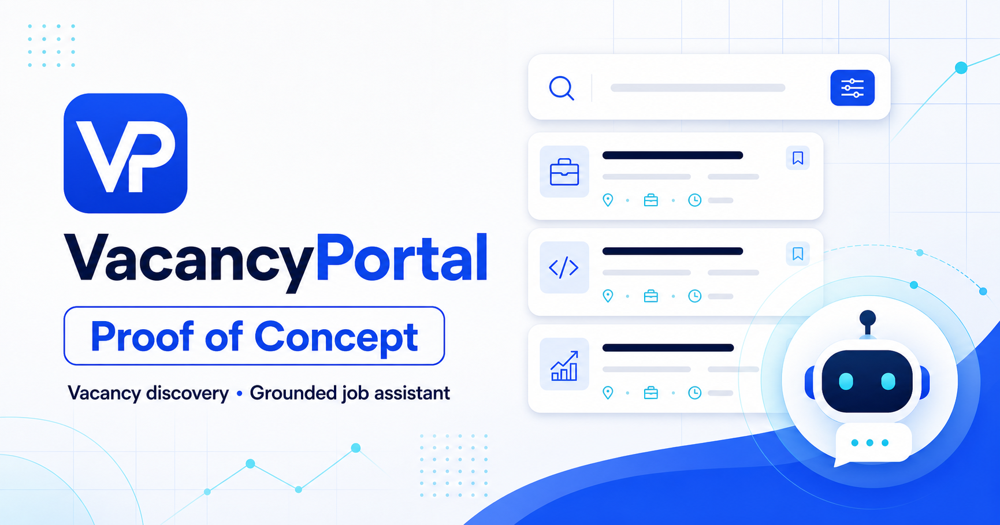
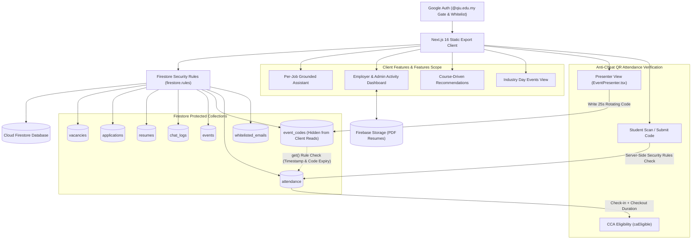

# QIU Industry Webapp

> [!NOTE]
> **Status:** Active Internal Testing Phase — Currently undergoing internal validation. Live deployment links and public hosting URLs are strictly withheld during testing.

**QIU Industry Webapp** is a full-fledged industry career, event & vacancy discovery web application built for **QIU (Quest International University)** students, academic staff, and participating industry partner employers. Built with Next.js 16 (App Router static export), React 19, TypeScript 5.9, Tailwind CSS v4.2, Cloud Firestore, and Firebase Authentication.

> [!IMPORTANT]
> **Privacy & Security Boundary:** Private source files (CSV, XLSX, XLS, TSV) and generated vacancy files (`data/jobs.json`) are strictly excluded from version control and static website export bundles. Shared vacancy, application, and event records are securely managed in Cloud Firestore and protected by server-enforced Firestore Security Rules (`firestore.rules`).



## Core Features

- **Gated Job Applications**: Applying to a vacancy requires a submitted resume on file. Candidates can provide a shareable resume URL (Google Drive, OneDrive, Dropbox) for zero-cost Firebase Spark plan hosting, or opt for direct PDF upload via Firebase Storage.
- **Events & Anti-Cheat QR Attendance Verification (NEW)**:
  - **Industry Day Event Management**: Admins create and manage event schedules, locations, speakers, session durations (`sessionMinutes`), and assigned presenter emails (`presenters`).
  - **Live Presenter View (`EventPresenter.tsx`)**: Presenters launch a dedicated live screen displaying a **Dynamic 25-Second Rotating QR Code** and 6-character code. The active step (`checkin` vs `checkout`), code, and 25s expiration timestamp (`codeExpiry`) are stored in `event_codes/{eventId}`.
  - **WhatsApp/Proxy Anti-Cheat Protection**: The `event_codes` collection is **strictly unreadable by client queries**. When a student scans/submits a code, Firestore Security Rules evaluate `eventCode(eventId)` server-side to verify step, code match, and timestamp validity (`request.time.toMillis() < codeExpiry`). Photos of QR codes shared via messaging apps expire within 25 seconds and become invalid.
  - **Two-Step Duration Verification for CCA Points**: Requires students to perform both a **Check-In** at the start and a **Check-Out** at the end. System calculates elapsed minutes vs `sessionMinutes` (threshold: ≥ 80% of `sessionMinutes` or 45 min floor) to award Co-Curricular Activity (CCA) eligibility (`caEligible`).
  - **Presenter Delegation**: Admins can assign specific speaker/presenter emails (`presenters` array) to an event, allowing guest speakers to run the live QR screen without full admin permissions.
- **Per-Job Grounded Assistant**: Embedded directly within each job details popup, the assistant is strictly grounded to that single vacancy's data (title, company, salary, location, job scope, requirements) to answer applicant queries without external LLM costs or model hallucinations.
- **Course-Driven Recommendations**: Automatically delivers personalized vacancy recommendations tailored to the student's program by matching vacancy specializations and titles against their directory course profile.
- **Employer & Admin Activity Dashboard**: A centralized activity dashboard. Employers view applications submitted specifically to their pre-bound company, while Admins and Superadmins maintain webapp-wide visibility across all candidate submissions and event attendance logs.
- **Strict Required Fields & Approval Workflow**: Enforces strict data quality when posting or editing vacancies by requiring numeric salary values alongside structured Job Scope & Minimum Requirements. Supports 4 job statuses (`approved`, `pending`, `pending_edit`, `rejected`).
- **Branded & Dark-Mode Optimized UI**: Features responsive navigation, QIU logo branding, adjustable font scaling, and high-contrast `on-primary` dark mode styling for enhanced visual clarity and accessibility.
- **Interactive Location Filtering**: Supports state selection across Malaysia as well as international country mapping.
- **Role-Based Access Control (RBAC)**: Enforced via Firestore Security Rules supporting 4 distinct user roles (`user`, `admin`, `superadmin`, `employer`), plus delegated presenter permissions.

---

## Access Model & Roles Matrix

Authentication requires a verified Google account. Access rights and capabilities are governed by server-side Firestore Security Rules and pre-whitelisted account entries.

| Role | Target Identity | Granted Capabilities & Scope |
| --- | --- | --- |
| `user` | Standard QIU student or staff (`@qiu.edu.my`) | Default role upon first Google sign-in. Can browse and filter vacancies, view course-driven recommendations, interact with per-job assistants, upload resume (URL or PDF), apply to open positions, scan dynamic QR codes for event check-in/checkout, and view their attendance history. |
| `employer` | External partner email whitelisted in `whitelisted_emails` | Granted access via pre-whitelisted email entry bound to a specific `company` name. Can post and stage edits to vacancies under their assigned company, and monitor candidate applications in their company-specific Activity Dashboard. |
| `admin` | Internal user promoted by Superadmin | Inherits all `user` capabilities plus full vacancy management (create, approve, edit, delete any vacancy webapp-wide), creating/managing Industry Day events, presenting QR screens, downloading attendance CSV reports, viewing all applications in the Activity Dashboard, and promoting `user` accounts to `admin`. |
| `superadmin` | Fixed identity (`ai@qiu.edu.my`) | Master administrator. Inherits all `admin` capabilities plus initial bulk JSON data import, system maintenance, and user role management. Immutable role that cannot be demoted or deleted. |
| *(Delegated Presenter)* | Email listed in event's `presenters` array | Non-admin users whose email is explicitly listed in an event's `presenters` field. Granted write access to `event_codes/{eventId}` to present the dynamic live QR screen for that specific event. |

> [!NOTE]
> Signing in with a non-whitelisted, non-QIU Google account results in an immediate authorization rejection; Firestore Security Rules deny all read/write access to vacancy, user, application, event, and attendance collections.

---

## Architecture Diagram



---

## Data Models & Schemas Summary

| Model / Collection | Document ID | Purpose & Key Schema Fields |
| --- | --- | --- |
| `Job` (`vacancies`) | `{id}` (numeric) | Vacancy details, salary, scope, requirements, status (`approved`/`pending`/`pending_edit`/`rejected`), location, company binding, `createdBy`, `createdAt`, `updatedAt`. |
| `Application` (`applications`) | `{studentUid}_{jobId}` | Candidate application submission record containing `studentUid`, `studentEmail`, `studentName`, `jobId`, `jobTitle`, `company`, optional `resumeId`, and `appliedAt` server timestamp. |
| `Resume` (`resumes`) | `{studentUid}` | Candidate resume on file with `source` (`upload` \| `generated` \| `link`), optional PDF `fileUrl` (Firebase Storage), `fileName`, `course`, and `updatedAt`. |
| `ChatLog` (`chat_logs`) | `{id}` | Grounded assistant conversation turn containing `studentUid`, `studentEmail`, `studentName`, `company` (optional filter), `question`, `answer`, and `createdAt`. |
| `EventItem` (`events`) | `{id}` (numeric) | Industry Day event schedule item containing `title`, `description`, `location`, `speakerName`, `speakerEmail`, `startAt`, `endAt`, `sessionMinutes`, `presenters` email array, and `createdBy`. |
| `EventCode` (`event_codes`) | `{eventId}` | **Secret server-side active code** (unreadable by client queries) containing `activeStep` (`checkin` \| `checkout` \| `none`), `activeCode` (25s rotating hash), and `codeExpiry` (epoch timestamp). |
| `Attendance` (`attendance`) | `{eventId}_{studentUid}` | Attendance verification record containing `eventId`, `eventTitle`, `studentUid`, `studentEmail`, `studentName`, `code`, `step` (`checkin` \| `checkout`), `checkInMs`, `checkOutMs`, `durationMinutes`, and `caEligible` status. |

---

## Technical Stack

| Layer | Technology | Description |
| --- | --- | --- |
| **UI** | React 19, TypeScript 5.9, Tailwind CSS 4.2 | Component-driven UI, responsive layout, dark mode, modal management |
| **Framework** | Next.js 16 (App Router) | Static site generation with `output: "export"` outputting bundle to `out/` |
| **Authentication** | Firebase Authentication | Google OAuth provider gate restricted to `@qiu.edu.my` domain and `whitelisted_emails` |
| **Database & Security** | Cloud Firestore & Security Rules | NoSQL database governed by 4-role RBAC and server-side assertion functions in `firestore.rules` |
| **Realtime State** | Firestore Reactive Subscriptions | Live data sync using `onSnapshot` for vacancies, applications, events, and presenter dynamic QR codes |
| **Storage** | Firebase Storage | Optional PDF resume file uploads with security rules enforcement |
| **Hosting** | Firebase Hosting | Production static asset distribution with custom header security policies |
| **AI Assistant** | Grounded Lexical Retrieval | High-performance deterministic keyword/field matching engine grounded to single vacancy context |
| **Testing & Verification** | Node Test Runner & Firebase Emulator | Local unit test suite (`npm test`) and Firestore Security Rules emulator tests (`npm run test:rules`) |

---

## Commands & Local Setup

### Prerequisites

- **Node.js**: `22.13.0` or newer
- **npm**: Included with Node.js
- **Java Runtime**: Required for local Firestore emulator security rules testing (`npm run test:rules`)
- **Firebase Project**: A Firebase project with Google Auth, Cloud Firestore, and Firebase Storage enabled.

### 1. Installation

Navigate into the `webapp/` directory and install project dependencies:

```bash
cd webapp
npm ci
```

### 2. Environment Setup

Create your local environment configuration file:

```bash
cp .env.example .env.local
```

Configure your Firebase Web App credentials in `.env.local`:

```dotenv
NEXT_PUBLIC_FIREBASE_API_KEY=your_api_key
NEXT_PUBLIC_FIREBASE_AUTH_DOMAIN=your_project_id.firebaseapp.com
NEXT_PUBLIC_FIREBASE_PROJECT_ID=your_project_id
NEXT_PUBLIC_FIREBASE_STORAGE_BUCKET=your_project_id.firebasestorage.app
NEXT_PUBLIC_FIREBASE_MESSAGING_SENDER_ID=your_messaging_sender_id
NEXT_PUBLIC_FIREBASE_APP_ID=your_app_id
```

### 3. Execution & Development Commands

Inside `webapp/`:

| Command | Description |
| --- | --- |
| `npm run dev` | Start Next.js development server at `http://localhost:3000` |
| `npm run build` | Build static export bundle into `out/` |
| `npm run start` | Serve static build locally via `npx serve out` |
| `npm run lint` | Run ESLint syntax and code quality checks |
| `npm test` | Build application and run unit & regression test suite |
| `npm run test:rules` | Run authorization tests against local Firestore emulator |

Recommended pre-commit verification gate:

```bash
npm run lint
npm test
npm run test:rules
```

---

## Initial Private Data Import

Private source files (CSV/XLSX) are never compiled into the client bundle. To seed or update vacancy records:

1. Run the Python data normalization script to generate `data/jobs.json` (git-ignored):
   ```bash
   python3 scripts/generate_data.py
   ```
2. Sign in to QIU Industry Webapp as Superadmin (`ai@qiu.edu.my`).
3. Open **Admin Tools** -> **Initial Data Import**.
4. Upload `data/jobs.json` to perform bulk batch writes into the Firestore `vacancies` collection.

---

## Deployment

Deploy rules, indexes, and static hosting to Firebase:

```bash
npm run build
npx firebase-tools deploy --only firestore:rules,firestore:indexes,hosting
```

---

## Security & Data Privacy

To guarantee confidentiality and protect sensitive internal data:
- Source data files (`*.csv`, `*.xlsx`, `*.xls`, `*.tsv`) and intermediate files (`data/jobs.json`) are strictly excluded from Git.
- Local configuration files containing credentials (`.env`, `.env.local`) are ignored by version control.
- `event_codes` collection is strictly unreadable by client subscriptions to prevent QR proxy leaks across WhatsApp or social media.

### Verification Command

Run this command before pushing commits to verify that no sensitive files or environment variables are tracked:

```bash
git ls-files -- data/jobs.json '*.csv' '*.xlsx' '*.xls' '*.tsv' '.env' '.env.local'
```

*Expected output: Empty output (no files returned).*

---

## Project Structure

```text
webapp/
├── app/
│   ├── auth-context.tsx         # Auth state, Google sign-in gate, role manager
│   ├── auth-policy.ts           # Email whitelist & role verification helpers
│   ├── chat.ts                  # Grounded assistant retrieval logic
│   ├── firebase-client.ts       # Firebase SDK setup (Auth, Firestore, Storage)
│   ├── globals.css              # Tailwind v4 styling & dark mode system
│   ├── layout.tsx               # Root layout & providers
│   └── page.tsx                 # Main application dashboard & layout shell
├── components/                  # Global UI components (Modal, etc.)
├── docs/                        # Project documentation (SOFTWARE_DOCUMENTATION.md)
├── features/                    # Modular feature components
│   ├── admin/                   # Admin panel, approval queue, resume viewer
│   ├── chat/                    # Grounded per-job assistant dialog
│   ├── events/                  # Events module (EventsView, EventPresenter, EventAttendance, EventForm)
│   ├── student/                 # Student profile, resume upload, history
│   └── vacancies/               # Vacancy listing, filters, modals, cards
├── lib/
│   ├── auth/                    # Course directory mappings
│   └── data/                    # Types (types.ts) and Firestore access layer (firestore.ts)
├── public/                      # Static assets & QIU branding logos
├── scripts/                     # Data processing scripts (generate_data.py)
├── tests/                       # Unit, regression, and Firestore rules emulator tests
├── firebase.json                # Firebase Hosting and emulator configuration
├── firestore.indexes.json       # Composite index definitions
├── firestore.rules              # Security rules for Firestore collections
├── storage.rules                # Security rules for Firebase Storage
├── next.config.ts               # Next.js config (output: 'export')
└── package.json                 # Dependencies & scripts
```

---

## System Notes

- **Scope**: Built as a full-fledged industry career, event & vacancy discovery web application for QIU students, staff, and industry partner employers.
- **Dynamic QR Anti-Cheat Engine**: Prevents proxy attendance by rotating single-use codes every 25 seconds stored in client-unreadable Firestore collections and verified server-side.
- **Deterministic Lexical Assistant**: Per-job assistant operates on fast deterministic lexical matching rather than LLM generation or vector embeddings, eliminating API token costs and hallucination risks during high-traffic usage.
- **Firebase Quotas & Scalability**: Operations are calibrated for production-ready performance; monitor storage and Firestore read/write limits during peak recruitment activity.
