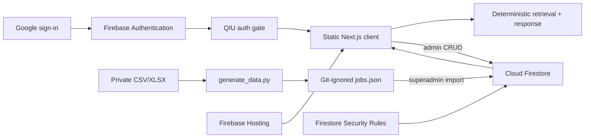

# VacancyPortal

VacancyPortal is a **proof-of-concept (POC)** vacancy discovery portal for QIU users. It provides authenticated vacancy browsing, role-based administration, shared Firestore records, and a deterministic assistant grounded only in those records.

> **Privacy boundary:** private CSV, Excel, and generated JSON files are excluded from Git and from the static website bundle. Vacancy and company data is uploaded to Firestore by the superadmin and is readable only through security rules by verified QIU Google accounts.


## Features

- Search by role, company, location, and specialization.
- Filter by company, specialization, opportunity type, and salary.
- Vacancy details, pagination, adjustable columns, larger text, responsive layout, and light/dark themes.
- Authenticated add, edit, and delete workflows for admins.
- Malaysian state selection and an interactive international country map.
- Superadmin role management and private JSON vacancy import.
- Deterministic grounded chat using only the vacancies already loaded from Firestore.
- Static Firebase Hosting deployment compatible with the Firebase Spark plan.

## Architecture



Vacancy data is not compiled into `out/`. The browser signs in, Firestore rules authorize the request, and the client subscribes to the protected `vacancies` collection. The assistant runs entirely in the browser against that authorized in-memory collection.

See [Software Documentation](docs/SOFTWARE_DOCUMENTATION.md) for component responsibilities, flows, security rules, data model, and operating guidance.

## Access model

| Identity | Access |
| --- | --- |
| Signed out, non-QIU, unverified, or non-Google identity | No vacancy or user data |
| `user` | Browse, filter, view details, and use grounded chat |
| `admin` | User access plus add, edit, and delete vacancies |
| `superadmin` | Admin access plus initial JSON import and user/admin role assignment |

Authentication must use Google, the email must be verified, and it must end exactly in `@qiu.edu.my`. Firestore rules enforce these checks independently of the UI. `ai@qiu.edu.my` is the fixed superadmin identity and cannot be demoted, duplicated, or deleted through client writes.

New QIU users create their own profile with the fixed default role `user`. Only the superadmin can change another account between `user` and `admin`.

## Technology stack

| Layer | Technology |
| --- | --- |
| UI | React 19, TypeScript, CSS |
| Application | Next.js App Router with static export |
| Authentication | Firebase Authentication with Google provider |
| Shared data | Cloud Firestore |
| Authorization | Firestore Security Rules |
| Hosting | Firebase Hosting |
| Assistant | Client-side deterministic lexical retrieval |
| Data preparation | Python CSV/XLSX normalization |
| Tests | Node test runner and Firebase Rules Unit Testing |

The active application has no Cloudflare Worker, server API route, Groq call, model API key, or paid language-model runtime. Legacy Cloudflare/D1 starter files may remain in the repository, but they are excluded from the TypeScript build and are not referenced by current npm scripts.

## Local setup

### Prerequisites

- Node.js `22.13.0` or newer
- npm
- Java for Firestore emulator tests
- A Firebase project; use a globally unique project ID
- Google authentication and Firestore enabled in that project

### Install

```bash
git clone https://github.com/SooYM/VacancyPortal.git
cd VacancyPortal
npm ci
```

### Configure Firebase

Register a Firebase Web App, then copy the example environment file:

```bash
cp .env.example .env.local
```

Replace every placeholder with the Web App configuration from Firebase Console:

```dotenv
NEXT_PUBLIC_FIREBASE_API_KEY=...
NEXT_PUBLIC_FIREBASE_AUTH_DOMAIN=<your-project-id>.firebaseapp.com
NEXT_PUBLIC_FIREBASE_PROJECT_ID=<your-project-id>
NEXT_PUBLIC_FIREBASE_STORAGE_BUCKET=<your-project-id>.firebasestorage.app
NEXT_PUBLIC_FIREBASE_MESSAGING_SENDER_ID=...
NEXT_PUBLIC_FIREBASE_APP_ID=...
```

These Firebase Web App values are public identifiers, not authorization secrets. Access is controlled by Firebase Authentication and `firestore.rules`. Never place service-account keys or private credentials in `NEXT_PUBLIC_*` variables.

In Firebase Console:

1. enable Authentication → Sign-in method → Google;
2. create a Firestore database;
3. add `localhost` and the final Hosting domain to Authentication authorized domains if they are not already present;
4. deploy the repository rules before importing vacancy data.

### Run

```bash
npm run dev
```

Open [http://localhost:3000](http://localhost:3000) and sign in with a verified `@qiu.edu.my` Google account.

## Initial private data import

Private source files are never required by the static build. To prepare an approved import locally, place the source CSV and company workbook where `scripts/generate_data.py` expects them, then run:

```bash
python3 scripts/generate_data.py
```

This creates ignored `data/jobs.json`.

1. Sign in as `ai@qiu.edu.my`.
2. Open **Admin tools**.
3. Select **Initial data import** and choose `data/jobs.json`.
4. Confirm the shared vacancy count after the Firestore batch completes.

Import accepts at most 500 records per operation. The selected file is read locally in the browser; normalized records are written directly to the protected `vacancies` collection. The file is not added to Git or the Hosting bundle.

## Commands

| Command | Purpose |
| --- | --- |
| `npm run dev` | Start Next.js locally |
| `npm run build` | Generate the static site in `out/` |
| `npm run start` | Serve `out/` locally |
| `npm run lint` | Run ESLint |
| `npm test` | Build and run application regression tests |
| `npm run test:rules` | Run authorization tests in the Firestore emulator |

Recommended gate:

```bash
npm run lint
npm test
npm run test:rules
```

## Firebase deployment

Install or invoke Firebase CLI and authenticate:

```bash
npx firebase-tools login
npx firebase-tools projects:list
```

If a project still needs to be created, its ID must be globally unique:

```bash
npx firebase-tools projects:create <your-project-id> --display-name VacancyPortal
```

Build with the matching `.env.local`, then deploy rules, indexes, and static Hosting:

```bash
npm run build
npx firebase-tools deploy --only firestore:rules,firestore:indexes,hosting --project <your-project-id>
```

The deployment uses `firebase.json` and serves `out/`. It does not require Cloud Functions, Cloud Run, App Hosting, or Blaze billing. Keep usage within current Firebase Spark quotas and review Firebase limits before wider rollout.

## Grounded assistant

`app/chat.ts` performs deterministic retrieval:

1. tokenize the question and remove common conversational words;
2. score authorized vacancies across title, company, type, specialization, location, and requirement;
3. apply supported internship, salary, and computing-study boosts;
4. return a refusal when no supplied record matches;
5. format up to five matching records as the answer and sources.

No prompt or vacancy is sent to Groq, OpenAI, or another model provider. This avoids model cost and external vacancy-data processing, but the assistant remains lexical rather than semantic.

## Privacy and security

Never commit:

- `data/jobs.json`;
- any CSV, XLS, XLSX, or TSV source file;
- `.env` or `.env.local`;
- service-account JSON, private keys, or Firebase debug logs.

Verify before pushing:

```bash
git ls-files -- data/jobs.json '*.csv' '*.xlsx' '*.xls' '*.tsv' '.env' '.env.local' '*.pem'
git check-ignore -v data/jobs.json out/index.html .env.local
```

The first command should return nothing. The second should show matching ignore rules.

Important boundaries:

- Firebase Hosting files are public; only generic UI and map assets belong there.
- Firestore rules, not the client auth screen, protect vacancy and user records.
- Authorized QIU users can read the vacancy records delivered to their browser.
- Admin and superadmin writes are validated for allowed fields, types, ranges, timestamps, and immutable audit fields.
- Firebase processes authentication profiles and Firestore records; apply institutional privacy and retention requirements before production use.

## Project structure

```text
VacancyPortal/
├── app/
│   ├── auth-context.tsx         # Sign-in gate, profile bootstrap, role manager
│   ├── auth-policy.ts           # QIU email and role policy helpers
│   ├── chat.ts                  # Deterministic grounded retrieval
│   ├── firebase-client.ts       # Firebase Web SDK initialization
│   ├── globals.css              # Responsive visual system
│   ├── layout.tsx               # Static metadata and auth provider
│   ├── map-tooltip.ts           # Edge-safe tooltip positioning
│   └── page.tsx                 # Portal, Firestore CRUD/import, map, chat
├── docs/SOFTWARE_DOCUMENTATION.md
├── public/                      # Public static assets only
├── scripts/generate_data.py     # Private source normalization
├── tests/
│   ├── admin-form-regression.test.mjs
│   ├── chat-retrieval.test.mjs
│   ├── firestore-rules.test.mjs
│   └── map-tooltip-regression.test.mjs
├── firebase.json
├── firestore.indexes.json
├── firestore.rules
└── next.config.ts               # output: export
```

## POC limitations

- This is not a production recruitment or applicant-tracking system.
- The assistant is deterministic lexical retrieval, not an LLM or vector RAG system.
- Company summaries are supplied but unverified.
- Salary figures and DOSM comparisons are contextual and may use different pay periods.
- Firestore has no approval, expiry, backup, audit-history, or moderation workflow in this POC.
- Role changes may require the affected user to sign out and back in before the UI reflects them; Firestore rules apply the new authorization immediately.
- Firebase Spark quotas limit storage, reads, writes, and Hosting transfer.

## License

No license has been declared. Add one before redistribution or external contribution.
