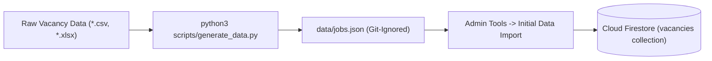

# QIU Industry Webapp — Data Models, Schemas & Firestore Dictionary

**Status:** Active Internal Testing Phase — Currently undergoing internal validation. Live deployment links and public hosting URLs are strictly withheld during testing.<br>
**Target Audience:** Database Administrators, Backend Engineers, Frontend Developers, Data Analysts, and Security Reviewers<br>
**Source Specifications:** [lib/data/types.ts](../lib/data/types.ts), [lib/data/firestore.ts](../lib/data/firestore.ts), and [firestore.rules](../firestore.rules)

---

## 1. Data Model Overview

The **QIU Industry Webapp** operates on a NoSQL Cloud Firestore architecture. System entities fall into five primary categories:
1. **User Profiles & Access Rights**: `users`, `whitelisted_emails`, `employer_signups`.
2. **Exhibitor & Vacancy Core**: `companies`, `vacancies`, `job_stats`.
3. **Student Career Workflows**: `applications`, `resumes`, `view_events`, `chat_logs`.
4. **Events & Dynamic Anti-Cheat Attendance**: `events`, `event_codes`, `attendance`.
5. **Portal Configuration**: `app_settings`.

---

## 2. Canonical TypeScript Domain Interfaces

All feature modules import canonical domain interfaces from [lib/data/types.ts](../lib/data/types.ts).

```ts
// lib/data/types.ts

export type UserRole = "user" | "employer" | "admin" | "superadmin";

export type JobStatus = "approved" | "pending" | "pending_edit" | "rejected";

export interface Job {
  id: number;
  title: string;
  company: string;
  type: string;                   // "Permanent" | "Internship" | "Contract" | "Part-time"
  specialization: string;
  vacancies: number;              // 1 to 10,000
  location: string;
  locationMode?: "malaysia" | "international";
  state?: string;
  country?: string;
  mapX?: number;
  mapY?: number;
  salaryLabel: string;
  salary: number;                 // RM monthly salary
  payFrequency: string;           // "Monthly" | "Annually" | "Weekly" | "Daily"
  minimumRequirement: string;    // "SPM" | "Certificate" | "Diploma" | "Degree" | "Post-graduate"
  detailsLink: string;
  email: string;
  companySummary: string;
  companySources: string[];
  jobScope?: string;              // Responsibilities / scope
  requirement?: string;           // Candidate qualifications
  youtubeUrl?: string;            // Promotional video URL
  isCustom?: boolean;
  status?: JobStatus;             // Approval status
  pendingEdit?: Partial<Job> | null; // Staged diff for approved job edits
  createdBy?: string;
}

export interface Application {
  id: string;                      // `${studentUid}_${jobId}`
  studentUid: string;
  studentEmail: string;
  studentName: string;
  jobId: number;
  jobTitle: string;
  company: string;
  resumeId?: string;
  resumeChoice?: "generated" | "link";
  appliedAt?: unknown;             // Firestore serverTimestamp
}

export interface ViewEvent {
  id: string;                      // `${studentUid}_${jobId}`
  studentUid: string;
  jobId: number;
  jobTitle: string;
  company: string;
  viewedAt?: unknown;
}

export interface ResumeProfile {
  headline?: string;
  summary?: string;
  phone?: string;
  cgpa?: string;
  fypTitle?: string;
  fypSummary?: string;
  skills?: string;                 // Free-text (comma/newline separated)
  education?: string;
  experience?: string;
  achievements?: string;
  links?: string[];                // Portfolio / GitHub / LinkedIn URLs
}

export interface Resume {
  id: string;                      // studentUid
  studentUid: string;
  studentEmail: string;
  studentName: string;
  course?: string;
  fileUrl?: string;                // External link or Storage download URL
  fileName?: string;
  source: "upload" | "generated" | "link";
  profile?: ResumeProfile;         // Structured fields powering GeneratedCV
  updatedAt?: unknown;
}

export interface ChatLog {
  id: string;
  studentUid: string;
  studentEmail: string;
  studentName: string;
  company: string | null;          // Detected target company, if any
  question: string;
  answer: string;
  createdAt?: unknown;
}

export interface EventItem {
  id: number;
  title: string;
  description: string;
  location: string;
  speakerName: string;
  speakerLinks: string[];         // LinkedIn / portfolio URLs
  speakerPhotoUrl?: string;
  startAt: string;                // ISO "YYYY-MM-DDTHH:mm"
  endAt: string;
  sessionMinutes: number;         // Scheduled length driving CCA calculation
  presenters: string[];           // Whitelisted presenter emails
  qrRotateSeconds?: number;
  specialization?: string;        // Target field (e.g. "AI & Machine Learning" or custom text)
  createdBy?: string;
}

export interface EventCode {
  activeStep: "checkin" | "checkout" | "none";
  activeCode: string;             // Dynamic 30s rotating hash
  codeExpiry: number;             // Epoch milliseconds
}

export interface Attendance {
  id: string;                      // `${eventId}_${studentUid}`
  eventId: number;
  eventTitle: string;
  studentUid: string;
  studentEmail: string;
  studentName: string;
  code: string;                   // Last validated 30s code
  step: "checkin" | "checkout";
  checkInMs?: number;             // Epoch ms at Check-In
  checkOutMs?: number;            // Epoch ms at Check-Out
  durationMinutes?: number;
  caEligible?: boolean;           // CCA points eligibility flag
  checkInAt?: unknown;
  checkOutAt?: unknown;
}

export interface UserRecord {
  uid: string;
  email: string;
  displayName: string;
  photoURL: string;
  role: UserRole;
  course?: string;
  courseCode?: string;
  company?: string;                // Employer company binding
}

export interface Company {
  id: number;
  name: string;
  website?: string;
  logoUrl?: string;
  videoUrl?: string;               // YouTube corporate video URL
  summary?: string;
  order?: number;                  // Sort weight
  boothNumber?: string;            // Venue booth identifier
  logoBackground?: "auto" | "light" | "dark";
  status?: "approved" | "pending" | "pending_edit";
  pendingEdit?: Partial<Company> | null;
  createdBy?: string;
}

export interface EmployerSignup {
  email: string;                   // Normalized lowercase email
  name: string;
  company: string;
  contact?: string;
  website?: string;
  logoUrl?: string;
  videoUrl?: string;
  summary?: string;
  status: "pending" | "approved";
  createdAt?: unknown;
  updatedAt?: unknown;
}

export interface AppSettings {
  portalTitle: string;
  portalTagline: string;
  qrRotateSeconds: number;
  ccaPercent: number;
  tabs: { home: boolean; events: boolean; vacancies: boolean; resume: boolean; history: boolean };
}

export interface JobStats {
  applicants: number;              // Real-time applicant tally
}
```

---

## 3. Detailed Firestore Collection Specifications

#### Usage Notes
- Employers can only manage `jobItems` where `createdBy` matches their UID email (`authorEmail`).
- `employer_signups` are external non-QIU vendors awaiting approval. Once approved (`approved: true`), an Admin provisions an `appUsers` profile and adds them to `companies`.
- Admins have access to a robust sort and filter panel in the Manage Vacancies dashboard to sort jobs by creation time, title, and company alphabetically.

### 3.1 `users/{uid}`
- **Document ID**: User's Firebase Authentication UID (`request.auth.uid`).
- **Purpose**: User profile record holding role assignments and academic mapping.
- **Schema & Validation**:
  - `email`: string (required)
  - `displayName`: string (max 120 chars)
  - `photoURL`: string (max 2,048 chars)
  - `role`: string (`'user'` \| `'employer'` \| `'admin'` \| `'superadmin'`). Minting `'superadmin'` requires fixed identity `ai@qiu.edu.my`.
  - `course`: string (max 120 chars)
  - `courseCode`: string (max 120 chars)
  - `company`: string (max 160 chars)
  - `createdAt`, `updatedAt`: timestamp

### 3.2 `whitelisted_emails/{emailId}`
- **Document ID**: Lowercased normalized email address (e.g. `employer@company.com`).
- **Purpose**: Authorizes non-QIU emails to sign in as employers or admins.
- **Schema**:
  - `email`: string
  - `company`: string (assigned employer company name)
  - `addedBy`: string
  - `createdAt`: timestamp

### 3.3 `vacancies/{vacancyId}`
- **Document ID**: Unique numeric ID (`Date.now()` or legacy numeric key).
- **Purpose**: Job vacancy listing repository.
- **Schema & Validation**:
  - `id`: integer ($> 0$)
  - `title`, `company`, `specialization`, `location`: string (1-160 chars)
  - `type`: enum (`'Permanent'`, `'Internship'`, `'Contract'`, `'Part-time'`)
  - `vacancies`: integer (1 to 10,000)
  - `salary`: number ($0$ to $1,000,000$)
  - `salaryLabel`: string (max 80 chars)
  - `payFrequency`: enum (`'Monthly'`, `'Annually'`, `'Weekly'`, `'Daily'`)
  - `minimumRequirement`: enum (`'SPM'`, `'Certificate'`, `'Diploma'`, `'Degree'`, `'Post-graduate'`)
  - `email`: string (max 254 chars)
  - `locationMode`: enum (`'malaysia'`, `'international'`)
  - `state`, `country`: string (max 80 chars)
  - `jobScope`, `requirement`: string (max 5,000 chars)
  - `status`: enum (`'approved'`, `'pending'`, `'pending_edit'`, `'rejected'`)
  - `pendingEdit`: map or null
  - `createdBy`: string
  - `createdAt`, `updatedAt`: timestamp

### 3.4 `applications/{appId}`
- **Document ID**: `${studentUid}_${jobId}`.
- **Purpose**: Prevents duplicate applications while linking students to vacancies.
- **Schema & Validation**:
  - `studentUid`: string
  - `studentEmail`: string (max 254 chars)
  - `studentName`: string (max 160 chars)
  - `jobId`: integer ($> 0$)
  - `jobTitle`, `company`: string (max 160 chars)
  - `resumeId`: string (optional, max 256 chars)
  - `resumeChoice`: enum (`'generated'`, `'link'`)
  - `appliedAt`: serverTimestamp

### 3.5 `resumes/{uid}`
- **Document ID**: Student's UID (`request.auth.uid`).
- **Purpose**: Single active resume on file per student.
- **Schema & Validation**:
  - `studentUid`: string (must equal document ID)
  - `source`: enum (`'upload'`, `'generated'`, `'link'`)
  - `fileUrl`: string (max 2,048 chars)
  - `fileName`: string (max 256 chars)
  - `profile`: map (structured CV profile fields, max 20 keys)

### 3.6 `chat_logs/{id}`
- **Document ID**: `${studentUid}_${Date.now()}`.
- **Purpose**: Audit trail of grounded assistant queries.
- **Schema & Validation**:
  - `studentUid`: string
  - `question`: string (max 5,000 chars)
  - `answer`: string (max 20,000 chars)
  - `company`: string or null (detected target company)

### 3.7 `events/{eventId}`
- **Document ID**: Unique numeric event ID.
- **Purpose**: Industry Day talk schedule and presenter assignments.
- **Schema & Validation**:
  - `id`: integer ($> 0$)
  - `title`: string (1-200 chars)
  - `description`, `location`, `speakerName`: string
  - `speakerLinks`: list of strings (max 10 URLs)
  - `sessionMinutes`: integer ($0$ to $1,440$)
  - `presenters`: list of lowercased emails (max 50)

### 3.8 `event_codes/{eventId}` (Secret Server Collection)
- **Document ID**: Event ID string (`String(eventId)`).
- **Purpose**: **Unreadable by client queries** (`allow read: if isAdmin()`). Stores the active 30s rotating attendance code.
- **Schema**:
  - `activeStep`: enum (`'checkin'`, `'checkout'`, `'none'`)
  - `activeCode`: string (30s code hash)
  - `codeExpiry`: number (epoch ms)

### 3.9 `attendance/{attendanceId}`
- **Document ID**: `${eventId}_${studentUid}`.
- **Purpose**: Verification record of student event attendance.
- **Schema & Validation**:
  - `eventId`: integer
  - `studentUid`, `studentEmail`, `studentName`: string
  - `code`: string (must match active secret code in `event_codes/{eventId}`)
  - `step`: enum (`'checkin'`, `'checkout'`)
  - `checkInMs`, `checkOutMs`: number
  - `durationMinutes`: number
  - `caEligible`: boolean

### 3.10 `job_stats/{jobId}`
- **Document ID**: Vacancy ID string (`String(jobId)`).
- **Purpose**: Atomic applicant tallies displayed on vacancy cards without reading full application collections.
- **Schema**:
  - `applicants`: number (updated via `increment(+1)` on apply, `increment(-1)` on withdrawal)

### 3.11 `companies/{companyId}`
- **Document ID**: Unique numeric company ID.
- **Purpose**: Exhibitor directory entries shown on the Home landing page.
- **Schema & Validation**:
  - `id`: integer ($> 0$)
  - `name`: string (1-200 chars)
  - `website`, `logoUrl`, `videoUrl`: string (max 2,048 chars)
  - `summary`: string (max 5,000 chars)
  - `boothNumber`: string (max 40 chars)
  - `logoBackground`: enum (`'auto'`, `'light'`, `'dark'`)
  - `status`: enum (`'approved'`, `'pending'`, `'pending_edit'`)

### 3.12 `employer_signups/{emailId}`
- **Document ID**: Lowercased self-registering email.
- **Purpose**: Self-service employer registration request queue.
- **Schema**:
  - `email`, `name`, `company`: string (required)
  - `contact`, `website`, `logoUrl`, `videoUrl`, `summary`: string (optional)
  - `status`: enum (`'pending'`, `'approved'`)

### 3.13 `app_settings/{docId}`
- **Document ID**: `'app'`.
- **Purpose**: Portal-wide administrative settings.
- **Schema**:
  - `portalTitle`, `portalTagline`: string
  - `qrRotateSeconds`: number ($5$ to $600$)
  - `ccaPercent`: number ($0$ to $100$)
  - `tabs`: map of boolean tab toggles

---

### 3.14 `event_interests/{eventId}_{uid}`
Student marked interest in a talk. **The document id is the uniqueness rule** — pinned in the security rules, so a student can hold at most one per event and the tally can never drift. There is no counter field anywhere; the number shown is a server-side count of these documents (`countEventInterests`).

| Field | Type | Notes |
| --- | --- | --- |
| `eventId` | `number` | Must match the id prefix. |
| `studentUid` | `string` | Must equal `request.auth.uid`. |
| `studentEmail`, `studentName` | `string` | For admin export. |
| `createdAt` | `timestamp` | |

### 3.15 `event_live_chat/{eventId}`
The open/closed switch for a talk's Q&A. A **separate document, not a field on the event**, because the presenter who runs the session is not an admin and cannot write the event document. Writable by an admin or the email listed in that event's `presenters`, reusing the same delegation clause as `event_codes`.

| Field | Type | Notes |
| --- | --- | --- |
| `eventId` | `number` | |
| `enabled` | `boolean` | Read live by students; the rules also `get()` it when accepting a message. |

### 3.16 `talk_live_chats/{msgId}`
One question asked during a talk. Creation is rejected unless `event_live_chat/{eventId}.enabled == true`, so a crafted client cannot post into a closed session. `studentName` is pinned to the caller's token so nobody can post as "Admin". Deletable by an admin or the event's presenter, so abuse can be removed and not merely stopped.

| Field | Type | Notes |
| --- | --- | --- |
| `eventId` | `number` | |
| `studentUid` | `string` | Must equal `request.auth.uid`. |
| `studentName` | `string` | Must equal the caller's token name or email. |
| `message` | `string` | 1–500 characters, enforced in rules. |

### 3.17 `event_feedbacks/{eventId}_{uid}`
A post-talk review. Creation requires an **attendance record to exist** for that event — "the student who attended can provide feedback" is enforced by `exists(/attendance/{eventId}_{uid})` in the rules, not by the UI.

| Field | Type | Notes |
| --- | --- | --- |
| `eventId`, `eventTitle` | `number`, `string` | |
| `studentUid` | `string` | Must equal `request.auth.uid`; id is pinned. |
| `rating` | `int` | 1–5, enforced in rules. |
| `comment` | `string` | ≤ 2000 characters. |

### 3.18 `interview_slots/{slotId}`
A mock interview slot opened by an employer. `slotId` is `{companySlug}_{date}_{startTime}`.

**`bookedStudents` carries uids and nothing else, on purpose.** Students must be able to read a slot to see whether it is full and whether they hold it, so anything stored here is readable campus-wide. Contact details live in `interview_bookings` (3.19).

| Field | Type | Notes |
| --- | --- | --- |
| `companyName` | `string` | Slots are matched to employers by name. |
| `date`, `startTime`, `endTime` | `string` | `YYYY-MM-DD`, `HH:mm`. |
| `maxBookings` | `number` | Capacity, enforced in rules. |
| `bookedStudents` | `InterviewSeat[]` | `{ studentUid, bookedAt }` only. |

A student's update may touch only `bookedStudents`/`updatedAt`, must move the list by exactly one, must stay within `maxBookings`, and the entry that moved must be their own — otherwise any student could cancel another's booking.

### 3.19 `interview_bookings/{slotId}_{uid}`
The identity behind one seat. **Staff-only** (`isAdmin() || isEmployer()`). Written in the same transaction as the seat, so the two cannot diverge; deleted with the seat on cancel, and with the slot on delete.

| Field | Type | Notes |
| --- | --- | --- |
| `slotId`, `companyName`, `date`, `startTime` | `string` | Denormalised for the employer view. |
| `studentUid` | `string` | Must equal `request.auth.uid`; id is pinned. |
| `studentEmail`, `studentName`, `course`, `employeeId` | `string` | The PII this split exists to protect. |

### 3.20 `company_views/{companyId}_{uid}_{YYYY-MM-DD}`
One profile visit, deduplicated to once per student per company per day. **The id is pinned in the rules and the collection is create-only**, so the dedupe is enforced server-side rather than by the client, and the total cannot be inflated by re-opening a profile. Readable by staff only.

There is deliberately **no counter document.** An earlier design kept `company_stats/{id}.views` incremented by the client; a field a client increments can be set to any value from the browser console, letting a student — or a rival employer — fake another company's numbers. The employer dashboard calls `countCompanyViews()` instead.

## 4. Real-Time Subscriptions & Atomic Counter Operations

The webapp leverages Firestore `onSnapshot` subscriptions for reactive UI updates:
- **`subscribeVacancies()`**: Listens to `vacancies` changes.
- **`subscribeJobStats()`**: Listens to `job_stats` for real-time applicant counter increments.
- **`subscribeCompanies()`**: Listens to `companies` directory updates.
- **`subscribeAttendance()`**: Listens to `attendance` records for student logs and admin dashboards.

### Atomic Tally Operations ([firestore.ts](../lib/data/firestore.ts#L330-L335))

```ts
export async function bumpApplicants(jobId: number, delta: 1 | -1) {
  const ref = doc(requireDb(), COLLECTIONS.jobStats, String(jobId));
  await setDoc(ref, { applicants: increment(delta) }, { merge: true });
}
```

---

## 5. Offline Data Normalization & Batch Import Pipeline

Private source data (`*.csv`, `*.xlsx`) is processed offline via [scripts/generate_data.py](../scripts/generate_data.py):



1. **Extraction**: Python script reads raw spreadsheet files from workspace directory.
2. **Normalization**: Cleaning salary figures, mapping Malaysian states, assigning unique integer IDs.
3. **JSON Export**: Output written to `data/jobs.json` (git-ignored).
4. **Batch Import**: Superadmin (`ai@qiu.edu.my`) uploads JSON in **Admin Tools**, executing Firestore batch write operations.
