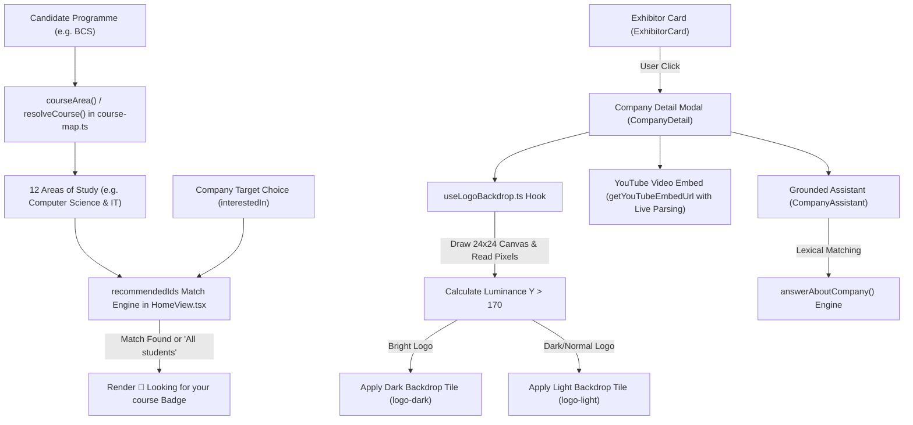
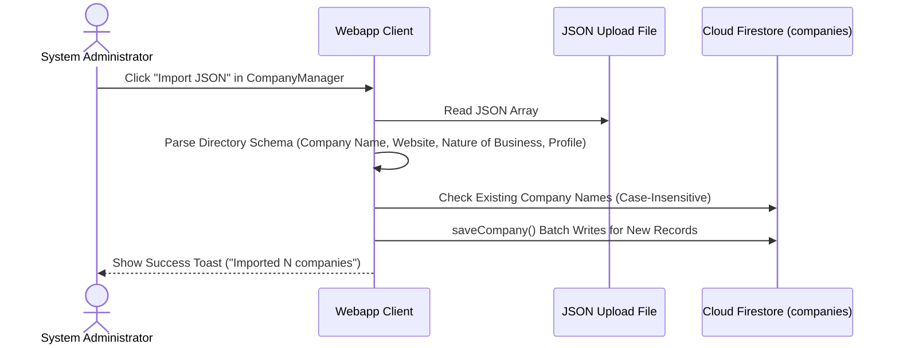
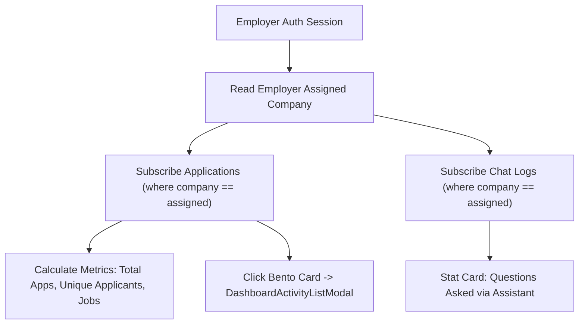

# QIU Industry Webapp — Feature Modules Technical Guide

**Status:** Active Internal Testing Phase — Currently undergoing internal validation. Live deployment links and public hosting URLs are strictly withheld during testing.<br>
**Target Audience:** Frontend Developers, System Integrators, UI/UX Engineers, and Technical Reviewers<br>
**Source Implementation Directory:** [webapp/features/](../features/) and [webapp/components/](../components/)

---

## 1. Feature Modules Architecture Overview

The **QIU Industry Webapp** feature architecture is structured into independent, loosely coupled modules. Each feature encapsulates its UI rendering, local state management, and Firestore interaction logic:

```text
webapp/
├── components/
│   ├── ImagePreview.tsx          # Real-time URL image previewer
│   ├── Modal.tsx                 # Accessible modal dialog container
│   └── toast.tsx                 # Global reactive toast notification system
├── features/
│   ├── Guide.tsx                 # Interactive 4-role user guide (Student, Employer, Admin, Super-Admin)
│   ├── admin/
│   │   ├── AdminPanel.tsx        # Sub-tab navigation container
│   │   ├── AdminSummary.tsx      # System overview metrics, bar charts & bento action pop-outs
│   │   ├── ApprovalQueue.tsx     # Review queue & 1-click bulk approvals
│   │   ├── CompanyManager.tsx    # Exhibitor editor, study area chip selector & JSON bulk importer
│   │   ├── DashboardActivityListModal.tsx # Bento metric card log pop-out modal
│   │   ├── DashboardStudentsModal.tsx # Active student engagement summary modal
│   │   ├── EmployerSummary.tsx   # Scoped employer analytics & bento pop-outs
│   │   ├── ResumeViewer.tsx      # Multi-mode candidate resume viewer
│   │   ├── SettingsPanel.tsx     # System settings & portal toggles
│   │   ├── StudentActivity.tsx   # Candidate application feeds
│   │   └── TalkChatHistory.tsx   # Talk Q&A audit trail & CSV report exporter
│   ├── events/
│   │   ├── EventAttendance.tsx   # Attendance log & CSV report exporter
│   │   ├── EventPresenter.tsx    # Live 30s rotating QR projector view
│   │   ├── EventsView.tsx        # Industry Day event schedule dashboard
│   │   ├── SpeakerAvatar.tsx     # Speaker headshot avatar fallback
│   │   └── TalkLiveChat.tsx      # Live Q&A, presentation mode font zoom & attendance gating
│   ├── home/
│   │   ├── HomeView.tsx          # Exhibitor landing directory, course matching & RAG assistant
│   │   └── useLogoBackdrop.ts    # HTML5 Canvas 2D logo luminance sampler
│   ├── student/
│   │   ├── cv-download.ts        # Standalone HTML/PDF download engine
│   │   ├── GeneratedCV.tsx       # Structured profile CV renderer
│   │   ├── StudentHistory.tsx    # Application history & withdrawal tab
│   │   └── StudentResume.tsx     # Resume profile editor
│   └── vacancies/
│       ├── VacancyCard.tsx       # Vacancy listing card component
│       ├── VacancyFilters.tsx    # 5-mode vacancy sorting & search
│       └── VacancyModal.tsx      # Vacancy popup & JobAssistant RAG
└── lib/
    └── data/
        └── course-map.ts         # 43 QIU programmes, 12 study areas, course resolver & match logic
```

---

## 2. Deep Dive Technical Feature Specifications

### Module 1: Home Directory, Nature of Business & Course Recommendations ([HomeView.tsx](../features/home/HomeView.tsx), [course-map.ts](../lib/data/course-map.ts) & [useLogoBackdrop.ts](../features/home/useLogoBackdrop.ts))

#### Overview
Renders the primary Industry Day exhibitor directory page displaying participating company cards, corporate summaries, booth tags, target study area badges, embedded YouTube videos, and a grounded per-company RAG assistant.



#### Nature of Business & Target Study Areas (`course-map.ts`)
Catalogue of 43 QIU academic programmes across 6 faculties mapped to 12 broad Areas of Study (`AREAS_OF_STUDY`):
- **12 Areas of Study**: *"Accounting & Finance"*, *"Actuarial Science Mathematics & Statistics"*, *"Biological Environmental & Life Sciences"*, *"Business Management & Administration"*, *"Computer Science & Information Technology"*, *"Education & Pedagogy"*, *"Engineering & Industrial Technology"*, *"Hospitality Tourism & Culinary Arts"*, *"Media Communication & Advertising"*, *"Medicine Biomedical & Healthcare"*, *"Pharmacy & Pharmaceutical Sciences"*, *"Social Sciences & Psychology"*.
- **Course Resolution (`resolveCourse`)**: Normalizes raw user course strings (e.g. `"BCS"`, `"BCS - Year 2"`, `"Bachelor of Computer Science (Hons)"`) against `PROGRAMMES`, matching longest abbreviations first, then programme names, then returning free text fallback.
- **Area Extraction (`courseArea`)**: Resolves candidate programme code to its primary study area string.

#### Target Selection & Recommendation Match Engine (`recommendedIds`)
- **Exhibitor Multi-Select**: Employers pick target study areas from a multi-select dropdown (`ALL_STUDENTS` + 12 study areas), rendered as removable chips saved to `interestedIn`.
- **Match Evaluation**: `recommendedIds` computes a `Set<number>` of matching company IDs by testing candidate study area or exact course string against company `interestedIn` arrays (or `"all students"`).
- **UI Surface**: Matching company cards display a `🌟 Looking for your course` success badge and gain top priority under the "Recommended for you" sort option.

#### Brand Logo Luminance Sampling Hook (`useLogoBackdrop.ts`)
Calculates image luminance using an HTML5 2D Canvas to automatically determine whether a company logo requires a light or dark background tile for optimal visual contrast:
- Formula: $Y = 0.2126R + 0.7152G + 0.0722B$
- Evaluates $Y > 170$ to switch `.logo-light` vs `.logo-dark`.

---

### Module 2: Employer Self-Registration & Company Bulk JSON Import ([ApprovalQueue.tsx](../features/admin/ApprovalQueue.tsx) & [CompanyManager.tsx](../features/admin/CompanyManager.tsx))

#### Overview
Enables external partner employers to self-register for Industry Day access and allows administrators to bulk-import exhibitor profiles from JSON files.



#### Company Bulk JSON Import (`importJson`)
- **JSON Parsing**: Accepts JSON arrays of objects conforming to either directory export schemas (`Company Name`, `Company Website`, `Nature of Business`, `Company Profile`) or standard schemas (`name`, `website`, `summary`).
- **Summary Synthesis**: Merges profile description and nature of business into a clean pre-formatted summary (`[profile, nature && 'Nature of business: ' + nature].filter(Boolean).join('\n\n')`).
- **Deduplication Engine**: Converts incoming names to lowercase and cross-references existing database entries and intra-file records to prevent duplicate creation.

---

### Module 3: Admin Dashboard Architecture Rework ([AdminPanel.tsx](../features/admin/AdminPanel.tsx))

#### Sub-Tab Navigation Model
The admin dashboard features modular sub-tabs partitioned by administrative responsibility:

```text
AdminPanel (Admin View)
├── access            ──> RoleManager (Promote/demote user roles)
├── approvals         ──> ApprovalQueue (Review signups, vacancies, staged edit diffs)
├── manageExhibitor   ──> CompanyManager [view="manage"] (Edit/delete existing exhibitors, JSON import)
├── addExhibitor      ──> CompanyManager [view="add"] (Add new exhibitor with logo fetcher)
├── manageVac         ──> Vacancy Manager (Filter, search, edit, delete vacancies)
├── addVac            ──> Vacancy Form (Create new vacancy listing)
├── activity          ──> StudentActivity [mode="all"] (Candidate application accordions)
├── resumes           ──> ResumeViewer (Search & view student PDF/Link/Generated CVs)
├── chats             ──> ChatHistory [mode="all"] (Audit assistant chat turns)
├── talkChats         ──> TalkChatHistory (Audit live talk questions & CSV export)
└── settings          ──> SettingsPanel (Portal title, QR rotation speed, CCA rules, data reset)
```

- **Role Gating**: Employers see a streamlined menu scoped strictly to their assigned company (`company`, `addVac`, `manageVac`, `resumes`, `activity`, `chats`). Admins access webapp-wide tabs.

#### Interactive Bento Metric Pop-outs (`Stat`)
Metric tiles in `AdminSummary.tsx` double as interactive buttons (`stat-card-action`). Clicking any metric tile opens `DashboardActivityListModal.tsx`, which displays the full list of records matching the metric's scope (applications, job views, check-ins, assistant queries) with 1-click item navigation.

#### Active Students Summary Modal (`DashboardStudentsModal.tsx`)
Clicking the "Students active" tile opens `DashboardStudentsModal.tsx`. It aggregates all activity records in the selected time range by candidate key (`studentUid` or `actor`), calculating distinct active student counts, action tallies per candidate, and last active dates.

#### Talk Q&A Audit Log (`TalkChatHistory.tsx`)
Maintains a full admin audit log of every question asked across live talk sessions. Presenters may delete inappropriate messages from the live room feed, making the live feed insufficient for post-event auditing. `TalkChatHistory` reads all chat logs, groups them by event, provides query filtering, and supports 1-click CSV export (`talk-questions-YYYY-MM-DD.csv`).

#### Data Export & CSV Integration
Admin and Employer sub-tabs feature integrated **CSV Export** buttons powered by a client-side exporter (`csv.ts`). This allows seamless offline extraction of application rosters, chat histories, vacancy stats, and event attendance straight from active table views without server-side processing.

#### Workspace Employee ID Telemetry
Automatically extracts the user's Employee ID from the Google Workspace Directory (`directory.readonly` scope) upon sign-in. This ID is subsequently stamped onto view events, candidate applications, and chat logs to guarantee internal tracking and accountability during events.

---

### Module 4: Employer Summary & Scoped Analytics ([EmployerSummary.tsx](../features/admin/EmployerSummary.tsx))

#### Overview
Provides a dedicated metrics landing dashboard for employers signed into the portal.



#### Metrics Displayed & Interactive Pop-outs
- **Total Applications**: Total candidate applications submitted for company vacancies.
- **Unique Applicants**: Count of distinct student UIDs (`Set(studentUid)`).
- **Jobs Applied To**: Count of active vacancies with candidates.
- **Assistant Queries**: Count of student questions asked about the company via `JobAssistant` / `CompanyAssistant`.
- **Interactive Bento Pop-outs**: Clicking application or question tiles opens `DashboardActivityListModal` scoped to the employer's company.
- **Server-Side Profile View Telemetry (`countCompanyViews`)**: Profile visits are counted server-side per student per session, preventing duplicate inflations.
- **Tenant Scope Isolation**: Strict client-side and server-side filtering preventing employers from viewing competitor data.

---

### Module 5: Generated CV Engine & Printable HTML Engine ([GeneratedCV.tsx](../features/student/GeneratedCV.tsx) & [cv-download.ts](../features/student/cv-download.ts))

#### Overview
Allows candidates to build a structured curriculum vitae directly within the webapp without hosting PDF files on paid cloud storage buckets.

```mermaid
flowchart LR
    StudentForm["Profile Form (StudentResume.tsx)"] --> SaveProfile["Save ResumeProfile to resumes/{uid}"]
    SaveProfile --> RenderView["Render GeneratedCV.tsx (In-App Preview)"]
    RenderView -->|"1-Click Download"| DownloadEngine["downloadCV(resume) in cv-download.ts"]
    DownloadEngine --> HTMLBlob["Synthesize Standalone HTML Document"]
    HTMLBlob --> SaveFile["Trigger Browser Download: CV_Student_Name.html"]
    SaveFile --> DirectPrint["User Opens & Prints to PDF (@media print)"]
```



#### Printable HTML Generator (`cv-download.ts`)
Outputs a standalone HTML file embedding custom CSS print media queries (`@media print`):

```ts
// features/student/cv-download.ts
export function downloadCV(resume: Resume) {
  const p = resume.profile ?? {};
  const name = resume.studentName || resume.studentEmail || "Student";
  const html = `<!doctype html><html lang="en"><head><meta charset="utf-8"><title>${esc(name)} — CV</title>
  <style>
    body { background: #eceef1; font-family: system-ui, sans-serif; }
    .sheet { max-width: 800px; margin: 2rem auto; background: #fff; padding: 2.4rem; }
    @media print { body { background: #fff; } .sheet { box-shadow: none; margin: 0; } }
  </style></head><body><div class="sheet">...</div></body></html>`;

  const blob = new Blob([html], { type: "text/html;charset=utf-8" });
  const url = URL.createObjectURL(blob);
  const a = document.createElement("a");
  a.href = url;
  a.download = `CV_${name.replace(/[^\w]+/g, "_")}.html`;
  a.click();
  URL.revokeObjectURL(url);
}
```

#### Automated Application Withdrawal
To maintain absolute data integrity and prevent broken application references, if a candidate removes or replaces a shared CV source document, the system automatically runs a cascading hook that seamlessly withdraws any active job applications tied to that original resume.

---

### Module 6: Global Toast Notification System ([toast.tsx](../components/toast.tsx))

#### Overview
A lightweight, event-driven notification engine delivering non-blocking visual user feedback across save, edit, delete, apply, check-in, check-out, and withdrawal operations.

```ts
// components/toast.tsx
type Kind = "success" | "error" | "info";

export function notify(message: string, kind: Kind = "success") {
  const toast = { id: ++counter, message, kind };
  listeners.forEach((l) => l(toast));
}
```

- **Subscriber Hook**: `<Toaster />` component mounts near the root layout (`app/layout.tsx`), listening to notification events.
- **Auto-Dismiss Window**: Toasts automatically fade out after $3,800\text{ ms}$ or when manually dismissed by clicking the close button (`×`).

---

### Module 7: Live Image Preview Component ([ImagePreview.tsx](../components/ImagePreview.tsx))

#### Overview
Positioned directly under form text inputs for company logos, speaker headshots, and video links to allow instant visual confirmation before saving records.

- **Regex Verification**: Evaluates `url` against `/^https?:\/\/.+/i`. Renders nothing for empty/invalid strings.
- **Fallback State**: Catches broken or un-fetchable image links using `onError={() => setFailed(true)}`, displaying a warning notice (`⚠ Couldn't load this image — check the link is public and points to an image.`).

---

### Module 8: Events UX, 30s Dynamic QR & Live Q&A ([EventPresenter.tsx](../features/events/EventPresenter.tsx) & [TalkLiveChat.tsx](../features/events/TalkLiveChat.tsx))

#### Live Presenter Screen (`EventPresenter.tsx`)
Displays a live projector view generating a dynamic rotating QR code every 30 seconds (`REFRESH_MS = 30000`):

```ts
// features/events/EventPresenter.tsx (L23-L39)
useEffect(() => {
  async function rotate() {
    const code = randomCode();
    const codeExpiry = Date.now() + refreshMs + 6000; // 6s grace for scan latency
    await setEventCode(event.id, { activeStep: step, activeCode: code, codeExpiry });
    const url = `${window.location.origin}/?ev=${event.id}&s=${step}&c=${code}`;
    const dataUrl = await QRCode.toDataURL(url, { width: 460, margin: 1 });
    setQr(dataUrl);
    setCount(refreshMs / 1000);
  }
  rotate();
  const iv = setInterval(rotate, refreshMs);
  return () => clearInterval(iv);
}, [event.id, step, refreshMs]);
```

#### Attendance Gating for Live Q&A (`TalkLiveChat.tsx`)
Students must have checked into the talk (`attended === true`, verified via live QR check-in) to ask questions. Unattended candidates receive a prompt instructing them to scan the hall screen QR code before submitting questions.

#### Presenter Full-Screen Presentation Mode & Font Zoom (`TalkLiveChat.tsx`)
Facilitators can project approved questions onto hall screens:
- **Projector Overlay**: Launches a fixed full-screen overlay displaying one approved question at a time.
- **Font Scale Controls (`presentScale`)**: Real-time text scaling via `A−` / `%` reset / `A+` UI buttons and hotkeys (`+`/`-`/`=`, Left/Right arrows navigation, ESC to exit).

---

### Module 9: Multi-Criteria Vacancy Sorting & QIU-Red Design Tokens ([VacancyFilters.tsx](../features/vacancies/VacancyFilters.tsx))

#### 5-Mode Vacancy Sorting Dropdown
Integrated directly into the reactive vacancy search sidebar, supporting instant client-side re-ordering across five modes: `default` (course recommendation fit), `newest`, `oldest`, `salary_high`, `salary_low`.

---

### Module 10: Expanded Multi-Role & Super-Admin User Guide ([Guide.tsx](../features/Guide.tsx))

#### Overview
An accessible modal guide (`Guide.tsx`) opened via the top navigation `?` button, tailored to the user's active role:
- **Student Guide (8 steps)**: Covers Navigation Tabs, Home Exhibitor Cards, Resume Builder options (Form CV vs PDF Link), Vacancy Filtering & `★ APPLIED` Markers, Application & Withdrawal, Mock Interview / Consultancy Booking (with overlap prevention), Talk Attendance & Live Q&A, and History Tracking.
- **Employer Guide (5 steps)**: Covers Account Registration & Admin Approval, Company Profile Setup & Staged Edits, Posting Vacancies with Salary Benchmarks, Managing Mock Interview Slots, and Candidate Applicant & Chat Analytics.
- **Admin Guide (6 steps)**: Covers Admin Tabs Overview, Company Approvals & JSON Import, Access Control & Email Whitelisting, Vacancy Management, Event QR Presenter Mode & Live Q&A Moderation, and Talk Q&A Audit History & Portal Settings.
- **Super-Admin Guide (7 steps)**: Inherits all Admin steps and adds Step 7: Account Roster Oversight (full active student telemetry), Danger Zone Reset (`CONFIRM-RESET` text confirmation requirement), and Super-Admin Account Immutability.

---

## 3. Related Multi-Page Documentation Links

- **[SOFTWARE_DOCUMENTATION.md](../docs/SOFTWARE_DOCUMENTATION.md)**: Comprehensive System Architecture Specification
- **[SECURITY_AND_RULES.md](../docs/SECURITY_AND_RULES.md)**: Security Model, Firestore Security Rules & 30s Dynamic QR Math
- **[DATA_MODELS_AND_SCHEMAS.md](../docs/DATA_MODELS_AND_SCHEMAS.md)**: Data Dictionary, TypeScript Interfaces & Firestore Collections
