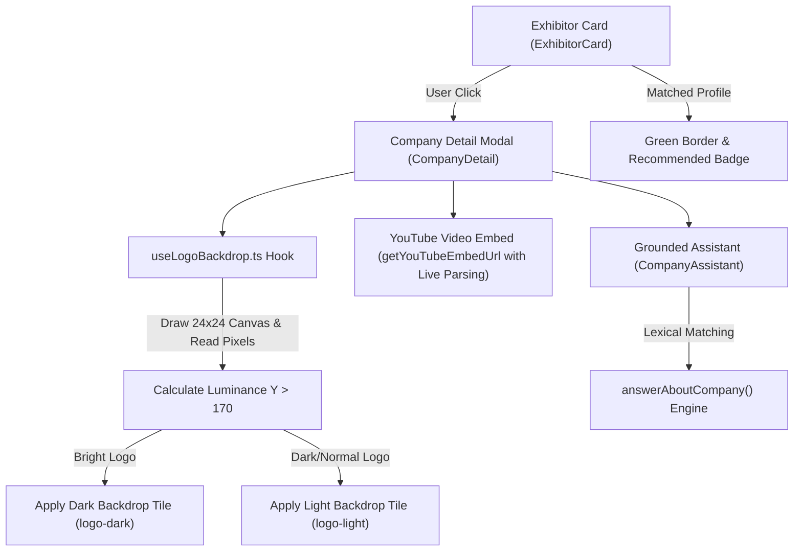
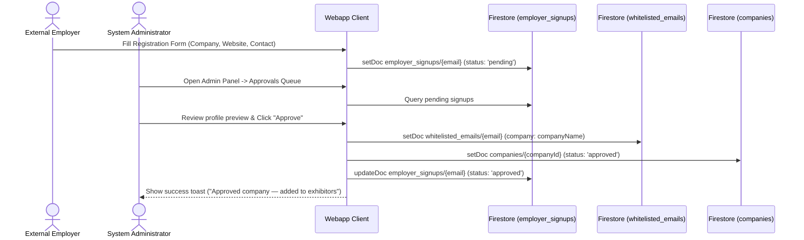
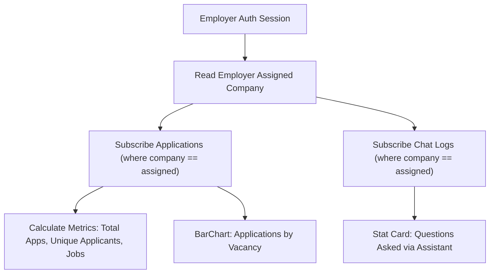

# QIU Industry Webapp — Feature Modules Technical Guide

**Status:** Active Internal Testing Phase — Currently undergoing internal validation. Live deployment links and public hosting URLs are strictly withheld during testing.<br>
**Target Audience:** Frontend Developers, System Integrators, UI/UX Engineers, and Technical Reviewers<br>
**Source Implementation Directory:** [webapp/features/](../features/) and [webapp/components/](../components/)

---

## 1. Feature Modules Architecture Overview

The **QIU Industry Webapp** feature architecture is structured into independent, loosely coupled modules. Each feature encapsulates its UI rendering, local state management, and Firestore interaction logic:

```text
webapp/
├── components/
│   ├── ImagePreview.tsx          # Real-time URL image previewer
│   ├── Modal.tsx                 # Accessible modal dialog container
│   └── toast.tsx                 # Global reactive toast notification system
├── features/
│   ├── admin/
│   │   ├── AdminPanel.tsx        # Sub-tab navigation container
│   │   ├── AdminSummary.tsx      # System overview metrics & bar charts
│   │   ├── ApprovalQueue.tsx     # Review queue & 1-click bulk approvals
│   │   ├── CompanyManager.tsx    # Exhibitor editor & website logo fetcher
│   │   ├── EmployerSummary.tsx   # Scoped employer analytics
│   │   ├── ResumeViewer.tsx      # Multi-mode candidate resume viewer
│   │   ├── SettingsPanel.tsx     # System settings & portal toggles
│   │   └── StudentActivity.tsx   # Candidate application feeds
│   ├── events/
│   │   ├── EventAttendance.tsx   # Attendance log & CSV report exporter
│   │   ├── EventPresenter.tsx    # Live 30s rotating QR projector view
│   │   ├── EventsView.tsx        # Industry Day event schedule dashboard
│   │   └── SpeakerAvatar.tsx     # Speaker headshot avatar fallback
│   ├── home/
│   │   ├── HomeView.tsx          # Exhibitor landing directory & RAG assistant
│   │   └── useLogoBackdrop.ts    # HTML5 Canvas 2D logo luminance sampler
│   ├── student/
│   │   ├── cv-download.ts        # Standalone HTML/PDF download engine
│   │   ├── GeneratedCV.tsx       # Structured profile CV renderer
│   │   ├── StudentHistory.tsx    # Application history & withdrawal tab
│   │   └── StudentResume.tsx     # Resume profile editor
│   └── vacancies/
│       ├── VacancyCard.tsx       # Vacancy listing card component
│       ├── VacancyFilters.tsx    # 5-mode vacancy sorting & search
│       └── VacancyModal.tsx      # Vacancy popup & JobAssistant RAG
```

---

## 2. Deep Dive Technical Feature Specifications

### Module 1: Home Directory & Company RAG ([HomeView.tsx](../features/home/HomeView.tsx) & [useLogoBackdrop.ts](../features/home/useLogoBackdrop.ts))

#### Overview
Renders the primary Industry Day exhibitor directory page displaying participating company cards, corporate summaries, booth tags, embedded YouTube videos, and a grounded per-company RAG assistant.



#### Brand Logo Luminance Sampling Hook (`useLogoBackdrop.ts`)
Calculates image luminance using an HTML5 2D Canvas to automatically determine whether a company logo requires a light or dark background tile for optimal visual contrast:
- Formula: $Y = 0.2126R + 0.7152G + 0.0722B$
- Evaluates $Y > 170$ to switch `.logo-light` vs `.logo-dark`.

#### Recommended Companies UI
Companies with vacancies matching the student's program (using `jobMatchesCourse` logic) are rendered directly in the main `exhibitor-grid`. These cards are visually distinguished with a `.exhibitor-card.recommended` CSS green border and a "🌟 Has vacancies matching your profile" success badge.

#### YouTube Live Embed
```ts
// features/home/useLogoBackdrop.ts (L24-L39)
const canvas = document.createElement("canvas");
const w = (canvas.width = 24), h = (canvas.height = 24);
const ctx = canvas.getContext("2d", { willReadFrequently: true });
ctx.drawImage(img, 0, 0, w, h);
const { data } = ctx.getImageData(0, 0, w, h);

let lum = 0, count = 0;
for (let i = 0; i < data.length; i += 4) {
  const a = data[i + 3];
  if (a < 24) continue; // Skip transparent background pixels
  // Relative Luminance formula (ITU-R BT.709)
  lum += (0.2126 * data[i] + 0.7152 * data[i + 1] + 0.0722 * data[i + 2]) * (a / 255);
  count++;
}
if (count && alive) setAuto(lum / count > 170 ? "dark" : "light");
```

- **Cross-Origin Fallback**: If canvas pixel reading is blocked by CORS security, the hook gracefully defaults to `"light"`.

#### In-Modal Grounded RAG Assistant (`CompanyAssistant`)
Operates on deterministic keyword matching (`answerAboutCompany`) grounded strictly to the selected company's summary, booth number, website, video URL, and active vacancies. Answers stream character-by-character into the typewriter chat interface.

#### Company Recommendation Engine
Suggests relevant companies dynamically based on available vacancies and match criteria, enhancing discovery of exhibitors during the event.

---


### Module 2: Employer Self-Registration & Approval Queue ([ApprovalQueue.tsx](../features/admin/ApprovalQueue.tsx))

#### Overview
Enables external partner employers to self-register for Industry Day access without requiring manual upfront email entry by administrators.



#### Key Capabilities
- **Self-Service Registration**: External employers submit registration details (`employer_signups/{email}`).
- **1-Click Admin Approval**: Approving a signup atomically whitelists the email in `whitelisted_emails`, assigns the employer role, and creates an exhibitor profile in `companies`.
- **Staged Edits (`pendingEdit`)**: Employer edits to live vacancies or company profiles stage diff records instead of overwriting live documents.
- **Bulk "Approve All"**: Admins can approve all pending vacancy submissions and staged edits simultaneously with 1 click (`approveAll`).

---

### Module 3: Admin Dashboard Architecture Rework ([AdminPanel.tsx](../features/admin/AdminPanel.tsx))

#### Sub-Tab Navigation Model
The admin dashboard features modular sub-tabs partitioned by administrative responsibility:

```text
AdminPanel (Admin View)
├── access            ──> RoleManager (Promote/demote user roles)
├── approvals         ──> ApprovalQueue (Review signups, vacancies, staged edit diffs)
├── manageExhibitor   ──> CompanyManager [view="manage"] (Edit/delete existing exhibitors)
├── addExhibitor      ──> CompanyManager [view="add"] (Add new exhibitor with logo fetcher)
├── manageVac         ──> Vacancy Manager (Filter, search, edit, delete vacancies)
├── addVac            ──> Vacancy Form (Create new vacancy listing)
├── activity          ──> StudentActivity [mode="all"] (Candidate application accordions)
├── resumes           ──> ResumeViewer (Search & view student PDF/Link/Generated CVs)
├── chats             ──> ChatHistory [mode="all"] (Audit assistant chat turns)
└── settings          ──> SettingsPanel (Portal title, QR rotation speed, CCA rules)
```

- **Role Gating**: Employers see a streamlined menu scoped strictly to their assigned company (`company`, `addVac`, `manageVac`, `resumes`, `activity`, `chats`). Admins access webapp-wide tabs.

#### Data Export & CSV Integration
Admin and Employer sub-tabs feature integrated **CSV Export** buttons powered by a client-side exporter (`csv.ts`). This allows seamless offline extraction of application rosters, chat histories, vacancy stats, and event attendance straight from active table views without server-side processing.

#### Workspace Employee ID Telemetry
Automatically extracts the user's Employee ID from the Google Workspace Directory (`directory.readonly` scope) upon sign-in. This ID is subsequently stamped onto view events, candidate applications, and chat logs to guarantee internal tracking and accountability during events.

---

### Module 4: Employer Summary & Scoped Analytics ([EmployerSummary.tsx](../features/admin/EmployerSummary.tsx))

#### Overview
Provides a dedicated metrics landing dashboard for employers signed into the portal.



#### Metrics Displayed
- **Total Applications**: Total candidate applications submitted for company vacancies.
- **Unique Applicants**: Count of distinct student UIDs (`Set(studentUid)`).
- **Jobs Applied To**: Count of active vacancies with candidates.
- **Assistant Queries**: Count of student questions asked about the company via `JobAssistant` / `CompanyAssistant`.
- **Ranked Bar Charts**: Visual bar charts displaying application distributions by vacancy title.
- **Tenant Scope Isolation**: Strict client-side and server-side filtering preventing employers from viewing competitor data.

---

### Module 5: Generated CV Engine & Printable HTML Engine ([GeneratedCV.tsx](../features/student/GeneratedCV.tsx) & [cv-download.ts](../features/student/cv-download.ts))

#### Overview
Allows candidates to build a structured curriculum vitae directly within the webapp without hosting PDF files on paid cloud storage buckets.

```mermaid
flowchart LR
    StudentForm["Profile Form (StudentResume.tsx)"] --> SaveProfile["Save ResumeProfile to resumes/{uid}"]
    SaveProfile --> RenderView["Render GeneratedCV.tsx (In-App Preview)"]
    RenderView -->|"1-Click Download"| DownloadEngine["downloadCV(resume) in cv-download.ts"]
    DownloadEngine --> HTMLBlob["Synthesize Standalone HTML Document"]
    HTMLBlob --> SaveFile["Trigger Browser Download: CV_Student_Name.html"]
    SaveFile --> DirectPrint["User Opens & Prints to PDF (@media print)"]
```



#### Printable HTML Generator (`cv-download.ts`)
Outputs a standalone HTML file embedding custom CSS print media queries (`@media print`):

```ts
// features/student/cv-download.ts
export function downloadCV(resume: Resume) {
  const p = resume.profile ?? {};
  const name = resume.studentName || resume.studentEmail || "Student";
  const html = `<!doctype html><html lang="en"><head><meta charset="utf-8"><title>${esc(name)} — CV</title>
  <style>
    body { background: #eceef1; font-family: system-ui, sans-serif; }
    .sheet { max-width: 800px; margin: 2rem auto; background: #fff; padding: 2.4rem; }
    @media print { body { background: #fff; } .sheet { box-shadow: none; margin: 0; } }
  </style></head><body><div class="sheet">...</div></body></html>`;

  const blob = new Blob([html], { type: "text/html;charset=utf-8" });
  const url = URL.createObjectURL(blob);
  const a = document.createElement("a");
  a.href = url;
  a.download = `CV_${name.replace(/[^\w]+/g, "_")}.html`;
  a.click();
  URL.revokeObjectURL(url);
}
```

#### Automated Application Withdrawal
To maintain absolute data integrity and prevent broken application references, if a candidate removes or replaces a shared CV source document, the system automatically runs a cascading hook that seamlessly withdraws any active job applications tied to that original resume.

---


### Module 6: Global Toast Notification System ([toast.tsx](../components/toast.tsx))

#### Overview
A lightweight, event-driven notification engine delivering non-blocking visual user feedback across save, edit, delete, apply, check-in, check-out, and withdrawal operations.

```ts
// components/toast.tsx
type Kind = "success" | "error" | "info";

export function notify(message: string, kind: Kind = "success") {
  const toast = { id: ++counter, message, kind };
  listeners.forEach((l) => l(toast));
}
```

- **Subscriber Hook**: `<Toaster />` component mounts near the root layout (`app/layout.tsx`), listening to notification events.
- **Auto-Dismiss Window**: Toasts automatically fade out after $3,800\text{ ms}$ or when manually dismissed by clicking the close button (`×`).

---

### Module 7: Live Image Preview Component ([ImagePreview.tsx](../components/ImagePreview.tsx))

#### Overview
Positioned directly under form text inputs for company logos, speaker headshots, and video links to allow instant visual confirmation before saving records.

- **Regex Verification**: Evaluates `url` against `/^https?:\/\/.+/i`. Renders nothing for empty/invalid strings.
- **Fallback State**: Catches broken or un-fetchable image links using `onError={() => setFailed(true)}`, displaying a warning notice (`⚠ Couldn't load this image — check the link is public and points to an image.`).

---

### Module 8: Events UX & 30-Second Dynamic QR Anti-Cheat Attendance ([EventPresenter.tsx](../features/events/EventPresenter.tsx) & [SpeakerAvatar.tsx](../features/events/SpeakerAvatar.tsx))

#### Target Specializations & Event Matches
Events utilize a single `specialization` string selected from a predefined list (shared with Vacancies, plus an "Other" custom option). If a student's course matches this specialization via regex pattern, the event card displays a "🌟 Relevant to you" badge in `EventsView.tsx`.

#### Live Presenter Screen (`EventPresenter.tsx`)
Displays a live projector view generating a dynamic rotating QR code every 30 seconds (`REFRESH_MS = 30000`):

```ts
// features/events/EventPresenter.tsx (L23-L39)
useEffect(() => {
  async function rotate() {
    const code = randomCode();
    const codeExpiry = Date.now() + refreshMs + 6000; // 6s grace for scan latency
    await setEventCode(event.id, { activeStep: step, activeCode: code, codeExpiry });
    const url = `${window.location.origin}/?ev=${event.id}&s=${step}&c=${code}`;
    const dataUrl = await QRCode.toDataURL(url, { width: 460, margin: 1 });
    setQr(dataUrl);
    setCount(refreshMs / 1000);
  }
  rotate();
  const iv = setInterval(rotate, refreshMs);
  return () => clearInterval(iv);
}, [event.id, step, refreshMs]);
```

- **Step Selector**: Presenters toggle between **Step 1: Check-in** (session commencement) and **Step 2: Check-out** (session conclusion).
- **SpeakerAvatar**: Renders speaker headshot photos or an SVG silhouette fallback when no image URL is configured.
- **Multi-Speaker Support**: Events natively support distinct arrays of presenters and multiple speaker profiles, accommodating panels and co-hosted sessions.

---


### Module 9: Multi-Criteria Vacancy Sorting & QIU-Red Design Tokens ([VacancyFilters.tsx](../features/vacancies/VacancyFilters.tsx))

#### 5-Mode Vacancy Sorting Dropdown
Integrated directly into the reactive vacancy search sidebar, supporting instant client-side re-ordering across five modes:

| Sort Mode | Operational Logic | Primary Target User |
| --- | --- | --- |
| `default` | Sorts by course recommendation match score first; newest listings second. | QIU Students seeking relevant roles |
| `newest` | Sorts vacancies by creation ID in descending order (`b.id - a.id`). | Returning students checking new openings |
| `oldest` | Sorts vacancies by creation ID in ascending order (`a.id - b.id`). | Administrators auditing legacy records |
| `salary_high` | Sorts vacancies by monthly RM salary descending (`b.salary - a.salary`). | Jobseekers prioritizing compensation |
| `salary_low` | Sorts vacancies by monthly RM salary ascending (`a.salary - b.salary`). | Comparative wage analysis |

#### Signature QIU-Red Visual Identity
Configured via CSS custom properties in [tokens.css](../lib/theme/tokens.css):
- Core brand red: `#ba1a1a` / `#900010` (`--color-primary: #d12a32`).
- Dark mode adjustment: `#ef5a60` for optimal contrast on dark surfaces.
- Logo inversion filter: `filter: invert(1) brightness(1.9)` applied to dark headers.

---

## 3. Related Multi-Page Documentation Links

- **[SOFTWARE_DOCUMENTATION.md](../docs/SOFTWARE_DOCUMENTATION.md)**: Comprehensive System Architecture Specification
- **[SECURITY_AND_RULES.md](../docs/SECURITY_AND_RULES.md)**: Security Model, Firestore Security Rules & 30s Dynamic QR Math
- **[DATA_MODELS_AND_SCHEMAS.md](../docs/DATA_MODELS_AND_SCHEMAS.md)**: Data Dictionary, TypeScript Interfaces & Firestore Collections
