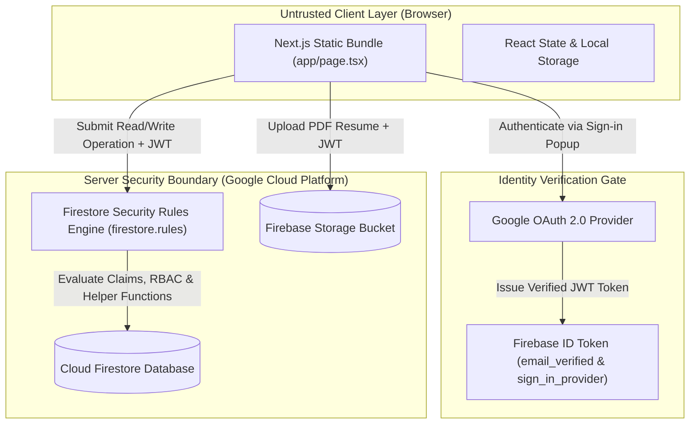
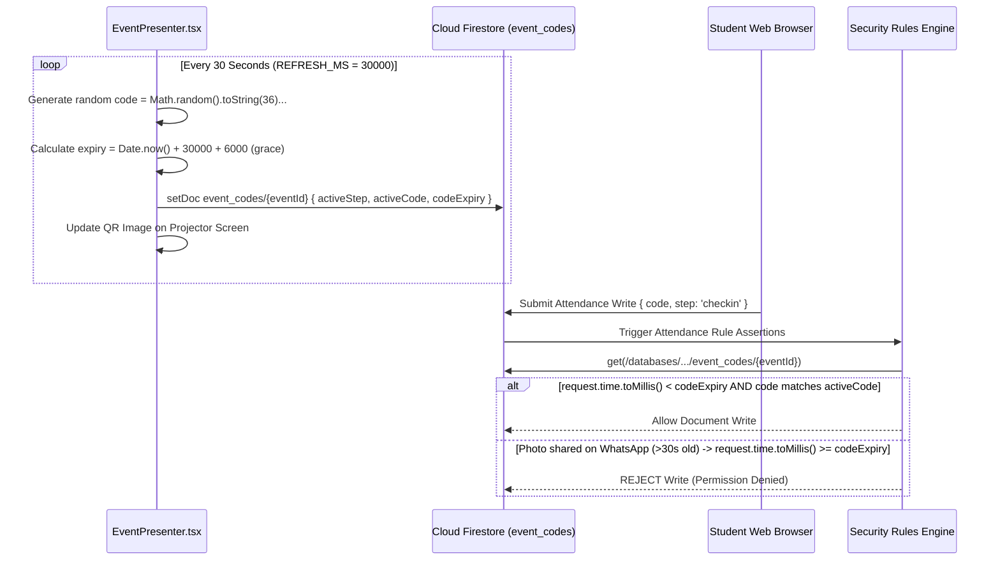

# QIU Industry Webapp — Security Model, Firestore Security Rules & Anti-Cheat Specifications

**Status:** Active Internal Testing Phase — Currently undergoing internal validation. Live deployment links and public hosting URLs are strictly withheld during testing.<br>
**Target Audience:** Security Auditors, System Administrators, Cloud Infrastructure Engineers, and Backend Developers<br>
**Security Enforcement Layer:** Server-Side Cloud Firestore Security Rules ([firestore.rules](file:///Users/sooyauming/Desktop/Intern/Vacancy%20Portal/webapp/firestore.rules)) and Firebase Storage Rules ([storage.rules](file:///Users/sooyauming/Desktop/Intern/Vacancy%20Portal/webapp/storage.rules))

---

## 1. Trust Boundaries & Security Architecture

The **QIU Industry Webapp** employs a zero-trust client architecture. Because Next.js static exports (`output: "export"`) render entirely client-side without an intermediate server runtime, client JavaScript and state are considered untrusted.



### Trust Boundary Isolation Rules
1. **Public Static Asset Boundary**: Static JS bundles, styling tokens, fonts, icons, and SVG country maps in `public/` and `out/` are public. Private data sources (`*.csv`, `*.xlsx`) and raw JSON datasets are strictly excluded.
2. **Authentication Boundary**: Firebase Authentication enforces Google OAuth 2.0. Unverified emails or non-Google OAuth tokens (e.g., raw password tokens) are rejected at the rule layer.
3. **Institutional Domain Boundary**: Authentication does not grant data access by default. Users must either match the QIU institutional domain regex (`^[^@]+@qiu[.]edu[.]my$`) or exist in `whitelisted_emails/{email}`.
4. **Anti-Cheat Attendance Boundary**: Active QR codes and timestamps stored in `event_codes/{eventId}` are unreadable by client subscriptions (`allow read: if isAdmin()`). Attendance write verification occurs server-side via `eventCode(eventId)` helper assertions.
5. **Multi-Tenant Employer Boundary**: Employers are restricted to viewing and managing resources (vacancies, profile edits, applications, chat logs) explicitly bound to their assigned company name.

---

## 2. Authentication Gate & Claims Engine

Every protected database request evaluated by [firestore.rules](file:///Users/sooyauming/Desktop/Intern/Vacancy%20Portal/webapp/firestore.rules) requires four cryptographic claims:

```javascript
// firestore.rules lines 5-28
function isAuthenticated() {
  return request.auth != null
    && request.auth.token.email_verified == true
    && request.auth.token.firebase.sign_in_provider == 'google.com';
}

function isQiuUser() {
  return isAuthenticated()
    && request.auth.token.email is string
    && request.auth.token.email.matches('^[^@]+@qiu[.]edu[.]my$');
}

function isWhitelisted() {
  return isAuthenticated()
    && request.auth.token.email is string
    && exists(/databases/$(database)/documents/whitelisted_emails/$(request.auth.token.email.lower()));
}

function isAllowedUser() {
  return isQiuUser() || isWhitelisted();
}
```

### Claim Requirements Summary
1. `request.auth != null`: Request carries a valid, non-expired Firebase Auth JWT token.
2. `request.auth.token.email_verified == true`: Identity provider has verified email ownership.
3. `request.auth.token.firebase.sign_in_provider == 'google.com'`: Defends in depth against tokens minted via non-Google authentication mechanisms.
4. `isAllowedUser()`: Assert that the user's email belongs to `@qiu.edu.my` OR is registered in the `whitelisted_emails` collection.

---

## 3. RBAC 4-Role Security Matrix

The system enforces a 4-role Role-Based Access Control (RBAC) model (`user`, `employer`, `admin`, `superadmin`), plus a delegated event presenter privilege:

| Role | Target Persona | Rule Helper Assertion | Granted Data Capabilities & Scope |
| --- | --- | --- | --- |
| `user` | Standard QIU Student / Academic Staff | Default role when role is absent or `'user'` | Read vacancies, companies, and events. Create/edit own profile (`users/{uid}`), resume (`resumes/{uid}`), applications (`applications/{appId}`), view events (`view_events/{id}`), chat logs (`chat_logs/{id}`), and attendance records (`attendance/{eventId}_{uid}`). |
| `employer` | External Industry Partner | `getUserRole() == 'employer'` | Read vacancies, companies, and events. Post vacancies and stage profile edits (submitted as `status: 'pending'`). Read candidate resumes and applications scoped strictly to their assigned company. |
| `admin` | Internal Admin Staff | `isAdmin()`: `isSuperAdmin() \|\| getUserRole() == 'admin'` | Full CRUD across vacancies, companies, events, and user roles. Perform 1-click bulk approvals (`approveJob`, `approveSignup`, `applyCompanyEdit`). Launch live 30s QR screens and export attendance CSV logs. |
| `superadmin` | Immutable Master Identity | `isSuperAdmin()`: `email == 'ai@qiu.edu.my'` | Master administration privileges. Inherits all `admin` rights plus system-wide data clearing (`clearCompanies`), initial JSON bulk data import, and user role management. Immutable role that cannot be deleted or demoted. |
| *(Delegated Presenter)* | Guest Speaker / Event Leader | `request.auth.token.email.lower() in get(events/{eventId}).data.presenters` | Non-admin user whose email is explicitly listed in an event's `presenters` array. Granted write access to `event_codes/{eventId}` to run the live 30s QR presenter view for that specific event. |

---

## 4. Firestore Security Rules Deep Dive

The complete database policy is defined in [firestore.rules](file:///Users/sooyauming/Desktop/Intern/Vacancy%20Portal/webapp/firestore.rules).

### 4.1 Optimization against Firestore Expression Limits
Firestore Security Rules enforce a strict **1,000 expression-evaluation limit** per request. Routing helper functions (such as `isAdmin()` or `isEmployer()`) that re-evaluate `isAllowedUser()` multiple times per document check can cause complex `create` or `update` rules to exceed this limit.

To prevent runtime rule evaluation failures, rules for high-frequency collections (`vacancies` and `companies`) evaluate `isAllowedUser()` once at the top level and compare roles inline:

```javascript
// firestore.rules lines 216-250 (Inlined role checks avoiding expression overflow)
match /vacancies/{vacancyId} {
  allow read: if isAllowedUser();
  allow create: if isAllowedUser()
    && validVacancy(request.resource.data)
    && (request.resource.data.createdBy == request.auth.uid || request.resource.data.createdBy == request.auth.token.email.lower())
    && request.resource.data.createdAt == request.time
    && request.resource.data.updatedAt == request.time
    && (isSuperAdmin() || getUserRole() == 'admin'
      || (getUserRole() == 'employer' && request.resource.data.status == 'pending'));
}
```

### 4.2 Collection-by-Collection Security Rules Specification

#### 1. `users/{uid}`
- **Read**: `isAllowedUser() && (request.auth.uid == uid || isSuperAdmin())`.
- **Create**: `isAuthenticated() && validUser(request.resource.data, uid)`.
- **Update**: User may edit own profile (`displayName`, `photoURL`, `course`, `updatedAt`) but **cannot alter their own role**. Admins may update roles. The fixed identity `ai@qiu.edu.my` is protected; no other user can be assigned `superadmin`.
- **Delete**: Restricted to `isSuperAdmin()`, preventing deletion of `ai@qiu.edu.my`.

#### 2. `whitelisted_emails/{emailId}`
- **Read**: `isAuthenticated()`.
- **Write**: `isAdmin()`. Approving an external employer signup creates a document here binding their email to a company.

#### 3. `vacancies/{vacancyId}`
- **Read**: `isAllowedUser()`.
- **Create**: Employers post vacancies with `status: 'pending'`. Admins publish with `status: 'approved'`. `createdBy` must match creator's UID/email, and timestamps must equal `request.time`.
- **Update**: Immutability enforced on `createdBy` and `createdAt`. Employers editing an approved job stage a `pendingEdit` object without altering the live listing.
- **Delete**: Admins can delete any vacancy; employers can delete only vacancies they created.

#### 4. `applications/{appId}` (Doc ID: `${studentUid}_${jobId}`)
- **Read**: `isAllowedUser() && (resource.data.studentUid == request.auth.uid || isAdmin() || isEmployer())`.
- **Create / Update**: `request.resource.data.studentUid == request.auth.uid && validApplication(request.resource.data)`.
- **Delete**: Owner student or `isAdmin()`. Enables student application withdrawal.

#### 5. `view_events/{id}`
- **Read / Write**: Private to owner student (`studentUid == request.auth.uid`) or `isAdmin()`.

#### 6. `resumes/{uid}` (Doc ID: `${studentUid}`)
- **Read**: Owner student, `isAdmin()`, or `isEmployer()`.
- **Create / Update**: `request.auth.uid == uid && validResume(request.resource.data, uid)`.
- **Delete**: Owner student or `isAdmin()`.

#### 7. `chat_logs/{id}`
- **Read**: `isAdmin() || isEmployer()`. Employers view logs filtered client-side by company name with student identity fields anonymized.
- **Create**: `isAllowedUser() && request.resource.data.studentUid == request.auth.uid`.
- **Update**: Blocked (`allow update: if false`). Chat turns are immutable logs.
- **Delete**: `isAdmin()`.

#### 8. `events/{eventId}`
- **Read**: `isAllowedUser()`.
- **Create / Update / Delete**: `isAdmin() && validEvent(request.resource.data)`.

#### 9. `event_codes/{eventId}` (Secret Dynamic QR Collection)
- **Read**: `isAdmin()`. **Client reads are blocked for non-admin users.**
- **Write**: `isAdmin()` OR delegated presenter (`request.auth.token.email.lower() in get(events/{eventId}).data.presenters`).
- **Delete**: `isAdmin()`.

#### 10. `attendance/{attendanceId}` (Doc ID: `${eventId}_${studentUid}`)
- **Read**: Owner student or `isAdmin()`.
- **Create (Check-In)**: Requires step `'checkin'`, valid `code`, and matching document ID `${eventId}_${request.auth.uid}`. Server-side rule asserts:
  ```javascript
  eventCode(string(request.resource.data.eventId)).activeStep == 'checkin'
  && eventCode(string(request.resource.data.eventId)).activeCode == request.resource.data.code
  && request.time.toMillis() < eventCode(string(request.resource.data.eventId)).codeExpiry
  ```
- **Update (Check-Out)**: Requires step `'checkout'`. Server-side rule asserts:
  ```javascript
  eventCode(string(resource.data.eventId)).activeStep == 'checkout'
  && eventCode(string(resource.data.eventId)).activeCode == request.resource.data.code
  && request.time.toMillis() < eventCode(string(resource.data.eventId)).codeExpiry
  ```

#### 11. `job_stats/{jobId}`
- **Read**: `isAllowedUser()`.
- **Write**: `isAllowedUser() && keys().hasOnly(['applicants'])`. Updated via atomic `increment(+1)` and `increment(-1)`.

#### 12. `companies/{companyId}`
- **Read**: `isAllowedUser()`.
- **Create / Update**: Admins publish directly; employers stage submissions with `status: 'pending'` or `status: 'pending_edit'`.
- **Delete**: `isAdmin()`.

#### 13. `app_settings/{docId}`
- **Read**: `isAllowedUser()`.
- **Write**: `isAdmin() && validSettings(request.resource.data)`.

#### 14. `employer_signups/{emailId}`
- **Read**: `isAuthenticated() && (emailId == request.auth.token.email.lower() || isAdmin())`.
- **Create**: Unwhitelisted visitors submit registration requests with `status: 'pending'` under their own email.
- **Update / Delete**: `isAdmin()` or applicant resubmitting a pending request.

---

## 5. 30-Second Dynamic QR TOTP Anti-Cheat Engine Math

To defeat proxy attendance fraud (where students photograph venue QR codes and share them over instant messaging apps like WhatsApp or Telegram), the portal implements a 30-second dynamic rotating QR code protocol.



### Mathematical Formulation & Grace Window
1. **Rotation Interval**: Codes rotate every 30 seconds ($\Delta t_{rotate} = 30\,000\text{ ms}$).
2. **Grace Window**: A 6,000 ms grace window ($\Delta t_{grace} = 6\,000\text{ ms}$) is added to account for mobile network latency and clock skew:
   $$\text{codeExpiry} = t_{\text{current}} + 30\,000 + 6\,000$$
3. **Server Validation Assertion**:
   $$t_{\text{request}} < \text{codeExpiry} \quad \wedge \quad C_{\text{submitted}} = C_{\text{active}}$$
4. **Proxy Defense**: Screenshots shared remotely over messaging apps become mathematically invalid after at most 36 seconds.

---

## 6. Two-Step Attendance Duration Math & CCA Eligibility

To prevent students from scanning check-in and immediately leaving the auditorium, Co-Curricular Activity (CCA) points credit (`caEligible`) requires two-step duration verification.

### Mathematical Formulation
When a student checks out, the system calculates elapsed attendance duration ($\Delta T_{\text{attendance}}$):

$$\Delta T_{\text{attendance}} = \left\lfloor \frac{t_{\text{checkOutMs}} - t_{\text{checkInMs}}}{60\,000} \right\rfloor \text{ minutes}$$

The required minimum attendance threshold ($T_{\text{threshold}}$) is calculated using global application settings (`ccaPercent` and `ccaFloorMinutes`):

$$T_{\text{threshold}} = \begin{cases} 
\left\lfloor \frac{\text{ccaPercent}}{100} \times \text{sessionMinutes} \right\rfloor & \text{if } \text{sessionMinutes} > 0 \\
\text{ccaFloorMinutes} & \text{if } \text{sessionMinutes} = 0 
\end{cases}$$

Default portal configuration parameters:
- $\text{ccaPercent} = 80\%$
- $\text{ccaFloorMinutes} = 45\text{ minutes}$

### Eligibility Assertion
$$\text{caEligible} = \begin{cases} 
\text{true} & \text{if } \Delta T_{\text{attendance}} \ge T_{\text{threshold}} \\
\text{false} & \text{if } \Delta T_{\text{attendance}} < T_{\text{threshold}}
\end{cases}$$

---

## 7. Storage Security Rules ([storage.rules](file:///Users/sooyauming/Desktop/Intern/Vacancy%20Portal/webapp/storage.rules))

Optional PDF resume uploads to Firebase Storage are secured by user ownership rules:

```javascript
rules_version = '2';
service firebase.storage {
  match /b/{bucket}/o {
    match /resumes/{userId}/{fileName} {
      // Student owns their directory; admins and employers read for candidate evaluation
      allow read: if request.auth != null && (request.auth.uid == userId || request.auth.token.role in ['admin', 'superadmin', 'employer']);
      allow write: if request.auth != null && request.auth.uid == userId
        && request.resource.size < 10 * 1024 * 1024 // 10MB limit
        && request.resource.contentType.matches('application/pdf');
      allow delete: if request.auth != null && (request.auth.uid == userId || request.auth.token.role in ['admin', 'superadmin']);
    }
  }
}
```

---

## 8. Data Audit & Leak Prevention Protocol

Run this command prior to committing code changes to verify that no credential files or private data sources are tracked:

```bash
git ls-files -- data/jobs.json '*.csv' '*.xlsx' '*.xls' '*.tsv' '.env' '.env.local'
```

*Expected output: Empty output (no tracked files returned).*
