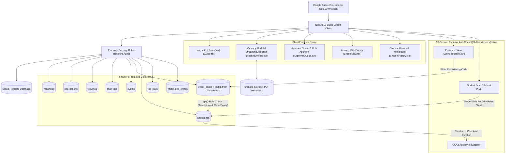
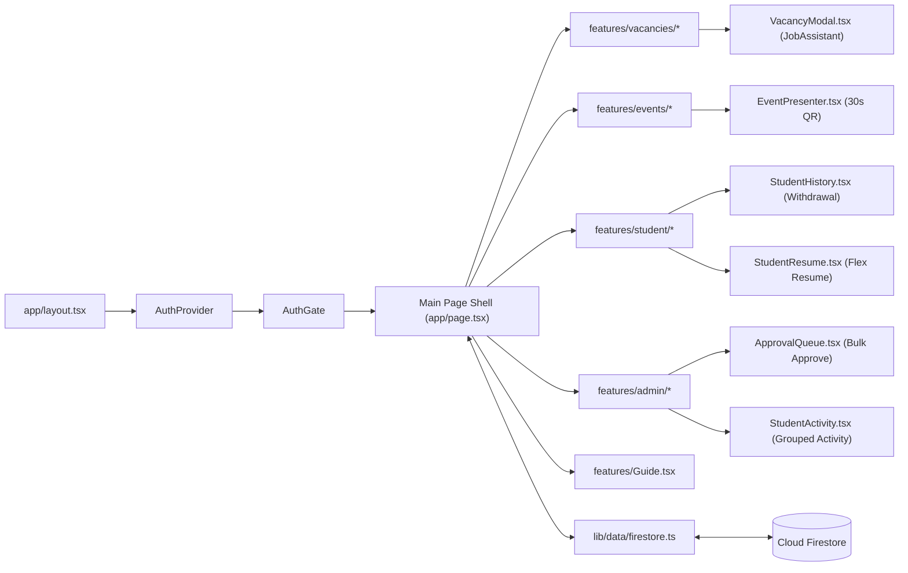
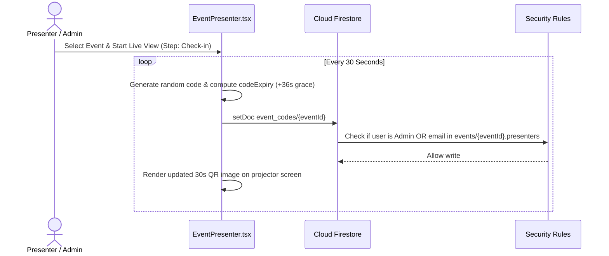
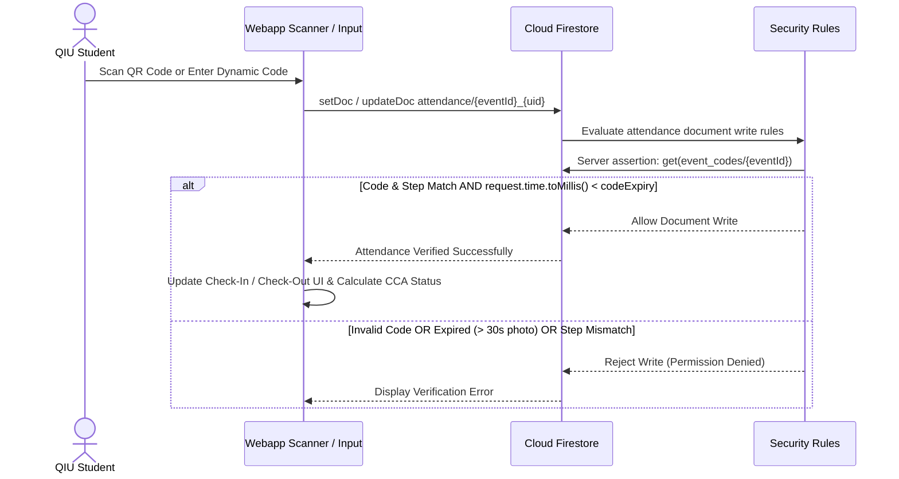

# QIU Industry Webapp Software Documentation

**Status:** Active Internal Testing Phase — Currently undergoing internal validation. Live deployment links and public hosting URLs are strictly withheld during testing.<br>
**Audience:** Developers, reviewers, administrators, and deployment owners<br>
**Deployment Model:** Static Next.js export on Firebase Hosting with Firebase Authentication and Cloud Firestore

---

## 1. Purpose and Scope

**QIU Industry Webapp** is a full-fledged industry career, event management, and anti-cheat attendance discovery web application built for **QIU (Quest International University)** students, academic staff, and participating industry partner employers.

The system delivers:
- **Visual Identity & QIU-Red Design System**: Signature QIU-Red brand color theme (`#ba1a1a` / `#900010` / `--color-primary: #d12a32`, hovering at `#b21f27`, brightened to `#ef5a60` on dark surfaces), clean default light theme with seamless dark mode support, and prominent large salary callouts across cards and detail popups.
- **Interactive Role Guides & Live Snapshots (`webapp/features/Guide.tsx`)**: Comprehensive onboarding system providing step-by-step guides for `student`/`user`, `employer`, `admin`, and `superadmin` roles (reopenable anytime via the `?` topbar button). Includes live-styled visual button snapshots (`<Demo>` and `<Chip>`) previewing key action buttons and status badges.
- **Multi-Criteria Vacancy Sorting System (`webapp/features/vacancies/VacancyFilters.tsx`)**: 5-mode sorting dropdown (`default`, `newest`, `oldest`, `salary_high`, `salary_low`) reactively bound into the filtering pipeline with 1-click filter reset (`resetFilters`).
- **Mobile UX & Header Polish (`webapp/app/globals.css` & `webapp/app/page.tsx`)**: Enlarged QIU brand logo asset sizing (`height: 3.2rem` desktop / `3rem` mobile) with dark surface logo inversion (`filter: invert(1) brightness(1.9)`), non-wrapping tab navigation (`white-space: nowrap`), and responsive mobile header layout (<600px) that hides secondary account text for clean logo and avatar display.
- **Enhanced Candidate & Vacancy Workflows**:
  - **Real-Time Applicant Counter**: Live applicant counts displayed per job on cards and modal popups, backed by atomic `increment()` counters in the `job_stats` collection.
  - **Application Withdrawal**: Students can withdraw submitted job applications directly from their Student History tab (`StudentHistory.tsx`) or inside `VacancyModal.tsx`, atomically decrementing the per-job applicant tally.
  - **Flexible Resume Management**: Supports shareable links (Google Drive, OneDrive, Dropbox) for zero-cost hosting or PDF upload via Firebase Storage, with full resume removal/deletion capability (`StudentResume.tsx`).
  - **In-Modal Streaming Assistant**: Embedded directly below the Apply/Resume block inside `VacancyModal.tsx` (`JobAssistant`) with an expanded typewriter streaming interface auto-scrolling to newest responses.
- **Admin & Employer Grouped Views + Bulk Actions**:
  - **Grouped Candidate Activity**: Candidate application feeds (`StudentActivity.tsx`) grouped by student for Admins with expandable `<details>` groups, and flat company-filtered feeds for Employers.
  - **Bulk "Approve All"**: 1-click batch approval feature in `ApprovalQueue.tsx` allowing admins to approve all pending employer vacancies and staged edits simultaneously (`approveAll`).
- **Events & 30-Second Dynamic QR Anti-Cheat Attendance Module**:
  - **Industry Day Event Management**: Admins schedule and manage event details (speaker, location, schedule, session duration `sessionMinutes`, and assigned presenter emails `presenters`).
  - **Live Dynamic Presenter View (`EventPresenter.tsx`)**: Displays a dynamic **30-second rotating QR code** (`REFRESH_MS = 30000`) and dynamic 6-character PIN code on projector screens, writing current active step (`checkin` or `checkout`), active code, and expiry timestamp (`codeExpiry`) to `event_codes/{eventId}`.
  - **WhatsApp / Proxy Anti-Cheat Protection**: The `event_codes` collection is **strictly unreadable by client queries**. Server-side Firestore Security Rules evaluate `eventCode(eventId)` to verify step match, code match, and timestamp validity (`request.time.toMillis() < codeExpiry`). Photos or screenshots shared over messaging apps expire within 30 seconds and fail verification.
  - **Two-Step CCA Points Eligibility Verification**: Students perform both a Check-In at session start and a Check-Out at session conclusion. Elapsed time is calculated against scheduled session length (`sessionMinutes`), awarding Co-Curricular Activity (CCA) points eligibility (`caEligible`) when threshold conditions are satisfied (≥ 80% of `sessionMinutes`, or 45-minute floor).
  - **Presenter Delegation**: Admins assign specific presenter emails (`presenters` array) to individual events, granting guest speakers display privileges for live QR screens without granting webapp-wide administrative roles.
- **Vacancy Search & Multi-Criteria Filtering**: Composable filtering across company, specialization, employment type (`Permanent`, `Internship`, `Contract`, `Part-time`), location (Malaysian state dropdown or interactive SVG world map), and salary ranges.
- **Course-Driven Recommendations**: Recommends relevant vacancies by matching student directory course profiles with vacancy titles and specializations.
- **Administrative Data Import**: Superadmin batch import mechanism for initializing or updating vacancy collections from processed local JSON files (`data/jobs.json`).

---

## 2. Design Decisions

| Decision | Reason | Consequence |
| --- | --- | --- |
| **Static Next.js Export** | Operates on standard Firebase Hosting without requiring Node.js server runtimes or serverless function overhead | All rendering and state management execute client-side in the browser |
| **QIU-Red Token Architecture** | Single re-theme seam in `tokens.css` anchoring QIU brand red (`#ba1a1a` / `#900010` / `#d12a32`) | Allows seamless dark mode adjustment (`#ef5a60`) without modifying component markup |
| **Interactive Role Guide System** | Provides clear role-specific onboarding for all user types with live-styled button snapshots | Reduces user friction and onboarding support queries across student, employer, and admin personas |
| **Multi-Criteria Vacancy Sorting Engine** | Supports 5 sorting modes (`default`, `newest`, `oldest`, `salary_high`, `salary_low`) integrated with 1-click filter reset | Delivers instant client-side vacancy re-ordering without database query overhead |
| **Mobile UX & Header Polish** | Enlarges QIU brand logo (`3.2rem` / `3rem`), prevents tab line-wrapping (`white-space: nowrap`), and hides secondary account text on mobile (<600px) | Maximizes screen real estate and brand prominence across mobile viewports while preventing layout clipping |
| **Unreadable `event_codes` Collection** | Prevents students from inspecting Firestore subscriptions to extract active attendance codes or sharing QR codes via WhatsApp/social proxy | Security rules evaluate `eventCode(eventId)` via internal `get()` assertions server-side; client reads are blocked |
| **30-Second Dynamic QR Refresh** | invalidates screenshot photos shared over instant messaging apps almost instantly | Presenter screens must remain open during presentation; photos expire in 30 seconds |
| **Two-Step Attendance Verification** | Enforces actual physical attendance for the entire session to prevent quick check-in-and-leave proxy fraud | Students must perform both Check-In and Check-Out; `caEligible` calculation enforces minimum elapsed duration |
| **Presenter Delegation Model** | Allows guest presenters/speakers to launch live QR screens without giving them full webapp `admin` rights | Presenters listed in `events/{eventId}.presenters` pass targeted authorization checks for `event_codes/{eventId}` writes |
| **Bulk "Approve All" Action** | Eliminates manual repetitive work for admins reviewing large queues of employer vacancy submissions | Admins can review all staged submissions and approve them in a single batch transaction |
| **Atomic Applicant Counter** | Provides live applicant counts on vacancy cards and modals without querying full application collections | `job_stats/{jobId}` maintains an atomic `increment()` tally updated on apply and withdrawal |
| **In-Modal Grounded Streaming Assistant** | Answers applicant questions deterministically grounded strictly to the selected vacancy with typewriter streaming | Eliminates LLM token costs, rate limits, and hallucination risks while providing an engaging UI |

---

## 3. System Context & Architecture



### Trust Boundaries

1. **Public Static Asset Boundary**: `out/` contains compiled static bundles, fonts, icons, branding assets, and map graphics. It strictly excludes private raw source files (`*.csv`, `*.xlsx`) and intermediate datasets (`data/jobs.json`).
2. **Authentication Boundary**: Firebase Authentication establishes identity tokens. Google provider checks ensure that non-Google tokens or unverified email accounts are rejected.
3. **Authorization Boundary (`firestore.rules`)**: Server-enforced rules validate user authentication, verified status, institutional domain matching (`@qiu.edu.my` or whitelisted employer email), role privileges, document schema validation, and audit field immutability.
4. **Anti-Cheat Attendance Boundary (`event_codes`)**: Dynamic rotating attendance codes stored in `event_codes/{eventId}` cannot be queried or read by client applications. Verification occurs entirely inside server-side Firestore Security Rules via the `eventCode(eventId)` helper during attendance creation or update.
5. **Admin & Presenter Boundary**: Administrative features (event management, user promotion, attendance CSV export, bulk vacancy approval) are restricted to `admin` and `superadmin` roles. Presenter access to write dynamic 30s QR codes is scoped strictly to the specific event where the user's email is registered in `presenters`.

---

## 4. Complete Technology Stack

| Layer | Technology | Active Responsibility & Version |
| --- | --- | --- |
| **UI Framework** | React 19, TypeScript 5.9 | Component hierarchy, modal dialogs, dark mode theme system, state management |
| **Styling & Design System** | Tailwind CSS 4.2, PostCSS, `tokens.css` | Responsive design tokens, QIU-Red visual branding, high-contrast dark mode |
| **Application Framework** | Next.js 16 (App Router) | Static export builder (`output: "export"`) producing pre-rendered HTML/JS in `out/` |
| **Authentication** | Firebase Authentication | Google OAuth 2.0 provider integration with institutional domain hints |
| **Database** | Cloud Firestore | Realtime NoSQL database holding users, vacancies, applications, events, attendance, job stats, and logs |
| **Database Security** | Firestore Security Rules v2 | Server-side role enforcement, schema validation, rate limits, and unreadable secret assertion |
| **File Storage** | Firebase Storage | Storage bucket for candidate PDF resume uploads with ownership security rules |
| **Static Hosting** | Firebase Hosting | Production CDN hosting delivering static assets with security header policies |
| **Realtime Sync** | Firestore `onSnapshot` Subscriptions | Live reactive updates for job vacancies, candidate applications, job stats, events, and dynamic presenter codes |
| **In-Modal Assistant** | Grounded Lexical Streaming Engine | Deterministic keyword matching engine executing inside the browser client with typewriter streaming UI |
| **Data Processing** | Python 3 | Off-line data normalization script (`scripts/generate_data.py`) transforming raw CSV/XLSX into JSON |
| **Test & Emulator Suite** | Node Test Runner & `@firebase/rules-unit-testing` | Unit test suite (`npm test`) and emulator-backed security rules assertion suite (`npm run test:rules`) |

---

## 5. Component Design



### 5.1 Authentication Components (`app/auth-context.tsx`, `app/auth-policy.ts`)
- `firebase-client.ts`: Initializes Firebase Auth, Firestore, and Storage SDKs.
- `auth-context.tsx`: Manages active user authentication state, handles Google OAuth sign-in flow, auto-provisions missing user profiles in `users/{uid}`, and provides role management state.
- `auth-policy.ts`: Contains domain helper functions for QIU email validation, email normalization, fixed superadmin identity check (`ai@qiu.edu.my`), and role evaluation helpers.

### 5.2 Interactive Role Guide System (`features/Guide.tsx`)
- Provides tailored onboarding sections for `student`, `employer`, and `admin`/`superadmin` roles.
- Re-openable anytime via the `?` icon button in the header.
- Renders live-styled button snapshots (`<Demo>` & `<Chip>`) previewing live UI buttons and status chips (`tone-accent`, `save-job`, `tone-success`, `enquire-main`, `cancel-edit`, `job-assistant-toggle`, `admin-button`, `edit-local`).

### 5.3 Vacancy & Application Components (`features/vacancies/*`, `features/student/*`)
- `VacancyFilters.tsx`: Renders the multi-criteria search and filtering sidebar, providing company, specialization, opportunity type dropdowns, maximum salary range slider, course recommendation filter, 5-mode sorting dropdown (`default`, `newest`, `oldest`, `salary_high`, `salary_low`), and a 1-click filter reset (`resetFilters`).
- `VacancyList.tsx` / `VacancyCard.tsx`: Displays authorized vacancies with real-time search, multi-criteria sorting, location mapping, and real-time applicant counts.
- `VacancyModal.tsx`: Displays vacancy details, requirements, scope, salary callouts, corporate intro videos, applicant counter, application apply/withdraw controls, and the embedded `JobAssistant` streaming typewriter interface.
- `StudentResume.tsx`: Manages candidate resume submissions (shareable external link or PDF file upload to Firebase Storage) with full removal/deletion support.
- `StudentHistory.tsx`: Displays candidate's applied and viewed vacancies with one-click application withdrawal support (`deleteApplication`).

### 5.4 Admin & Employer Management Components (`features/admin/*`)
- `ApprovalQueue.tsx`: Renders pending employer vacancy posts and staged edits with side-by-side field diffs, individual approve/reject buttons, and a 1-click **"Approve All"** bulk action.
- `StudentActivity.tsx`: Displays candidate applications. Grouped by student with expandable `<details>` accordions for Admins; flat company-filtered list for Employers.

### 5.5 Events & Anti-Cheat Attendance Module (`features/events/*`)
- `EventsView.tsx`: Displays upcoming Industry Day talks and sessions, speaker metadata, session length (`sessionMinutes`), and student attendance status.
- `EventDetail.tsx`: Modal view providing session descriptions, speaker profiles, check-in status, and quick scan buttons.
- `EventForm.tsx`: Administrative modal for creating and updating event entries, setting scheduled duration, and configuring the `presenters` email whitelist array.
- `EventPresenter.tsx`: Dedicated live projector display screen. Generates a dynamic dynamic QR code and 6-character code every **30 seconds** (`REFRESH_MS = 30000`), publishing active step, code, and expiry timestamp to `event_codes/{eventId}`.
- `EventAttendance.tsx`: Administrative attendance log viewer. Displays real-time attendee list, check-in/checkout timestamps, calculated duration, CCA points eligibility (`caEligible`), and exports formatted UTF-8 CSV reports for Excel.

---

## 6. Identity and Role Model

### 6.1 Authentication Requirements
`firestore.rules` enforces the following claims on every protected database request:
1. Valid authenticated Firebase token (`request.auth != null`).
2. Verified email address (`request.auth.token.email_verified == true`).
3. Google sign-in provider (`request.auth.token.firebase.sign_in_provider == 'google.com'`).
4. Institutional email domain matching `@qiu.edu.my` OR explicit entry in `whitelisted_emails/{email}`.

### 6.2 Roles & Capabilities Matrix

| Role | Vacancy Access | Event Management | Live 30s QR Screen | Attendance Logs & CSV Export | Role Management | Data Import | Bulk Approve |
| --- | --- | --- | --- | --- | --- | --- | --- |
| `user` | Browse, Filter, Apply, Withdraw | View Events, Check-in/out | No | View Own History Only | No | No | No |
| `employer` | Post & Stage Edits (Own Company) | No | No | No | No | No | No |
| `admin` | Full CRUD (All Companies) | Create, Edit, Delete | Yes | Full View & Export | Promote Users | No | Yes |
| `superadmin` | Full CRUD (All Companies) | Create, Edit, Delete | Yes | Full View & Export | Full RBAC Control | Batch Import | Yes |
| *(Delegated Presenter)* | Standard User Access | View Assigned Event | Yes (Assigned Event Only) | View Assigned Event | No | No | No |

---

## 7. Firestore Data Model & Schemas

### 7.1 `users/{uid}`
```ts
export interface UserRecord {
  uid: string;
  email: string;
  displayName: string;
  photoURL: string;
  role: "user" | "admin" | "superadmin" | "employer";
  course?: string;         // e.g. "Computer Science"
  courseCode?: string;     // e.g. "BCS"
  company?: string;        // Assigned employer company binding
  createdAt?: Timestamp;
  updatedAt: Timestamp;
}
```

### 7.2 `whitelisted_emails/{email}`
```ts
export interface WhitelistedEmail {
  email: string;           // Normalized lowercase email
  company?: string;        // Bound company name for employer accounts
  addedBy: string;
  createdAt: Timestamp;
}
```

### 7.3 `vacancies/{id}`
```ts
export interface Job {
  id: number;
  title: string;
  company: string;
  type: "Permanent" | "Internship" | "Contract" | "Part-time";
  specialization: string;
  vacancies: number;
  location: string;
  locationMode?: "malaysia" | "international";
  state?: string;
  country?: string;
  mapX?: number;
  mapY?: number;
  salaryLabel: string;
  salary: number;
  payFrequency: "Monthly" | "Annually" | "Weekly" | "Daily";
  minimumRequirement: "SPM" | "Certificate" | "Diploma" | "Degree" | "Post-graduate";
  detailsLink: string;
  email: string;
  companySummary: string;
  companySources: string[];
  jobScope?: string;
  requirement?: string;
  youtubeUrl?: string;
  isCustom?: boolean;
  status?: "approved" | "pending" | "pending_edit" | "rejected";
  pendingEdit?: Partial<Job> | null;
  createdBy?: string;
  createdAt?: Timestamp;
  updatedAt?: Timestamp;
}
```

### 7.4 `applications/{appId}` (Doc ID: `${studentUid}_${jobId}`)
```ts
export interface Application {
  id: string;
  studentUid: string;
  studentEmail: string;
  studentName: string;
  jobId: number;
  jobTitle: string;
  company: string;
  resumeId?: string;
  appliedAt?: Timestamp;
}
```

### 7.5 `resumes/{uid}` (Doc ID: `${studentUid}`)
```ts
export interface Resume {
  id: string;
  studentUid: string;
  studentEmail: string;
  studentName: string;
  course?: string;
  fileUrl?: string;        // Storage download URL or external share link
  fileName?: string;
  source: "upload" | "generated" | "link";
  updatedAt?: Timestamp;
}
```

### 7.6 `chat_logs/{id}`
```ts
export interface ChatLog {
  id: string;
  studentUid: string;
  studentEmail: string;
  studentName: string;
  company: string | null;  // Detected target company, if any
  question: string;
  answer: string;
  createdAt?: Timestamp;
}
```

### 7.7 `events/{eventId}`
```ts
export interface EventItem {
  id: number;
  title: string;
  description: string;
  location: string;
  speakerName: string;
  speakerEmail: string;
  startAt: string;        // ISO format "YYYY-MM-DDTHH:mm"
  endAt: string;
  sessionMinutes: number; // Scheduled length driving CCA eligibility threshold
  presenters: string[];   // Whitelisted emails granted live QR presentation rights
  createdBy?: string;
  createdAt?: Timestamp;
  updatedAt?: Timestamp;
}
```

### 7.8 `event_codes/{eventId}` (Secret Server-Only Collection)
```ts
export interface EventCode {
  activeStep: "checkin" | "checkout" | "none";
  activeCode: string;     // Dynamic 30s rotating code
  codeExpiry: number;     // Epoch timestamp in milliseconds
}
```

> [!IMPORTANT]
> **Client Read Protection:** Security rules block all direct client `read` requests (`allow read: if isAdmin()`). When a student submits a check-in or checkout, Firestore Security Rules evaluate `eventCode(eventId)` internally via server-side `get()` assertions.

### 7.9 `attendance/{attendanceId}` (Doc ID: `${eventId}_${studentUid}`)
```ts
export interface Attendance {
  id: string;
  eventId: number;
  eventTitle: string;
  studentUid: string;
  studentEmail: string;
  studentName: string;
  code: string;           // Submitted dynamic code validated by security rules
  step: "checkin" | "checkout";
  checkInMs?: number;     // Client epoch timestamp at Check-In
  checkOutMs?: number;    // Client epoch timestamp at Check-Out
  durationMinutes?: number; // Calculated elapsed duration in minutes
  caEligible?: boolean;   // Co-Curricular Activity (CCA) points eligibility flag
  checkInAt?: Timestamp;
  checkOutAt?: Timestamp;
}
```

### 7.10 `job_stats/{jobId}` (Public Real-Time Tally Collection)
```ts
export interface JobStats {
  applicants: number;     // Atomic count updated via increment(+1) and increment(-1)
}
```

---

## 8. Primary Flows

### 8.1 Presenter Dynamic 30s QR Code Rotation Flow



### 8.2 Student Anti-Cheat Attendance Verification Flow



### 8.3 Two-Step CCA Points Calculation Flow
1. **Check-In**: Student submits active `checkin` code while presenter runs Step 1. Firestore creates `attendance/{eventId}_{studentUid}` with `checkInMs` timestamp.
2. **Session Attendance**: Student attends event session.
3. **Check-Out**: Student submits active `checkout` code while presenter runs Step 2. Firestore updates attendance document with `checkOutMs`.
4. **Eligibility Computation**: `durationMinutes` is calculated as `Math.round((checkOutMs - checkInMs) / 60000)`. `caEligible` is set to `true` if `durationMinutes >= ccaThresholdMinutes(sessionMinutes)` (where threshold is ≥ 80% of `sessionMinutes` or 45 min floor).

### 8.4 Candidate Application & Withdrawal Flow
1. **Apply**: Student clicks "Apply to this vacancy →" in `VacancyModal.tsx`.
2. **Document Creation**: App creates `applications/{studentUid}_{jobId}` document.
3. **Atomic Tally Increment**: App invokes `bumpApplicants(jobId, +1)`, triggering atomic `increment(1)` on `job_stats/{jobId}`.
4. **Withdrawal**: Student clicks "Withdraw application" in `VacancyModal.tsx` or `StudentHistory.tsx`.
5. **Document Deletion & Tally Decrement**: App deletes `applications/{studentUid}_{jobId}` and invokes `bumpApplicants(jobId, -1)` (`increment(-1)`).

---

## 9. Anti-Cheat Security & Data Protection Model

### Dynamic QR Expiration vs Screenshot Fraud
Standard static QR codes posted at venues are vulnerable to proxy attendance, where students take photos and broadcast them via WhatsApp or Telegram groups.

QIU Industry Webapp resolves proxy attendance through a multi-tiered defense:
1. **Short Expiry Window**: Dynamic codes rotate every 30 seconds (`REFRESH_MS = 30000`). A shared photo becomes invalid almost instantly.
2. **Unreadable Secret Collection**: `event_codes` cannot be queried by students (`allow read: if isAdmin()`), blocking automated screen-scraping bots.
3. **Atomic Server-Side Rule Evaluation**: When an attendance document write request arrives, Firestore Security Rules retrieve the secret `event_codes/{eventId}` document server-side and assert:
   - `eventCode(eventId).activeStep == request.resource.data.step`
   - `eventCode(eventId).activeCode == request.resource.data.code`
   - `request.time.toMillis() < eventCode(eventId).codeExpiry`

If any assertion fails, Firestore instantly rejects the transaction.

---

## 10. Local Development & Setup Commands

### Prerequisites
- Node.js `22.13.0` or newer
- npm package manager
- Java Runtime Environment (JRE) for local Firestore security rules emulator testing

### Setup & Execution Commands

```bash
# 1. Install dependencies
cd webapp
npm ci

# 2. Configure environment
cp .env.example .env.local

# 3. Start development server
npm run dev

# 4. Execute linting & static build
npm run lint
npm run build

# 5. Execute application tests
npm test

# 6. Execute emulator-backed Firestore Security Rules tests
npm run test:rules
```

---

## 11. Testing & Quality Gates

The repository includes comprehensive automated tests covering application logic, UI components, and Firestore security rules:

```bash
# Run unit & regression test suite
npm test

# Run Firestore security rules emulator suite
npm run test:rules
```

### Test Suites Overview

| Test File | Target Scope |
| --- | --- |
| `tests/admin-form-regression.test.mjs` | Vacancy editing, salary input normalization, field preservation |
| `tests/chat-retrieval.test.mjs` | Deterministic assistant lexical matching, typewriter response formatting |
| `tests/map-tooltip-regression.test.mjs` | Interactive location map boundary checks |
| `tests/firestore-rules.test.mjs` | Complete Firestore security rules suite verifying domain restrictions, RBAC enforcement, `event_codes` privacy, presenter delegation, bulk actions, job_stats counters, and anti-cheat attendance assertions |

---

## 12. Firebase Deployment Procedure

Deploy security rules, composite indexes, and static hosting to Firebase:

```bash
# Build static bundle
npm run build

# Deploy rules, indexes, and hosting
npx firebase-tools deploy --only firestore:rules,firestore:indexes,hosting
```

---

## 13. Operations & Maintenance

### 13.1 Creating Events & Delegating Presenters
1. Sign in as an `admin` or `superadmin`.
2. Open **Events Management** -> **Create Event**.
3. Fill in Title, Description, Location, Speaker Name, Speaker Email, Start/End Times, and `sessionMinutes`.
4. To grant guest presenters live QR display rights, enter their emails into the **Presenters** list.

### 13.2 Running Live Event QR Screens
1. Open the Event item and click **Launch Live Presenter Screen**.
2. Toggle between **Step 1: Check-in** (at start of session) and **Step 2: Check-out** (at end of session).
3. Keep the browser window active on the projector screen. Dynamic codes will automatically update every 30 seconds.

### 13.3 Reviewing & Bulk Approving Employer Vacancies
1. Sign in as an `admin` or `superadmin`.
2. Open **Admin Panel** -> **Approvals Queue**.
3. Review staged edits and new listings with side-by-side diffs.
4. Click **Approve** or **Reject** individually, or click **"Approve all"** to process the entire queue in 1 click.

### 13.4 Exporting Attendance Records
1. Open the Event item and click **View Attendance Log**.
2. Click **Export to Excel (CSV)** to download a UTF-8 BOM-encoded CSV file containing student names, emails, check-in/checkout times, total duration, and `caEligible` status.

---

## 14. Known Limitations

- **Active Internal Testing Phase**: Currently undergoing internal validation prior to public release.
- **Presenter Screen Active Window Requirement**: The live QR view (`EventPresenter.tsx`) must remain open in an active browser tab during presentation to continuously write 30s rotating codes to Firestore.
- **Deterministic Assistant Bounds**: Grounded in-modal assistant operates on lexical pattern matching and does not perform broad LLM natural language reasoning.

---

## 15. Production Recommendations

1. Maintain periodic reviews of `whitelisted_emails` to revoke access for departed external employers.
2. Ensure guest presenter emails listed in event `presenters` arrays match their authenticated QIU Google email addresses.
3. Monitor Firestore read/write quota metrics during high-capacity campus recruitment fairs and Industry Day events.

---

## 16. Repository References

- `webapp/app/auth-context.tsx` — Authentication state, profile bootstrap, role manager
- `webapp/app/auth-policy.ts` — Domain validation and superadmin policies
- `webapp/app/firebase-client.ts` — Firebase Web SDK initialization
- `webapp/app/globals.css` — QIU-Red design system, dark mode logo inversion, non-wrapping tab styles, and responsive mobile header breakpoints
- `webapp/features/Guide.tsx` — Interactive role onboarding guide with live visual snapshots
- `webapp/features/vacancies/VacancyFilters.tsx` — Multi-criteria vacancy filters, 5-mode sorting dropdown (`default`, `newest`, `oldest`, `salary_high`, `salary_low`), and 1-click filter reset control
- `webapp/features/vacancies/VacancyModal.tsx` — Vacancy detail popup with in-modal streaming assistant & applicant counter
- `webapp/features/admin/ApprovalQueue.tsx` — Pending vacancy review queue with bulk "Approve All"
- `webapp/features/admin/StudentActivity.tsx` — Grouped application feeds by student/company
- `webapp/features/events/EventsView.tsx` — Industry Day event dashboard
- `webapp/features/events/EventPresenter.tsx` — Dynamic 30s rotating QR presenter view
- `webapp/features/events/EventAttendance.tsx` — Real-time attendance log & CSV exporter
- `webapp/features/student/StudentHistory.tsx` — Student application history & withdrawal tab
- `webapp/features/student/StudentResume.tsx` — Flexible resume management (share link or PDF upload)
- `webapp/lib/data/types.ts` — Canonical domain interfaces (`Job`, `EventItem`, `EventCode`, `Attendance`, `JobStats`, etc.)
- `webapp/lib/data/firestore.ts` — Database access layer & CCA eligibility logic
- `webapp/lib/theme/tokens.css` — QIU-Red visual design tokens & dark mode definitions
- `webapp/firestore.rules` — Authoritative security rules and server-side assertion functions
- `webapp/tests/firestore-rules.test.mjs` — Emulator-backed security rules test suite

---

## 17. License

No license is currently declared. Repository visibility does not grant permission to reuse or redistribute code or data.
