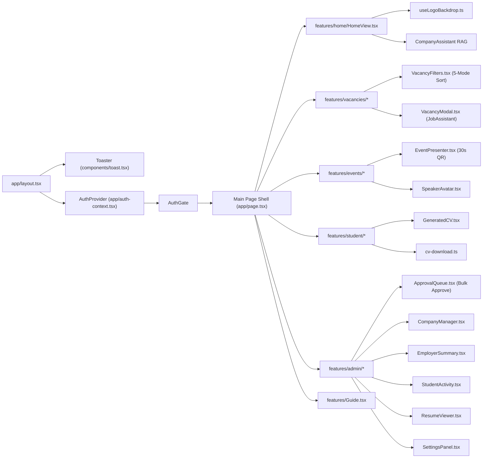
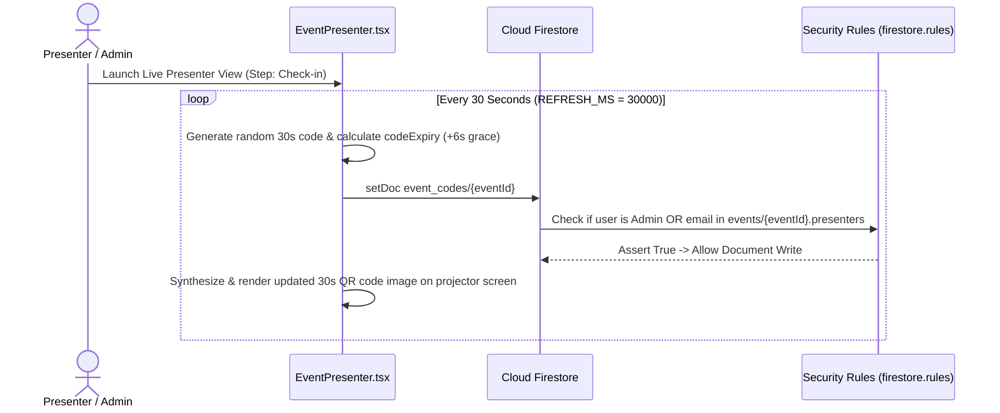
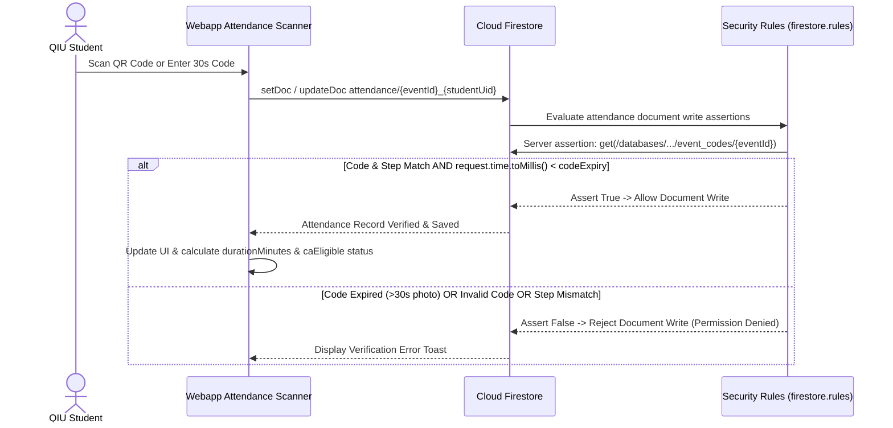
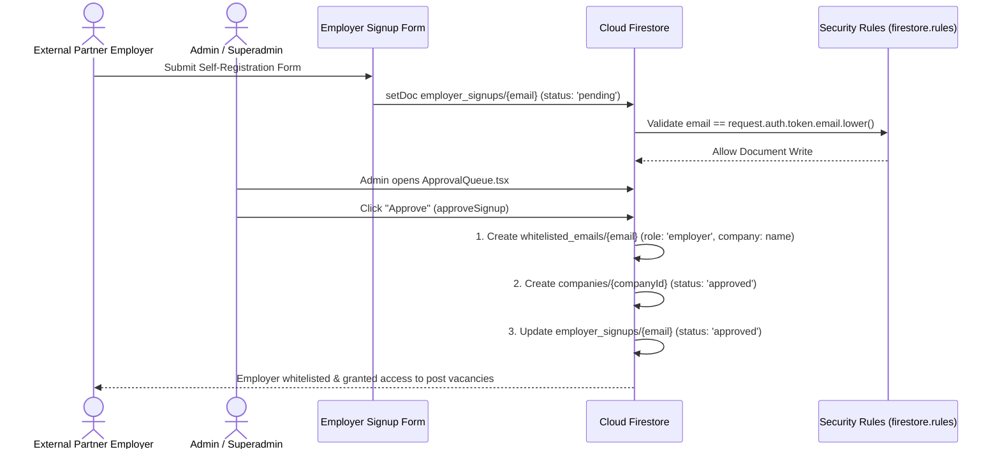
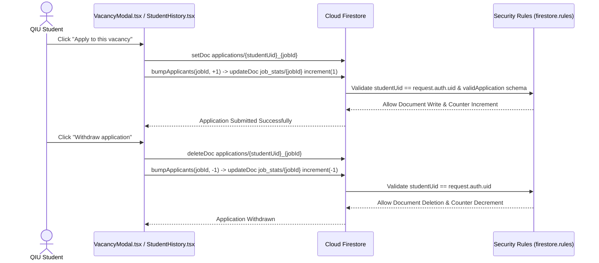

# QIU Industry Webapp — Comprehensive System Architecture Specification

**Status:** Active Internal Testing Phase — Currently undergoing internal validation. Live deployment links and public hosting URLs are strictly withheld during testing.<br>
**Target Audience:** Software Architects, Developers, Security Auditors, Deployment Engineers, and Academic Administrators<br>
**Deployment Model:** Static Next.js 16 export on Firebase Hosting with Cloud Firestore and Firebase Authentication

---

## 1. Purpose and System Scope

**QIU Industry Webapp** is a career, event management, exhibitor showcase, and anti-cheat attendance web application engineered for **QIU (Quest International University)** students, academic staff, and participating industry partner employers.

The platform provides an end-to-end ecosystem comprising nine core subsystem capabilities:
1. **Signature QIU-Red Visual Identity System**: Bespoke brand design system (`#ba1a1a` / `#900010` / `--color-primary: #d12a32`, hovering at `#b21f27`, brightened to `#ef5a60` in dark mode), clean light default theme with seamless system dark mode toggle, and prominent salary callout blocks.
2. **Home Landing & Company Directory RAG ([HomeView.tsx](file:///Users/sooyauming/Desktop/Intern/Vacancy%20Portal/webapp/features/home/HomeView.tsx))**: Industry Day exhibitor showcase directory featuring corporate profiles, booth numbers, YouTube video embeds, automated brand logo luminance backdrop sampling ([useLogoBackdrop.ts](file:///Users/sooyauming/Desktop/Intern/Vacancy%20Portal/webapp/features/home/useLogoBackdrop.ts)), and in-modal grounded company RAG assistant (`CompanyAssistant`).
3. **Employer Self-Registration & Approval Queue ([ApprovalQueue.tsx](file:///Users/sooyauming/Desktop/Intern/Vacancy%20Portal/webapp/features/admin/ApprovalQueue.tsx))**: Self-service signup pipeline for external partner employers (`employer_signups`), pending queue, admin registration approval with automatic email whitelisting in `whitelisted_emails`, and staged edit review (`pendingEdit`).
4. **Admin Dashboard Architecture Rework ([AdminPanel.tsx](file:///Users/sooyauming/Desktop/Intern/Vacancy%20Portal/webapp/features/admin/AdminPanel.tsx))**: Sub-tab navigation architecture partitioning system administration into specialized modules: [AdminSummary.tsx](file:///Users/sooyauming/Desktop/Intern/Vacancy%20Portal/webapp/features/admin/AdminSummary.tsx), [ApprovalQueue.tsx](file:///Users/sooyauming/Desktop/Intern/Vacancy%20Portal/webapp/features/admin/ApprovalQueue.tsx), [CompanyManager.tsx](file:///Users/sooyauming/Desktop/Intern/Vacancy%20Portal/webapp/features/admin/CompanyManager.tsx), [StudentActivity.tsx](file:///Users/sooyauming/Desktop/Intern/Vacancy%20Portal/webapp/features/admin/StudentActivity.tsx), [ResumeViewer.tsx](file:///Users/sooyauming/Desktop/Intern/Vacancy%20Portal/webapp/features/admin/ResumeViewer.tsx), and [SettingsPanel.tsx](file:///Users/sooyauming/Desktop/Intern/Vacancy%20Portal/webapp/features/admin/SettingsPanel.tsx).
5. **Employer Summary & Scoped Analytics ([EmployerSummary.tsx](file:///Users/sooyauming/Desktop/Intern/Vacancy%20Portal/webapp/features/admin/EmployerSummary.tsx))**: Dedicated metrics dashboard for employers showing company vacancies, total applications, unique applicants, assistant queries, and strict single-company tenant scope isolation.
6. **Generated CV Engine & Printable HTML Generator ([GeneratedCV.tsx](file:///Users/sooyauming/Desktop/Intern/Vacancy%20Portal/webapp/features/student/GeneratedCV.tsx) & [cv-download.ts](file:///Users/sooyauming/Desktop/Intern/Vacancy%20Portal/webapp/features/student/cv-download.ts))**: Built-in structured CV form renderer (`GeneratedCV.tsx`) and 1-click standalone HTML download generator (`cv-download.ts`) that prints cleanly to PDF without requiring cloud storage costs.
7. **Global Toast Notification System ([toast.tsx](file:///Users/sooyauming/Desktop/Intern/Vacancy%20Portal/webapp/components/toast.tsx))**: Reactive event-driven notification engine delivering real-time feedback (`success`, `error`, `info`) on save, edit, delete, apply, check-in, check-out, and withdrawal operations.
8. **Live Image Preview Component ([ImagePreview.tsx](file:///Users/sooyauming/Desktop/Intern/Vacancy%20Portal/webapp/components/ImagePreview.tsx))**: Real-time URL previewer positioned under logo and video link inputs, featuring automatic URL regex verification and load error warnings.
9. **Events UX & 30-Second Dynamic QR Anti-Cheat Attendance ([EventPresenter.tsx](file:///Users/sooyauming/Desktop/Intern/Vacancy%20Portal/webapp/features/events/EventPresenter.tsx) & [SpeakerAvatar.tsx](file:///Users/sooyauming/Desktop/Intern/Vacancy%20Portal/webapp/features/events/SpeakerAvatar.tsx))**: Live presenter view displaying a 30s rotating QR code (`REFRESH_MS = 30000`) and 6-character PIN code. Server-side rule assertion against secret `event_codes` collection blocks screenshot sharing over messaging apps. Two-step check-in/check-out duration verification enforces minimum physical attendance ($\ge 80\%$ of `sessionMinutes` or 45-minute floor) for Co-Curricular Activity (`caEligible`) points.

---

## 2. Architecture & Design Decisions Matrix

| Decision | Context & Rationale | System Consequence & Benefit |
| --- | --- | --- |
| **Static Next.js Export (`output: "export"`)** | Eliminates Node.js server maintenance, cold starts, and serverless runtime costs. | App builds to static HTML/JS/CSS deployed on Firebase Hosting CDN edge nodes. |
| **QIU-Red Token Architecture ([tokens.css](file:///Users/sooyauming/Desktop/Intern/Vacancy%20Portal/webapp/lib/theme/tokens.css))** | Centralized design token seam defining primary brand color `#ba1a1a` / `#900010`. | Supports seamless dark mode adaptation (`#ef5a60`) without modifying React markup. |
| **Canvas Logo Luminance Sampling ([useLogoBackdrop.ts](file:///Users/sooyauming/Desktop/Intern/Vacancy%20Portal/webapp/features/home/useLogoBackdrop.ts))** | External brand logos pasted by employers vary in opacity and color. | Samples image pixels in an HTML5 2D Canvas ($Y = 0.2126R + 0.7152G + 0.0722B$). Automatically applies dark backdrop tiles behind white transparent logos. |
| **Unreadable `event_codes` Collection ([firestore.rules](file:///Users/sooyauming/Desktop/Intern/Vacancy%20Portal/webapp/firestore.rules#L311-L319))** | Prevents students from querying Firestore subscriptions to scrape attendance codes. | Rules block client reads (`allow read: if isAdmin()`). Server-side `get()` assertions validate submitted codes during attendance writes. |
| **30-Second Dynamic QR Rotation ([EventPresenter.tsx](file:///Users/sooyauming/Desktop/Intern/Vacancy%20Portal/webapp/features/events/EventPresenter.tsx))** | Defeats proxy attendance fraud where students share screenshots via WhatsApp. | QR code and active secret expire every 30 seconds (`REFRESH_MS = 30000`). Screenshots shared remotely become invalid almost instantly. |
| **Two-Step Attendance Duration Math ([firestore.ts](file:///Users/sooyauming/Desktop/Intern/Vacancy%20Portal/webapp/lib/data/firestore.ts#L226-L233))** | Prevents quick check-in-and-leave proxy fraud. | Students must submit both Check-In and Check-Out. System computes duration against `sessionMinutes` threshold ($\ge 80\%$ or 45 min floor) before granting `caEligible` status. |
| **Printable Generated CV HTML Engine ([cv-download.ts](file:///Users/sooyauming/Desktop/Intern/Vacancy%20Portal/webapp/features/student/cv-download.ts))** | Eliminates PDF generation server costs and Storage bucket dependencies. | Generates standalone HTML document styled with print CSS media queries (`@media print`), enabling direct PDF saving from browser print dialogs. |
| **Global Toast Engine ([toast.tsx](file:///Users/sooyauming/Desktop/Intern/Vacancy%20Portal/webapp/components/toast.tsx))** | Avoids prop-drilling notification state through deep component trees. | Lightweight reactive listener pattern (`notify()`) triggering non-blocking visual feedback toasts with 3.8s auto-dismiss timers. |
| **Single-Company Employer Scope Isolation ([EmployerSummary.tsx](file:///Users/sooyauming/Desktop/Intern/Vacancy%20Portal/webapp/features/admin/EmployerSummary.tsx))** | Enforces multi-tenant data boundaries between competing external partner companies. | Employers view only candidates, applications, vacancies, and chat logs explicitly bound to their assigned company. |
| **Bulk "Approve All" Workflow ([ApprovalQueue.tsx](file:///Users/sooyauming/Desktop/Intern/Vacancy%20Portal/webapp/features/admin/ApprovalQueue.tsx))** | Eliminates manual review bottlenecks during high-volume recruitment fairs. | Admins review side-by-side diffs and execute batch transaction approvals across pending vacancies and staged profile edits in 1 click. |

---

## 3. System Context & Architecture Diagram

```mermaid
flowchart TD
    Auth["Google Auth (@qiu.edu.my Gate & Whitelist)"] --> Client["Next.js 16 Static Export Client"]
    Client --> Rules["Firestore Security Rules (firestore.rules)"]
    Rules --> Firestore[("Cloud Firestore Database")]
    
    subgraph ProtectedCollections ["Firestore Protected Collections"]
        Vacancies[("vacancies")]
        Applications[("applications")]
        Resumes[("resumes")]
        ChatLogs[("chat_logs")]
        Events[("events")]
        EventCodes[("event_codes (Unreadable by Client Reads)")]
        Attendance[("attendance")]
        JobStats[("job_stats")]
        Companies[("companies")]
        Signups[("employer_signups")]
        Settings[("app_settings")]
        Whitelist[("whitelisted_emails")]
        Users[("users")]
    end
    
    Rules --> Vacancies
    Rules --> Applications
    Rules --> Resumes
    Rules --> ChatLogs
    Rules --> Events
    Rules --> EventCodes
    Rules --> Attendance
    Rules --> JobStats
    Rules --> Companies
    Rules --> Signups
    Rules --> Settings
    Rules --> Whitelist
    Rules --> Users

    subgraph AttendanceEngine ["30-Second Dynamic Anti-Cheat QR Attendance Module"]
        Presenter["Presenter View (EventPresenter.tsx)"] -->|"Write 30s Rotating Code"| EventCodes
        Student["Student Scan / Submit Code"] -->|"Server Assertion Rule Evaluation"| Attendance
        EventCodes -.->|"get() Rule Check (Timestamp & Code Expiry)"| Attendance
        Attendance -->|"Check-in + Checkout Duration"| CCA["CCA Eligibility (caEligible)"]
    end

    subgraph Subsystems ["Core Application Feature Modules"]
        HomeView["Home Directory & RAG (HomeView.tsx)"]
        Queue["Approval Queue & Bulk Approve (ApprovalQueue.tsx)"]
        AdminTabs["Admin Sub-Tabs (AdminPanel.tsx)"]
        EmpSummary["Employer Analytics (EmployerSummary.tsx)"]
        CVEngine["Generated CV Engine (GeneratedCV.tsx & cv-download.ts)"]
        Toaster["Global Toast System (toast.tsx)"]
        ImgPreview["Live Image Preview (ImagePreview.tsx)"]
        Sorting["5-Mode Vacancy Filter (VacancyFilters.tsx)"]
    end

    Client --> HomeView
    Client --> Queue
    Client --> AdminTabs
    Client --> EmpSummary
    Client --> CVEngine
    Client --> Toaster
    Client --> ImgPreview
    Client --> Sorting
    Client --> Presenter
    Client --> Student
    Modal <--> Storage[("Firebase Storage (PDF Resumes)")]
```



---

## 4. Complete Technical Stack

| Layer | Technology | Active Version & Responsibilities |
| --- | --- | --- |
| **UI Framework** | React 19, TypeScript 5.9 | Component hierarchy, modal popups, reactive state, custom hooks |
| **Styling & Tokens** | Tailwind CSS 4.2, `tokens.css` | Responsive layouts, QIU-Red visual system (`#ba1a1a` / `#900010`), dark mode |
| **App Framework** | Next.js 16 (App Router) | Static export builder (`output: "export"`) producing pre-rendered HTML/JS bundle |
| **Authentication** | Firebase Authentication | Google OAuth 2.0 provider integration with institutional domain hints |
| **Database** | Cloud Firestore | NoSQL database holding users, vacancies, applications, events, attendance, job stats, companies |
| **Security Rules** | Firestore Security Rules v2 | Server-side role enforcement, schema validation, rate limits, unreadable secret assertion |
| **File Storage** | Firebase Storage | Storage bucket for candidate PDF resume uploads with user ownership rules |
| **Static Hosting** | Firebase Hosting | Production CDN hosting delivering static assets with security header policies |
| **Realtime Sync** | Firestore `onSnapshot` | Reactive updates for job vacancies, candidate applications, job stats, events, dynamic QR codes |
| **QR Generation** | `qrcode` package | Real-time QR code data URL synthesis on live presenter screens |
| **Test Suite** | Node Test Runner & `@firebase/rules-unit-testing` | Unit test suite (`npm test`) and emulator-backed security rules assertion suite (`npm run test:rules`) |

---

## 5. Component Design & Hierarchy



### 5.1 Global Core Components
- **[app/layout.tsx](file:///Users/sooyauming/Desktop/Intern/Vacancy%20Portal/webapp/app/layout.tsx)**: Root application wrapper initializing typography, CSS tokens, global `<Toaster />`, and `<AuthProvider />`.
- **[components/toast.tsx](file:///Users/sooyauming/Desktop/Intern/Vacancy%20Portal/webapp/components/toast.tsx)**: Global notification stack rendering transient feedback popups (`notify()`) with 3.8s auto-dismiss timers.
- **[components/ImagePreview.tsx](file:///Users/sooyauming/Desktop/Intern/Vacancy%20Portal/webapp/components/ImagePreview.tsx)**: Link preview component rendering live thumbnails under logo and video form inputs.

### 5.2 Home Directory & Exhibitor Subsystem
- **[features/home/HomeView.tsx](file:///Users/sooyauming/Desktop/Intern/Vacancy%20Portal/webapp/features/home/HomeView.tsx)**: Renders the primary landing directory of approved Industry Day exhibitors, booth tags, YouTube video popups, and the grounded company streaming assistant.
- **[features/home/useLogoBackdrop.ts](file:///Users/sooyauming/Desktop/Intern/Vacancy%20Portal/webapp/features/home/useLogoBackdrop.ts)**: Canvas 2D image sampling hook determining whether a logo requires a dark or light background tile based on relative luminance calculations.

### 5.3 Admin Sub-Tabs Subsystem
- **[features/admin/AdminPanel.tsx](file:///Users/sooyauming/Desktop/Intern/Vacancy%20Portal/webapp/features/admin/AdminPanel.tsx)**: Sub-tab navigation container managing administrative workflows.
- **[features/admin/AdminSummary.tsx](file:///Users/sooyauming/Desktop/Intern/Vacancy%20Portal/webapp/features/admin/AdminSummary.tsx)**: Metric cards and top-applied company/job bar charts.
- **[features/admin/ApprovalQueue.tsx](file:///Users/sooyauming/Desktop/Intern/Vacancy%20Portal/webapp/features/admin/ApprovalQueue.tsx)**: Combined review queue for self-service employer signups, pending vacancy submissions, and staged profile edit diffs with 1-click **"Approve All"**.
- **[features/admin/CompanyManager.tsx](file:///Users/sooyauming/Desktop/Intern/Vacancy%20Portal/webapp/features/admin/CompanyManager.tsx)**: Exhibitor editor featuring website logo auto-fetching (`logoFromWebsite`).
- **[features/admin/DataExport.tsx](file:///Users/sooyauming/Desktop/Intern/Vacancy%20Portal/webapp/features/admin/DataExport.tsx)**: Reusable component providing 1-click UTF-8 BOM CSV exports across all admin and employer list views via `csv.ts`.
- **[features/admin/EmployerSummary.tsx](file:///Users/sooyauming/Desktop/Intern/Vacancy%20Portal/webapp/features/admin/EmployerSummary.tsx)**: Employer analytics overview scoped strictly to the assigned company.
- **[features/admin/StudentActivity.tsx](file:///Users/sooyauming/Desktop/Intern/Vacancy%20Portal/webapp/features/admin/StudentActivity.tsx)**: Accordion feed of student application activity, enriched with auto-extracted Workspace Employee IDs.
- **[features/admin/ResumeViewer.tsx](file:///Users/sooyauming/Desktop/Intern/Vacancy%20Portal/webapp/features/admin/ResumeViewer.tsx)**: Candidate resume reviewer supporting PDF, link, and generated CV views.
- **[features/admin/SettingsPanel.tsx](file:///Users/sooyauming/Desktop/Intern/Vacancy%20Portal/webapp/features/admin/SettingsPanel.tsx)**: System settings manager (portal titles, QR rotation frequency, CCA percentage/floor rules, tab toggles).

### 5.4 Student & Resume Subsystem
- **[features/student/GeneratedCV.tsx](file:///Users/sooyauming/Desktop/Intern/Vacancy%20Portal/webapp/features/student/GeneratedCV.tsx)**: Rendered CV sheet displaying structured candidate profiles (headline, summary, CGPA, FYP, skills, links, experience, achievements).
- **[features/student/cv-download.ts](file:///Users/sooyauming/Desktop/Intern/Vacancy%20Portal/webapp/features/student/cv-download.ts)**: Standalone HTML generator exporting clean, printable CV documents.
- **[features/student/StudentHistory.tsx](file:///Users/sooyauming/Desktop/Intern/Vacancy%20Portal/webapp/features/student/StudentHistory.tsx)**: Candidate application history dashboard with 1-click application withdrawal support (`deleteApplication`), including cascaded withdrawals on shared CV removal.

### 5.5 Events & Anti-Cheat Attendance Subsystem
- **[features/events/EventPresenter.tsx](file:///Users/sooyauming/Desktop/Intern/Vacancy%20Portal/webapp/features/events/EventPresenter.tsx)**: Live projector display screen writing 30-second rotating codes to secret `event_codes/{eventId}` documents. Supports multiple distinct presenters.
- **[features/events/SpeakerAvatar.tsx](file:///Users/sooyauming/Desktop/Intern/Vacancy%20Portal/webapp/features/events/SpeakerAvatar.tsx)**: Speaker photo component with placeholder SVG fallback.
- **[features/events/EventAttendance.tsx](file:///Users/sooyauming/Desktop/Intern/Vacancy%20Portal/webapp/features/events/EventAttendance.tsx)**: Administrative attendance viewer rendering real-time check-in/checkout logs and exporting UTF-8 BOM CSV reports.

---

## 6. Primary System Sequence Diagrams

### 6.1 Presenter 30-Second Dynamic QR Code Rotation



### 6.2 Student Anti-Cheat Attendance Verification



### 6.3 Employer Self-Registration & Approval Workflow



### 6.4 Candidate Application & Withdrawal Workflow



---

## 7. Operational Testing & Quality Gates

The system includes automated unit test scripts and a local Firestore emulator test suite:

```bash
# Execute unit & regression test suite
npm test

# Execute emulator-backed Firestore Security Rules tests
npm run test:rules
```

### Test Suite Map

| Test Suite File | Operational Target |
| --- | --- |
| [tests/admin-form-regression.test.mjs](file:///Users/sooyauming/Desktop/Intern/Vacancy%20Portal/webapp/tests/admin-form-regression.test.mjs) | Vacancy draft state management, salary parsing, field preservation |
| [tests/chat-retrieval.test.mjs](file:///Users/sooyauming/Desktop/Intern/Vacancy%20Portal/webapp/tests/chat-retrieval.test.mjs) | Grounded assistant lexical pattern matching and typewriter streaming |
| [tests/map-tooltip-regression.test.mjs](file:///Users/sooyauming/Desktop/Intern/Vacancy%20Portal/webapp/tests/map-tooltip-regression.test.mjs) | Interactive location map coordinate boundary handling |
| [tests/firestore-rules.test.mjs](file:///Users/sooyauming/Desktop/Intern/Vacancy%20Portal/webapp/tests/firestore-rules.test.mjs) | Complete authorization matrix verifying domain restrictions, RBAC enforcement, `event_codes` privacy, presenter delegation, bulk actions, and anti-cheat attendance assertions |

---

## 8. Multi-Page Documentation Cross-References

For specific operational domain guides, consult the dedicated specifications:
- **[SECURITY_AND_RULES.md](file:///Users/sooyauming/Desktop/Intern/Vacancy%20Portal/webapp/docs/SECURITY_AND_RULES.md)**: Security Model, Firestore Security Rules & 30s Dynamic QR Math
- **[DATA_MODELS_AND_SCHEMAS.md](file:///Users/sooyauming/Desktop/Intern/Vacancy%20Portal/webapp/docs/DATA_MODELS_AND_SCHEMAS.md)**: Data Dictionary, TypeScript Interfaces & Firestore Collections
- **[FEATURE_MODULES_GUIDE.md](file:///Users/sooyauming/Desktop/Intern/Vacancy%20Portal/webapp/docs/FEATURE_MODULES_GUIDE.md)**: Feature Modules Technical Specification
- **[CODEBASE_FILE_MAP.md](file:///Users/sooyauming/Desktop/Intern/Vacancy%20Portal/webapp/docs/CODEBASE_FILE_MAP.md)**: Exhaustive File-by-File Technical Code Map & Section-by-Section Code Block Breakdown

---

## 9. License & Usage Terms

No open-source license is granted. Repository code and data schemas are proprietary assets of Quest International University (QIU).
