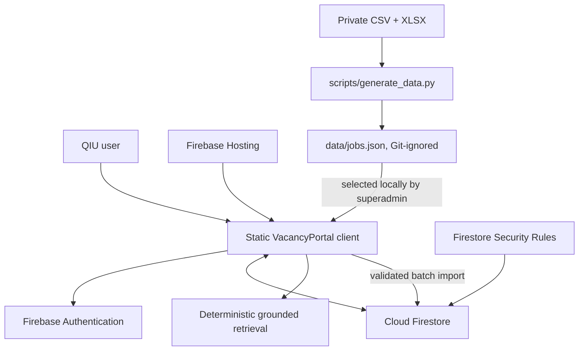
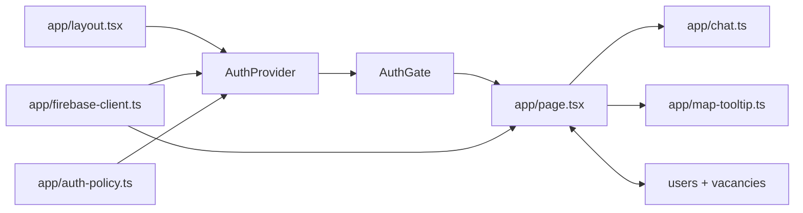
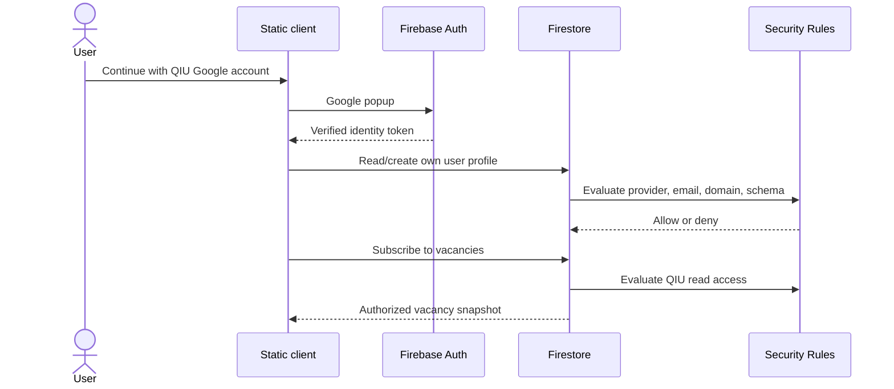
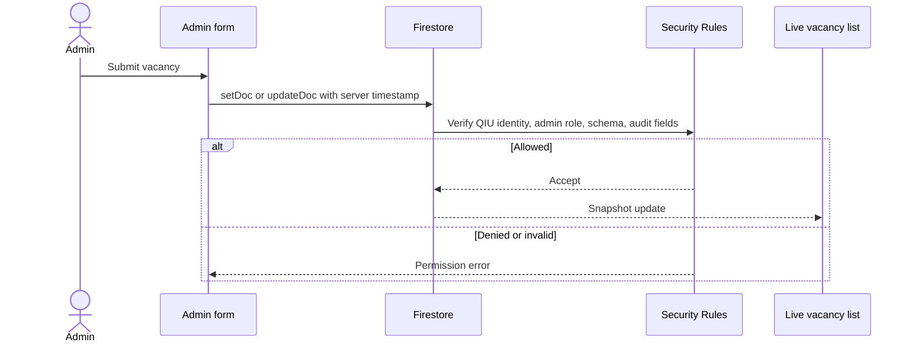
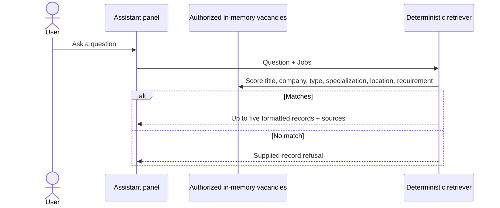

# QIU Industry Webapp Software Documentation

**Status:** Active Internal Testing Phase<br>
**Audience:** Developers, reviewers, administrators, and deployment owners<br>
**Deployment model:** Static Next.js export on Firebase Hosting with Firebase Authentication and Cloud Firestore

## 1. Purpose and scope

QIU Industry Webapp is a full-fledged industry career & vacancy discovery web application for QIU accounts. It provides:

- vacancy search and composable company, specialization, opportunity-type, and salary filters;
- authenticated vacancy and company-profile access;
- candidate application submission with resume support (Shareable URL or PDF upload);
- role-based access control with 4 distinct roles (`user`, `employer`, `admin`, `superadmin`);
- employer & administrator Activity Dashboards for candidate application tracking;
- per-job grounded deterministic assistant for applicant queries;
- course-driven recommendations based on student academic profiles;
- private JSON import into Firestore for administrative initialization;
- static deployment using Firebase services.

## 2. Design decisions

| Decision | Reason | Consequence |
| --- | --- | --- |
| Static Next.js export | Works with Firebase Hosting without a server runtime | All application logic runs in the browser |
| Firestore instead of bundled JSON | Keeps private vacancy records out of public Hosting assets | Authorized clients read records from Firebase |
| Google-only QIU authentication | Matches the institutional access requirement | Other providers, domains, and unverified accounts are rejected |
| Firestore rules as authority | Client checks can be bypassed | Every protected read and write is reauthorized server-side |
| Fixed email superadmin | Initial administrative bootstrap | `ai@qiu.edu.my` must remain an active institutional Google identity |
| Deterministic local assistant | Avoids paid inference and external record processing | Retrieval is lexical, not a true language model |
| Superadmin browser import | Avoids shipping private seed data or adding backend ingestion | Initial import is manual and capped at 500 records |

The active application no longer uses the former Cloudflare/vinext Worker or Groq runtime. There is no `/api/chat` request, model API key, or server-side generation. Legacy starter files under `worker/`, `db/`, `examples/`, and `vite.config.ts` are excluded from the active TypeScript build and current npm scripts.

## 3. System context



### Trust boundaries

1. **Public Hosting boundary:** `out/` contains the static application, fonts, icons, social image, and country map. It must not contain vacancy JSON.
2. **Authentication boundary:** Firebase establishes a verified identity. Google provider selection in the UI is helpful but not sufficient by itself.
3. **Authorization boundary:** `firestore.rules` checks provider, verified email, exact domain, role, document schema, and audit fields.
4. **Institutional-user boundary:** authorized QIU users receive vacancy data in their browser and can inspect or copy it.
5. **Admin boundary:** admin and superadmin writes are shared; they are not local-only changes.
6. **Import boundary:** the private file remains local until its records are deliberately written to Firestore.

## 4. Technology stack

| Concern | Technology | Active responsibility |
| --- | --- | --- |
| UI | React 19, TypeScript, CSS | Portal, dialogs, filters, map, chat, admin tools |
| Framework | Next.js App Router | Static page generation and metadata |
| Build | `next build`, `output: "export"` | Produces `out/` |
| Authentication | Firebase Authentication | Google sign-in and ID tokens |
| Database | Cloud Firestore | Shared users and vacancies |
| Authorization | Firestore Security Rules v2 | Domain, provider, RBAC, and schema checks |
| Hosting | Firebase Hosting | Static asset delivery and security headers |
| Assistant | TypeScript lexical retrieval | Deterministic grounded responses |
| Data preparation | Python | CSV/XLSX to private JSON |
| Tests | Node + Firebase Rules Unit Testing | App regressions and emulator authorization checks |

## 5. Component design



### 5.1 Authentication components

`app/firebase-client.ts` initializes the Firebase Web SDK from `NEXT_PUBLIC_FIREBASE_*` build variables. These values identify a Firebase Web App; they are not service-account secrets.

`app/auth-context.tsx`:

- opens Google sign-in with a QIU hosted-domain hint;
- rejects unverified and non-QIU emails client-side;
- creates a missing user profile with the default role;
- refreshes display name and photo URL without allowing self-role changes;
- exposes the current role to the UI;
- provides the superadmin role manager.

`app/auth-policy.ts` normalizes emails, checks the QIU domain, derives the fixed superadmin, and exposes UI authorization helpers.

`AuthGate` prevents the portal from rendering before client authentication completes. It is a presentation boundary only; Firestore rules are the security boundary.

### 5.2 Portal component

`app/page.tsx` owns:

- the live Firestore vacancy subscription;
- search, filters, pagination, columns, text scale, and theme;
- vacancy details and salary context;
- admin create, edit, delete, and superadmin import operations;
- Malaysian and international location entry;
- deterministic chat state and source links.

Only display preferences are stored in `localStorage` under `vacancyportal-view-prefs`. Vacancies are no longer stored in browser-local persistence.

### 5.3 Deterministic assistant

`app/chat.ts` is included in the static client. It searches only the vacancy array already authorized and loaded from Firestore. It performs no network request beyond the existing Firestore subscription and sends no prompt or record to an external model provider.

## 6. Identity and role model

### 6.1 Required identity claims

`firestore.rules` requires all of the following:

- an authenticated Firebase user;
- `email_verified == true`;
- `firebase.sign_in_provider == "google.com"`;
- an email matching the exact `@qiu.edu.my` suffix.

The Google `hd=qiu.edu.my` parameter is only a sign-in hint. Provider and domain enforcement remains in rules.

### 6.2 Roles

| Role | Vacancy reads | Vacancy writes | Role management | JSON import |
| --- | ---: | ---: | ---: | ---: |
| `user` | Yes | No | No | No |
| `admin` | Yes | Create, update, delete | No | No |
| `superadmin` | Yes | Create, update, delete | Assign `user`/`admin` | Yes |

The superadmin is determined from the authenticated email `ai@qiu.edu.my`, not from an editable client value. Rules prevent its profile from being assigned to another UID, demoted, or deleted.

### 6.3 Profile lifecycle

1. A verified QIU Google identity signs in.
2. The client reads `users/{uid}`.
3. If absent, that identity may create only its own document with:
   - its exact authenticated email;
   - role `user`, except `ai@qiu.edu.my`, which receives `superadmin`;
   - server timestamps and optional display profile fields.
4. A user may update only its own `displayName`, `photoURL`, and `updatedAt`.
5. The superadmin may assign another profile `user` or `admin`.

Firestore rules apply a changed role immediately. The affected browser may need sign-out/sign-in before its cached UI role changes.

## 7. Firestore data model

### 7.1 `users/{uid}`

```ts
type UserProfile = {
  email: string;
  role: "user" | "admin" | "superadmin";
  displayName?: string;
  photoURL?: string;
  createdAt?: Timestamp;
  updatedAt: Timestamp;
};
```

Only the superadmin may list all profiles. Normal users may read their own profile.

### 7.2 `vacancies/{id}`

```ts
type Vacancy = {
  id: number;
  title: string;
  company: string;
  type: "Permanent" | "Internship" | "Contract" | "Part-time";
  specialization: string;
  vacancies: number;
  location: string;
  salaryLabel: string;
  salary: number;
  payFrequency: "Monthly" | "Annually" | "Weekly" | "Daily";
  minimumRequirement: "SPM" | "Certificate" | "Diploma" | "Degree" | "Post-graduate";
  detailsLink: string;
  email: string;
  companySummary: string;
  companySources: string[];
  isCustom: true;
  locationMode: "malaysia" | "international";
  state: string;
  country: string;
  mapX?: number;
  mapY?: number;
  createdBy: string;
  createdAt: Timestamp;
  updatedAt: Timestamp;
};
```

Rules reject unknown fields and enforce string lengths, numeric bounds, enum values, email shape, location consistency, server timestamps, and immutable `createdBy`/`createdAt` on update. Creation requires `createdBy` to equal the authenticated admin UID.

`companySummary` and `companySources` are supplied discussion material, not verified employer claims.

### 7.3 Indexes

The current client subscribes to the full authorized vacancy collection and filters in memory, so `firestore.indexes.json` declares no composite indexes. Add indexes only when server-side queries require them.

## 8. Primary flows

### 8.1 Sign-in and protected read



Non-QIU, unverified, signed-out, and non-Google identities cannot read vacancy records even if they bypass the visual gate.

### 8.2 Admin vacancy write



Editing preserves supplied pay frequency, details reference, company summary, and company sources. Those fields default only for a newly created vacancy.

### 8.3 Superadmin import

1. The superadmin generates or receives an approved `jobs.json` locally.
2. The browser parses the selected file and requires an array of no more than 500 basic records.
3. Malaysian location aliases such as `Kuala Lumpur` are normalized to the configured state label.
4. The client adds location fields, audit fields, and server timestamps.
5. A Firestore batch writes the records.
6. Security rules validate every document; one invalid record rejects the whole batch.

Import is intentionally unavailable to ordinary admins. Re-importing an existing numeric document ID replaces that document.

### 8.4 Grounded chat



Supported boosts cover internship intent, salary comparisons, and a small computing-study vocabulary including the observed `computer scienc` typo. No embeddings, vector database, prompt generation, or external inference service is used.

## 9. Private data lifecycle

### 9.1 Source preparation

`scripts/generate_data.py` reads the private vacancy CSV and company-discussion workbook, normalizes salary data, joins company information, and writes `data/jobs.json`.

These files remain ignored:

- `data/jobs.json`;
- `*.csv`;
- `*.xls`, `*.xlsx`, and `*.tsv`;
- `.env*`, except `.env.example`;
- `out/` and Firebase debug state.

### 9.2 Deployment boundary

The static build does not import `data/jobs.json`. Therefore approved vacancy values and company summaries do not appear in `out/`. The generated file is supplied manually after deployment through authenticated superadmin import.

Git and bundle exclusion do not prevent an authorized QIU user from reading records delivered by Firestore. This design controls access; it does not provide digital-rights enforcement after delivery.

### 9.3 External processors

Firebase processes authentication profile data, Hosting requests, and Firestore records. The application does not send vacancy records or chat questions to Groq, OpenAI, or another model API. Deployment owners must still apply institutional classification, retention, consent, and account-lifecycle policies to Firebase.

## 10. Local development

### Prerequisites

- Node.js 22.13 or newer
- npm
- Java for Firestore emulator tests
- Firebase project with Google Authentication and Firestore
- Firebase Web App configuration

### Environment

```bash
npm ci
cp .env.example .env.local
```

Fill `.env.local` with values from Firebase Console:

```dotenv
NEXT_PUBLIC_FIREBASE_API_KEY=...
NEXT_PUBLIC_FIREBASE_AUTH_DOMAIN=<your-project-id>.firebaseapp.com
NEXT_PUBLIC_FIREBASE_PROJECT_ID=<your-project-id>
NEXT_PUBLIC_FIREBASE_STORAGE_BUCKET=<your-project-id>.firebasestorage.app
NEXT_PUBLIC_FIREBASE_MESSAGING_SENDER_ID=...
NEXT_PUBLIC_FIREBASE_APP_ID=...
```

Never use a project ID merely because it matches the product name; Firebase project IDs are globally unique. Confirm the project belongs to the intended QIU Firebase account.

### Run

```bash
npm run dev
```

Open `http://localhost:3000`. Add `localhost` to Firebase Authentication authorized domains when required.

## 11. Test and quality gates

```bash
npm run lint
npm test
npm run test:rules
```

| Test | Coverage |
| --- | --- |
| `admin-form-regression.test.mjs` | Salary entry, Firestore save wiring, refresh behavior, imported-field preservation |
| `chat-retrieval.test.mjs` | Computing-study matching, typo handling, deterministic refusal |
| `map-tooltip-regression.test.mjs` | Country label containment at map edges |
| `firestore-rules.test.mjs` | QIU/Google reads, outsider denial, self-escalation denial, immutable superadmin, admin-only CRUD, audit-field protection |

`npm run test:rules` starts a local Firestore emulator against the demo project ID `demo-vacancyportal`; it does not access production Firebase data.

Recommended manual checks:

1. Verify Google QIU sign-in and non-QIU rejection.
2. Confirm a new user can browse but cannot see admin controls.
3. Promote a test user and confirm Firestore permits vacancy CRUD.
4. Demote the account and confirm rules deny further writes.
5. Confirm `ai@qiu.edu.my` cannot be changed or deleted.
6. Import approved JSON and confirm all records appear through the live subscription.
7. Edit an imported record and confirm company context and pay frequency remain intact.
8. Search a multi-role company and combine all filters.
9. Ask supported and unsupported chat questions and confirm source-only behavior.
10. Inspect `out/` and confirm private vacancy strings are absent.

## 12. Firebase Spark deployment

### Firebase project setup

1. Create or select a Firebase project with a globally unique project ID.
2. Register a Web App.
3. Enable Authentication → Google.
4. Create Cloud Firestore.
5. Configure Authentication authorized domains.
6. Populate `.env.local` with that same project’s Web App values.

CLI example:

```bash
npx firebase-tools login
npx firebase-tools projects:list
npx firebase-tools projects:create <your-project-id> --display-name VacancyPortal
```

Project creation is needed only when an owned project does not already exist. The display name may be `VacancyPortal`; the project ID must be unique.

### Validate and deploy

```bash
npm run lint
npm test
npm run test:rules
npm run build
npx firebase-tools deploy --only firestore:rules,firestore:indexes,hosting --project <your-project-id>
```

`firebase.json` deploys:

- `firestore.rules`;
- `firestore.indexes.json`;
- static `out/` Hosting content;
- long-lived cache headers for static assets;
- `X-Content-Type-Options`, `Referrer-Policy`, and `X-Frame-Options` headers.

This architecture requires no Cloud Functions, Cloud Run, App Hosting, or Blaze-only server runtime. It is designed for Spark usage, but quotas and Firebase product terms can change. Deployment owners must monitor current Authentication, Firestore, and Hosting limits.

### First deployment order

1. Deploy rules and Hosting.
2. Open the Hosting URL and sign in as `ai@qiu.edu.my` to create the fixed superadmin profile.
3. Import the approved private JSON.
4. Assign test users as needed.
5. Re-run manual privacy and role checks.

## 13. Operations

### Role changes

- Promote only known QIU accounts.
- Use separate test accounts when validating admin behavior.
- Firestore authorization changes immediately; ask affected users to sign out and back in if the UI still shows an old role.
- The fixed superadmin account must be protected by QIU Google account controls.

### Vacancy updates

- Admin changes propagate through the live Firestore snapshot.
- Use the superadmin importer only for approved batch initialization or replacement.
- There is no built-in rollback or audit-history collection; export/backup Firestore before substantial replacement.

### Incident response

If unauthorized access is suspected:

1. disable the affected Firebase Authentication account or Google identity;
2. remove its admin role in Firestore;
3. inspect Firebase and Google account logs available to the project owner;
4. rotate any exposed service credentials—none should exist in this client repository;
5. correct and deploy rules before restoring access.

## 14. Known limitations

- Active internal testing phase; currently undergoing internal validation prior to public release.
- Deterministic lexical retrieval is not an LLM and has limited semantic recall.
- Every authorized user receives the matching Firestore vacancy documents in the browser.
- Client filtering reads the full vacancy collection and may become expensive at larger scale.
- No vacancy approval, expiry, history, moderation, backup automation, or recovery UI.
- No Firebase App Check, centralized telemetry, or alerting.
- Profile roles are read at sign-in; UI role refresh is not realtime.
- Import is capped at one Firestore batch of 500 records.
- Company discussions are unverified.
- Salary normalization does not fully model ranges or comparable pay periods.
- Spark quotas may be insufficient for wider institutional adoption.

## 15. Production recommendations

Before production use:

1. complete institutional data-classification, consent, retention, and Firebase tenancy reviews;
2. add account deprovisioning and periodic role review;
3. add App Check where appropriate, monitoring, alerts, and an incident runbook;
4. implement audit-history, approval, expiry, backup, and restore workflows;
5. move filtering to indexed Firestore queries when record volume warrants it;
6. add end-to-end browser tests for sign-in, roles, CRUD, import, and accessibility;
7. create a measured retrieval evaluation set before expanding assistant behavior;
8. add a license before external redistribution or contribution.

## 16. Repository references

- `app/auth-context.tsx` — authentication state, profile bootstrap, and role manager
- `app/auth-policy.ts` — QIU domain and role helpers
- `app/firebase-client.ts` — Firebase Web SDK initialization
- `app/page.tsx` — Firestore subscription, portal UI, CRUD, and import
- `app/chat.ts` — deterministic grounded retrieval and response formatting
- `app/map-tooltip.ts` — country-tooltip geometry
- `firestore.rules` — authoritative access and validation policy
- `firestore.indexes.json` — Firestore index configuration
- `firebase.json` — Hosting and Firestore deployment configuration
- `next.config.ts` — static export configuration
- `scripts/generate_data.py` — private source normalization
- `tests/firestore-rules.test.mjs` — emulator-backed authorization tests

## 17. License

No license is currently declared. Repository visibility does not grant permission to reuse or redistribute code or data.
